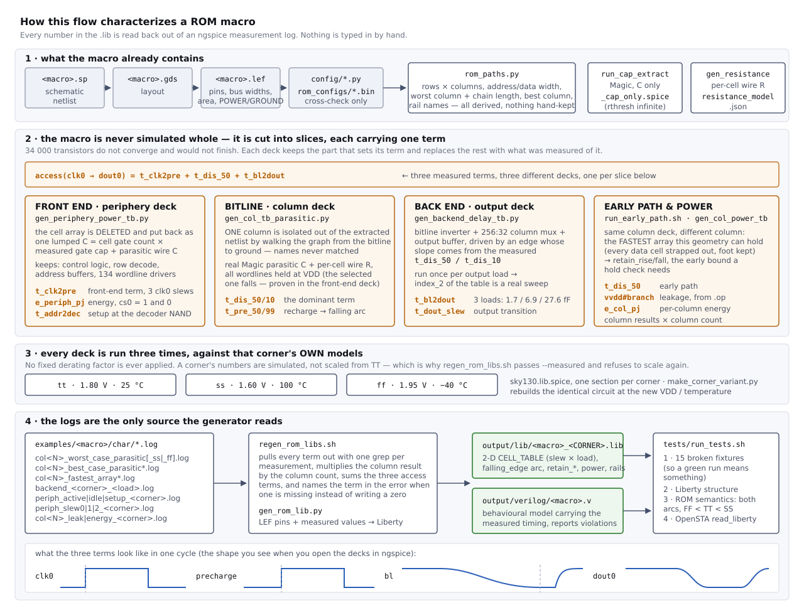

# openram-rom-libgen

Automated **timing and power characterization** for ROM macros built with
[OpenRAM](https://github.com/VLSIDA/OpenRAM), and **Liberty (`.lib`)
generation** from the result.

OpenRAM's own characterizer only writes a `.lib` for SRAM; its ROM compiler
emits just `.sp` / `.v` / `.lef` / `.gds`. This repository fills that gap: it
builds SPICE testbenches from the macro's own netlist, measures them with
ngspice at three corners, and writes the `.lib` that synthesis and STA need,
plus a behavioural Verilog model carrying the measured timing.

No number in the output is typed by hand -- every one is read back out of a
measurement log.

| deliverable | directory |
|---|---|
| Liberty, three corners per macro | `output/lib/<macro>_<CORNER>.lib` |
| behavioural model with measured timing | `output/verilog/<macro>.v` |

Override the root with `ROM_OUT_DIR`.



The macro is never simulated whole -- 34 000 transistors do not converge and
would not finish. It is cut into slices, each deck carrying one term of the
answer, and the terms are added back together in the `.lib`. The diagram is
the map of that; the sections below are the detail.

---

## Quick start

```sh
# 1. point the flow at your macros (default: <repo>/examples)
export ROM_MACROS_DIR=/path/to/your/macros
python3 scripts/rom_char/rom_paths.py --list

# 2. check one macro has everything the flow needs
python3 scripts/rom_char/rom_paths.py --check <macro>

# 3. tell the tools where ngspice, magic and the PDK are
export NGSPICE_BIN=ngspice
export MAGIC_BIN=magic
export PDK_ROOT=$HOME/OpenLane/pdks
export OPENRAM_TECH=$HOME/OpenRAM/technology

# 4. run the flow (see "The flow" below for what each step does)
./scripts/rom_char/run_cap_extract.sh <macro>
./scripts/rom_char/run_col_timing.sh
./scripts/rom_char/run_backend_delay.sh
./scripts/rom_char/run_periphery_power.sh
./scripts/rom_char/run_addr_setup.sh
./scripts/rom_char/run_col_power.sh
./scripts/rom_char/run_col_energy.sh
./scripts/rom_char/run_periphery_leak.sh
./scripts/rom_char/run_coldec_delay.sh
./scripts/rom_char/run_pin_cap.sh
./scripts/rom_char/regen_rom_libs.sh
./tests/run_tests.sh
python3 scripts/rom_char/gen_macro_behavioral_v.py
```

Two further runs are not in that list because they are cross-checks rather
than steps that produce a number the `.lib` needs, and both are expensive:

```sh
# ramp independence of the pin capacitances -- the charge over a full swing
# must not depend on how fast the pin is driven
PIN_TR=2n ./scripts/rom_char/run_pin_cap.sh wrom0

# the GOLDEN REFERENCE: the same measurement with NOTHING deleted, no lumped
# load anywhere. Hours, and ~15 GB. tests/run_tests.sh picks up its logs and
# reports the deviation -- as a warning, never as a failure.
GOLDEN_PINS="clk0,addr0[0],addr0[9]" ./scripts/rom_char/run_pin_cap.sh wrom0
```

Every other check on the reduced decks -- ramp independence, agreement across
the four macros, insensitivity to a 2x change in the array load -- is a
*self-consistency* check: it bounds how far an answer moves when a knob moves,
and it is structurally blind to an error that every variant shares. The golden
run is the only one that is not.

If you only want to look around without a simulator, everything in
[Understanding the macro](#understanding-the-macro) works on the netlist alone.

---

## Understanding the macro

### The cell array is a NAND chain


A bitline is not one transistor per row tied to ground -- it is every cell of
that column **in series**, from the bitline contact at the top down to a single
foot transistor at the bottom. There are two cell types:

```
one_cell   : X0 D G S gnd    -> drain and source are DIFFERENT nets = a real transistor
zero_cell  : X0 S G S gnd    -> drain and source are the SAME net   = a permanent short
```

| `rom_base_one_cell` | `rom_base_zero_cell` |
|---|---|
|  |  |

Every cell position holds a physical transistor. What programs the bit is
whether a metal strap shorts its source to its drain. **That strap is the
stored data** -- the via pattern you can see in the layout is the ROM contents.


### How a read works

During evaluate, **all wordlines stay HIGH except the selected one**, which is
driven LOW. So the chain conducts through dozens of pass transistors:

| cell in the selected row | when its wordline goes low | chain | bitline | read |
|---|---|---|---|---|
| `one_cell` (transistor) | turns **off** | broken | stays at VDD | **1** |
| `zero_cell` (strap) | strap does not care | conducts | discharges | **0** |

This is also why the macro is slow: the discharge current flows through ~80
series transistors, so the bitline behaves as a distributed RC line and the
delay grows roughly **quadratically** with the chain length.

You can read any column straight out of the netlist:

```
$ python3 scripts/rom_char/rom_explore.py wrom0 --col 236
== wrom0 column 236 -- bitline chain (top to bottom, 134 rows)
   1 = one_cell  (series NMOS, gate=wl) -> resistance in the chain
   0 = zero_cell (source/drain shorted) -> wire only

   r0    1010110101001111101100111111010111001001
   r40   1011110010111001101010010110100110011111
   r80   1000011110011100101010011111101001010100
   r120  11111011111101

   series NMOS count = 82  (real transistors in the discharge path)
```

The column with the most `one_cell`s is the slowest one, and characterization
runs on it. That choice is made by the tools, never by hand.

### The precharge phase, and why it is part of the answer

Nothing ever drives a bitline high in this macro. A read is a question about
charge that was put there in the previous half cycle, which is what makes the
array *precharged*, and it makes the length of that half cycle part of the
access time rather than a detail of the testbench.

One cycle has two phases, and the `precharge` net is what separates them. It
gates two devices at once:

| `clk0` | `precharge` net | precharge PMOS (top of the column) | foot NMOS (bottom of the chain) | the bitline |
|---|---|---|---|---|
| low | low | **on** -- pulls the bitline to VDD | **off** -- the chain is cut from ground | charges |
| high | high | off | **on** -- the chain reaches ground | discharges, or does not: that is the bit |

Both devices are driven by the same net on purpose: the foot transistor is
what keeps a short from VDD to ground through the chain while the bitline is
being charged. It is also why the foot is never one of the programmable cells
-- its gate is the `precharge` net, not a wordline, and
`gen_col_tb_parasitic.py` identifies it by that gate rather than by its
position.

**The chain's internal nodes never reach VDD.** They are charged from the
bitline *through the cells*, and every cell is an NMOS pass transistor, so
each one loses a threshold; the deeper the node, the lower it settles.
Measured at the end of a settled 100 ns precharge phase on wrom0 column 236 at
TT: bitline 1.799 V, first chain node 1.070 V, node 41 0.843 V, node 81
0.821 V -- and they keep creeping up as the phase is made longer, which is the
next paragraph.
There is no steady state in which the chain is simply "full".

So the longer the precharge phase lasts, the more charge the next read has to
remove, and the slower that read is:

| precharge phase | settled `t_dis_50` (wrom0, TT) |
|---|---|
| 25 ns | 6.96 ns |
| 50 ns | 9.54 ns |
| 100 ns | 11.59 ns |
| 200 ns | 12.96 ns |
| 1 us | 14.85 ns |

Monotonic and saturating. The worst case is therefore the **longest** precharge
-- a ROM that has been sitting idle with `clk0` parked low, whose chain has
filled asymptotically, and whose next read is the slowest read the macro can
perform. That is a real operating condition and it is the one the `.lib` has
to cover, so the column deck runs at `TCLK=2u`: a 1 us precharge phase, far
into the saturated region.

**And the first cycle is not a measurement.** The deck sets `.ic` on the
bitline only; with `uic` every internal chain node starts at 0 V and jumps
within picoseconds to a capacitive-divider level set by each cell's parasitic
C to vdd and to gnd. That level is *higher* than what conduction produces, and
the nodes cannot come back down -- during precharge the foot is off, so they
can only be charged, never discharged. A longer first precharge does not wash
it out: wrom0 reads 16.5035 ns on cycle 1 whether the first phase is 25 ns,
100 ns or 1 us, against 14.8495 ns settled at that same 1 us phase.

| | cycle 1 (capacitive divider) | settled |
|---|---|---|
| bitline | 1.8000 V | 1.7990 V |
| chain node 1 | 1.2623 V | 1.0696 V |
| chain node 41 | 1.1171 V | 0.8426 V |
| chain node 81 | 1.1082 V | 0.8201 V |

Cycle 1 is nearly flat; the settled state is a gradient built by conduction.
Every measurement in the column deck therefore sits on the third cycle, and
the deck also emits `t_dis_50_prev` -- the same measurement one cycle earlier
-- so that settling is *proven* rather than assumed. If the two differ by more
than 1% the generator says so and the number must not be used. This is the
same rule the energy decks apply with `q_c2` against `q_c3`; the timing deck
did not have it until 2026-09-20, and measured its first cycle. The effect on
the numbers it produces:

| corner | cycle 1 | settled, 1 us phase |
|---|---|---|
| tt | 16.5035 ns | 14.8495 ns |
| ss | 41.9709 ns | 36.0231 ns |
| ff | 8.9101 ns | 8.2893 ns |

The old values were pessimistic for `access`, which is the safe direction, but
they reached that margin through a state the circuit never occupies -- and for
`retain_rise`/`retain_fall`, which come from the same deck, the artefact
pointed the other way: retain is an *early* bound, and an unphysically slow
discharge makes the output look like it holds its previous value longer than
it really does, which is exactly what lets a hold violation pass unnoticed.

#### Does a chain that never reaches VDD cost noise margin?

It is the obvious next question, and the deck cannot answer it: every wordline
is held at DC VDD, so the only case it simulates is a read of **0**. On a read
of **1** the selected cell breaks the chain and the bitline has to *stay* high
while every still-conducting node above the break shares charge with it -- and
the deeper the selected row, the more nodes hang on the bitline. Measured by
hand on wrom0 column 236 at TT, pulsing one wordline low during evaluate:

| | selected row at the top | selected row at the bottom (81 cells still conducting) |
|---|---|---|
| `v(bl)` at 20 ns | 1.8163 V | 1.8415 V |
| `v(bl)` at 200 ns | 1.8141 V | 1.8230 V |
| `v(bl)` min over a 1 us evaluate | 1.8000 V | 1.7336 V |
| `v(bl_b)` max (inverter output) | 0.0000 V | 0.0000 V |

The 1 level holds. Two mechanisms protect it: each pass transistor cuts itself
off once its node is within a threshold of the bitline, so the chain cannot
drag the bitline down to its own level; and 41 kohm of chain resistance makes
the redistribution far slower than the access time. The partially charged
chain costs **speed on a read of 0, not level on a read of 1** -- and the
bitline itself is driven by the precharge PMOS directly, with no pass
transistor in the way, so its high level is full rail to begin with.

(The readings above VDD at 20 ns are the precharge edge coupling into the
bitline through the cell capacitances. It is the small bump visible at the
start of every discharge if you plot the deck.)

What this does *not* cover is neighbour-column coupling, which the column deck
does not carry at all -- see limitation 1 below.

---

## What is measured, and how


The macro has seven top-level blocks. Six appear in the measurements:

| block | timing | power |
|---|---|---|
| `rom_control_logic` (clock driver + NAND) | periphery deck | yes |
| `rom_row_decode` (address buffers, decoder, wl drivers) | periphery deck | yes |
| `rom_base_array` (cells + precharge) | column deck (worst column) | yes (x columns) |
| `rom_bitline_inverter` | back-end deck | yes (inside the column deck) |
| `rom_column_mux_array` | back-end deck | no |
| `rom_output_buffer` | back-end deck | no |
| `rom_column_decode` (addr[2:0] -> word_sel) | not measured | no |

### `access` is the sum of three measured terms

There is no output latch, so `dout0` is valid only during clk0's high phase,
and the path from clock to data crosses three stages. Each is measured in its
own deck:

| # | term | what | deck | log |
|---|---|---|---|---|
| 1 | front end | `clk0` -> `precharge` | periphery | `periph_active_<corner>.log` (`t_clk2pre`) |
| 2 | bitline | precharge -> bitline 50% | column | `col<N>_worst_case_parasitic*.log` (`t_dis_50`) |
| 3 | back end | bitline -> `dout0` | back end | `backend_<corner>_<load>.log` (`t_bl2dout`) |

The same path run backwards gives the **falling-edge arc**: when clk0 falls
the precharge PMOS pulls the bitline back to VDD and every dout0 bit returns
to 1, so the data is gone. The `.lib` carries that as a second `timing()`
group on `dout0` with `timing_type : falling_edge`, built from the *minimum*
of the same three terms (`t_clk2pre + t_pre_50 + t_bl2dout` at the smallest
load). The earliest invalidation is the number that matters -- what has to be
proven is that the consumer captured before the data went away. Without this
group STA reads an unlatched ROM as if it held its output and reports a false
pass.


Term 2 dominates. The figure shows the same column at all three corners, with
the 50% crossing that defines `t_dis_50` and the 99% recharge that defines
`t_pre`.


The front-end deck also settles the decoder polarity by measurement rather than
assumption: after clk0 rises, the selected wordline **falls**. That is what
justifies holding every wordline at VDD in the column deck.


The back-end deck is run once per output load, so the `index_2`
(`total_output_net_capacitance`) axis of the CELL_TABLE is a real measurement
and not three copies of one number. The bitline edge driving it is not a guess
either -- it uses the slope implied by the measured `t_dis_50`/`t_dis_10`.

Also measured: setup (`t_addr2dec*`), leakage (`.op`), per-column energy and
periphery energy, active and idle.

### The frequency window this ROM may be driven in

There is an upper bound, it is in the `.lib`, and it should be preferred to
any number written in prose. There is **also a lower bound**, it is not in the
`.lib`, and Liberty has no way to express it.

**Upper bound -- it is `minimum_period` on `clk0`.** `min_pulse_width(rise)`
is the full evaluate window the data needs, `min_pulse_width(fall)` is the
recharge the bitline needs, and their sum is the period. On the example
macros:

| macro | corner | `min_pulse_width` rise / fall | `minimum_period` | f_max |
|---|---|---|---|---|
| wrom0 | TT | 17.83 / 11.52 ns | 29.35 ns | 34.1 MHz |
| wrom0 | SS | -- | 54.75 ns | 18.3 MHz |
| wrom0 | FF | -- | 20.74 ns | 48.2 MHz |
| wrom3 | TT | -- | 28.82 ns | 34.7 MHz |

Prefer these to any number written in prose: STA enforces what is in the
`.lib`, and nothing enforces a sentence in a README. (The `fmax` field of
`ROM_CORNERS` is **not** this bound -- it only scales the `P = E x f` column
of a summary table.)

**Lower bound -- this is a precharged ROM, so one exists.** Two separate
things happen as the clock slows down, and they must not be confused.

*The access time saturates, and that costs nothing.* The chain's internal
nodes never reach VDD, so the longer clk0 is parked low the more charge the
next read has to remove. On wrom0 column 236 at TT the settled `t_dis_50`
runs 6.96 ns at a 25 ns precharge phase, 11.59 ns at 100 ns and 14.85 ns at
1 us, monotonic and saturating. The column deck measures at the saturated
1 us point -- the ROM that has been idle indefinitely and is about to perform
the slowest read it can -- so an arbitrarily long LOW phase is already
covered by the number the library ships.

*The stored level does not saturate, and that is the real bound.* The bitline
is a **dynamic node**: during evaluate the precharge PMOS is off and nothing
refreshes it. On a read of 1 the selected cell breaks the series chain and
the bitline is left floating high, holding its value on its own capacitance
against subthreshold leakage through the cell that broke the chain, and
against charge sharing with the partially charged cells still hanging on it.
Hold clk0 high long enough and that 1 decays through the bitline inverter's
trip point and is read as a 0 -- the classic retention limit of any
precharged logic, and the reason dynamic logic has a minimum clock frequency
at all. The bound is worst at SS, where subthreshold leakage is largest.

`min_pulse_width(rise)` is a *minimum*; Liberty has no maximum-pulse-width
constraint that a normal STA flow enforces, so this one genuinely cannot be
carried in the `.lib` and has to be stated here instead.

Every measurement uses **real Magic parasitic capacitance** and runs each
corner against its own sky130 models -- no fixed derating factor.

### The scaling trick

The 34k-transistor array is never simulated whole:

* **column slice** -- the worst column is isolated by walking the extracted
  netlist graph, measured, and the result multiplied by the column count
  (leakage, energy);
* **periphery slice** -- the array is deleted and its load (cell gate count x
  measured gate capacitance + parasitic wire C) is put back as a lump;
* **block slices, for leakage** -- the periphery is cut into one instance of
  each repeated block (control logic, address buffer, wordline driver, one
  row-decode column, one column-decode column and its driver, one bitline
  inverter, one column mux transistor and one output buffer), each on its
  own supply source, so a single `.op` reports every block's current on a
  separate branch and each is multiplied by a count from the netlist. Every
  block the macro instantiates is in that list: a block left out is scored as
  zero, silently, which is what happened to the read back end until
  2026-09-22.

So runtime does not explode as the macro grows.

The leakage deck is built from the **schematic** netlist rather than the Magic
extraction: leakage is a DC quantity, so parasitic capacitance cannot change
it, and the deck stays at a few hundred devices. That matters, because `.op`
does **not** converge on the full periphery netlist -- the row decoder is a
precharged NAND chain whose internal nodes have no DC path, the matrix is
singular there, and dynamic gmin, true gmin and source stepping all fail after
eight minutes and 2.7 GB. Cut into static-CMOS blocks plus one decode column,
every slice converges in seconds.

#### gmin has to be swept, not chosen

`gmin` is the artificial conductance ngspice puts on every node to help it
converge, and it sits in **parallel with the leakage being measured**: at the
pA level it simply becomes the answer. It is not one value for the whole deck
either -- the blocks differ by five orders of magnitude. Measured on wrom0 at
TT:

| slice | gmin=1e-12 | 1e-15 | 1e-18 | 1e-21 |
|---|---|---|---|---|
| control logic | 14.3293 nA | 14.2232 | 14.2231 | 14.2231 |
| wordline driver | 0.692543 nA | 0.688946 | 0.688943 | 0.688943 |
| address buffer | 0.00562414 nA | 0.000229725 | 0.000224123 | 0.000224107 |
| row-decode column | 0.0421749 nA | 0.0000825065 | 0.0000352684 | 0.0000352347 |

At 1e-12 the address buffer is **96% artificial** and the decode column 1200x
too high; 1e-15, the value the column deck settled on, is still 2.3x too high
for the decode column. So `run_periphery_leak.sh` runs the whole axis and, per
slice, takes the smallest gmin with the point above it agreeing -- the same
"two values agree, therefore converged" rule the energy and timing decks use.
A slice that never settles is printed as NOT CONVERGED and is not used.

What the periphery actually leaks (wrom0, TT, converged values):

| block | count | per slice | total |
|---|---|---|---|
| bitline inverter | 256 | 0.365519 nA | 93.57 nA |
| wordline driver | 133 | 0.688943 nA | 91.63 nA |
| control logic (clock driver + NAND + precharge driver) | 1 | 14.2231 nA | 14.22 nA |
| column-decode driver | 8 | 0.474726 nA | 3.80 nA |
| output buffer | 32 | 0.000209 nA | 0.007 nA |
| row-decode column | 133 | 0.0000352 nA | 0.005 nA |
| address buffer | 8 | 0.000224 nA | 0.002 nA |
| column-decode column | 8 | 0.0000321 nA | 0.000 nA |
| column mux pass transistor | 256 | ~0 (5e-10 nA) | 0.000 nA |
| **periphery** | | | **203.24 nA** |
| cell array (256 x the worst column) | 256 | 0.366003 nA | 93.70 nA |

The bitline inverters are the largest single entry and they were **missing**
until 2026-09-22: the deck sliced the control path and the decoders and
stopped there, so the read back end -- 256 bitline inverters, 256 mux
transistors, 32 output buffers -- was scored as zero. Adding it took the
periphery from 109.66 to 203.24 nA at TT, +85%. A block left out of this deck
does not announce itself; it just lowers the answer, which is the unsafe
direction. The check that catches it is comparing the slice list against the
instances of the top-level cell.

The column mux is in the list and measures ~0, which is the right answer
rather than a missing one: during precharge every bitline is high, so every
bitline inverter output is 0, every column select is low (measured, see
`run_coldec_delay.sh`) and the node the mux drives leaks down to 0 as well --
the transistor is off with 0 V across it. It is measured rather than argued
away, and `run_periphery_leak.sh` prints it as `ZERO (under ... floor)`,
because a 1 % *relative* convergence test means nothing at 1e-19 A.

Every one of the four example macros gives the same periphery number: the
periphery is the same circuit in all of them, only the stored bits differ, and
in this state the decode chain is cut by its foot transistor rather than by
its contents. The array half is the part that moves with the `.bin`.

The decode chains leak in picoamps -- they are cut by a foot transistor with
sixteen devices stacked above it -- and the whole periphery term is really the
256 bitline inverters plus the 133 wordline drivers plus the clock tree. It is
**more than twice the array**, so `cell_leakage_power` roughly triples:
0.000169 mW to 0.000535 mW at TT, 0.000297 to 0.001029 mW at SS, 0.000076 to
0.000240 mW at FF.

Both chip-select states are measured (`cs0` = 0 and 1) and they come out equal
to six decimals at every corner. That is a result, not a copy: `cs0` gates the
precharge *path*, so it changes what the macro does on a clock edge, and a
leakage number describes the static state it sits in between edges. The `.lib`
carries both `leakage_power` groups with their `when` conditions and says so
in the header.

Energy is measured as the charge drawn from the supply over a cycle, and the
last two cycles are compared: equal values are the proof that the circuit has
settled.

Both energy decks run ngspice with `method=gear` rather than its default
trapezoidal integrator, and that is not a preference. Trapezoidal rings on the
extracted body nodes and the ringing lands straight in the `i(vdd)` charge
integral, so the answer depends on the time step -- on the column deck a
200/400/800/1600 step sweep gives 0.4956 / 0.4823 / 0.4849 / 0.4917 pJ, 2.8%
and not even monotonic, against 0.4805 / 0.4851 / 0.4858 / 0.4860 with gear
(0.18% from the second point on). The periphery deck is the same story an
order of magnitude larger: 17% spread and an outright abort at the finest
step. A charge integral has to be step converged before it means anything.

It shows up in the settling check too: on trapezoidal, cycles 2 and 3 of the
column deck differed by 2.8% at TT, which reads as a chain that has not
filled yet. With gear they agree to five digits. The gap was the integrator,
not the circuit.

### Predicting a geometry change

Two different scaling questions live here, and the measurements answer only
one of them.

**At a fixed array height**, which is what the four example macros are (all
134x256 -- only the stored pattern differs), changing the data changes how
many of the 134 cells in the worst column are real transistors rather than
straps. The bitline, its capacitance and the number of cells it runs past do
not move. That costs about **125 ps per extra series device at TT** (72 ps at
FF, 281 ps at SS), on top of a line that is already ~5 ns of fixed delay --
measured, and close to linear, which is what adding resistors to a fixed RC
line should look like.

**Growing the array**, by contrast, lengthens the bitline and adds series
devices at the same time, so R and C both rise and the delay grows roughly
with the square of the row count. That is the law worth knowing before
changing `words_per_row`, and it is the one the repository cannot show: it
needs macros of different row counts, and every example here is 134x256.

---

## Size independence

When a ROM is regenerated (different `word_size`, `words_per_row` or `.bin`)
**no script needs editing**. Everything the flow needs is derived:

| fact | source |
|---|---|
| macro list | `<tree>/<macro>/<macro>.sp` directories |
| row / column count | netlist scan (scoped to `*_rom_base_array`) |
| worst column + series chain length | same scan (`one_cell` count) |
| address / data width | LEF pins (`PIN addr0[..]`, `PIN dout0[..]`) |
| word count | size of `rom_configs/<macro>.bin` |
| `word_size` / `words_per_row` | `config/<macro>.py` (cross-check) |
| power / ground pin names | LEF pins (`USE POWER`, `USE GROUND`) |

The single source of truth is
[`scripts/rom_char/rom_paths.py`](scripts/rom_char/rom_paths.py). The netlist
wins; if `word_size*8*words_per_row` disagrees with it you get a **warning**,
and if `words_per_row` is not a power of two it tells you the address space
will have holes. Geometry is cached in `<macro>/char/.geometry.json` and
refreshes itself when the netlist changes.

---

## Using your own ROM

A macro directory is expected to look like an OpenRAM ROM output:

```
<macro>/
  <macro>.sp            netlist          (required -- geometry comes from here)
  <macro>.lef           pins + area      (required -- pin list for the .lib)
  <macro>.gds           layout           (needed for parasitic extraction)
  config/<macro>.py     word_size, words_per_row   (optional, cross-check)
  rom_configs/<macro>.bin                (optional, word count for the model)
  char/                 generated decks and logs (created for you)
```

Check it before running anything:

```
$ python3 scripts/rom_char/rom_paths.py --check wrom0
macro directory : /path/to/examples/wrom0

files:
  ok      wrom0.sp                     schematic netlist -- geometry, worst column
  ok      wrom0.lef                    LEF -- pin list, bus widths and area for the .lib
  ok      wrom0.gds                    GDS -- needed by run_cap_extract.sh
  ...
sub-circuits expected by the flow:
  ok      wrom0_rom_base_array               cell array (geometry, worst column)
  ok      wrom0_rom_base_one_cell            cell with a real NMOS (series chain)
  ...
All good -- this macro can go through the flow.
```

The sub-circuit names it looks for are the ones OpenRAM's `rom_compiler`
emits:

```
<macro>_rom_base_array        <macro>_rom_control_logic
<macro>_rom_base_one_cell     <macro>_rom_row_decode
<macro>_rom_base_zero_cell    <macro>_rom_bitline_inverter
<macro>_precharge_cell        <macro>_rom_column_mux_array
                              <macro>_rom_output_buffer
```

If your ROM has the same architecture under different names, adjust those names
in the generators. If it is a **different architecture** -- NOR ROM, latched
output, differential read -- the decks themselves need rethinking: they encode
the precharged-NAND behaviour described above.

---

## Requirements

* Python 3.8+ (no third-party packages)
* **ngspice** -- for the measurement runs
* **Magic** 8.3+ -- for parasitic extraction
* sky130 PDK ngspice models
* an OpenRAM technology tree, for the extraction step only

| variable | default | purpose |
|---|---|---|
| `ROM_MACROS_DIR` | `<repo>/examples` | macro tree |
| `ROM_OUT_DIR` | `<repo>/output` | where `lib/` and `verilog/` are written |
| `NGSPICE_BIN` | `ngspice` | ngspice binary |
| `MAGIC_BIN` | `magic` | magic binary |
| `OPENRAM_TECH` | -- | required by `run_cap_extract.sh` |
| `PDK_ROOT` | `~/OpenLane/pdks` | where sky130A lives |
| `SKY130_LIB` | `$PDK_ROOT/sky130A/libs.tech/ngspice/sky130.lib.spice` | model file |
| `JOBS` | `4` | parallel ngspice runs |
| `LOADS` | `1.7225 6.89 27.56` | `.lib` CELL_TABLE output load points (fF) |
| `ROM_CORNERS` | `tt:1.8:25:34.1 ss:1.6:100:18.3 ff:1.95:-40:48.2` | corner:VDD:temp:fmax(MHz). `fmax` only scales the `P = E x f` summary column -- the real bound is `minimum_period` in the `.lib` |

---

## The flow

```sh
# 1) real parasitic C extraction (Magic; once per macro, slow)
./scripts/rom_char/run_cap_extract.sh wrom0        #  -> wrom0_cap_only.spice

# 2) column timing: bitline discharge + precharge, three corners
./scripts/rom_char/run_col_timing.sh               #  -> col<N>_worst_case_parasitic*.log

# 2b) optional: per-cell wire resistance, and a deck that includes it
python3 scripts/rom_char/gen_resistance_model.py wrom0
python3 scripts/rom_char/gen_col_tb_parasitic.py wrom0 --with-resistance

# 3) back-end delay + output slew, three corners x three loads
./scripts/rom_char/run_backend_delay.sh            #  -> backend_<corner>_<load>.log

# 4) periphery energy (active/idle) + cell gate capacitance
JOBS=4 ./scripts/rom_char/run_periphery_power.sh   #  -> periph_{active,idle}_<corner>.log

# 5) address setup (needs the cellgate log from step 4)
./scripts/rom_char/run_addr_setup.sh               #  -> periph_setup_<corner>.log

# 6) column leakage and column energy
./scripts/rom_char/run_col_power.sh                #  -> col<N>_leak_<corner>.log
./scripts/rom_char/run_col_energy.sh               #  -> col<N>_energy_<corner>.log

# 6b) periphery leakage (one slice per block x a count, gmin-swept)
./scripts/rom_char/run_periphery_leak.sh           #  -> periph_leak_cs<n>_<corner>.total

# 7) write the .lib files (reads every log; nothing is entered by hand)
./scripts/rom_char/regen_rom_libs.sh               #  -> output/lib/<macro>_<CORNER>.lib

# 7b) validate what was just written (regen_rom_libs.sh already runs the
#     structural pass; this adds the ROM semantics and OpenSTA if installed)
./tests/run_tests.sh

# 8) behavioural Verilog
python3 scripts/rom_char/gen_macro_behavioral_v.py #  -> output/verilog/<macro>.v

# 9) optional: redraw the waveform figures from what was just measured
./scripts/rom_char/run_waveform_capture.sh   # ngspice hardcopy -> docs/img/*.svg
```

Every script takes macro names as arguments; with none, **every macro in the
tree** is processed:

```sh
./scripts/rom_char/run_backend_delay.sh wrom1 wrom2
ROM_MACROS_DIR=/path/to/macros ./scripts/rom_char/regen_rom_libs.sh
```

Steps 2-6 are independent of each other (5 depends on 4); step 7 needs them
all. Step 1 is the slow one (tens of minutes); steps 4 and 5 take a few minutes
per corner, the rest are seconds.

### When something goes wrong

| symptom | cause |
|---|---|
| `regen_rom_libs.sh` prints `missing measurement (...)` | that step has not been run, or its ngspice run failed -- the message names the term |
| `no setup measurement -> using pessimistic bound` | step 5 was skipped; the `.lib` is safe but pessimistic |
| `ERROR: ... _cap_only.spice does not exist` | step 1 has not been run for that macro |
| `no cellgate log (run run_periphery_power.sh first)` | step 5 was run before step 4 |
| `no periphery leakage log -> cell_leakage_power covers the ARRAY ONLY` | step 6b has not been run; the clock tree, decoders, wordline drivers and the read back end are scored as zero |
| a slice prints `NOT CONVERGED` in `run_periphery_leak.sh` | the gmin axis does not reach far enough down -- widen `GMINS` |
| `WARNING: config says ... columns, netlist has ...` | the config and the layout disagree; the netlist is used |
| a measurement is `FAILED` in a summary table | the ngspice run did not converge -- look at the `.log` in `char/` |

---

## Files

| file | job |
|---|---|
| `rom_paths.py` | path resolution + geometry (single source of truth), pre-flight check |
| `common.sh` | shared base for `run_*.sh`: paths, corners, `macro_list`, `load_geom`, `meas` |
| `find_worst_column.py` | finds the worst column and its series chain from the netlist |
| `rom_explore.py` | array structure summary, column histogram, row map |
| `run_cap_extract.sh` | capacitance-only parasitic extraction with Magic |
| `gen_col_tb_parasitic.py` | isolated testbench for the worst column (graph walk, name independent) |
| `gen_resistance_model.py` | per-cell series wire resistance: Magic per cell + analytic where it segfaults |
| `make_corner_variant.py` | SS/FF variant of the TT deck (identical circuit) |
| `run_col_timing.sh` | ties those two together: column timing at three corners |
| `gen_backend_delay_tb.py` / `run_backend_delay.sh` | bitline -> `dout0` and output slew vs load |
| `gen_cell_gate_tb.py` | equivalent cell gate capacitance (`C = Q(VDD)/VDD`) |
| `gen_periphery_power_tb.py` / `run_periphery_power.sh` | periphery energy (cs0=0/1), front-end delay, setup |
| `run_addr_setup.sh` | `addr0` -> decoder NAND input setup measurement |
| `gen_col_power_tb.py` / `run_col_power.sh` / `run_col_energy.sh` | column leakage (`.op`) and column energy |
| `gen_periphery_leak_tb.py` / `run_periphery_leak.sh` | periphery leakage: one slice per block x a count, with a gmin sweep |
| `gen_power_tb.py` | brute-force full-macro deck, for cross-checks only |
| `gen_rom_lib.py` | LEF + measured values -> Liberty |
| `gen_macro_behavioral_v.py` | behavioural `.v` that reports timing violations |
| `regen_rom_libs.sh` | the top-level script that ties the flow together |
| `run_waveform_capture.sh` | re-runs a measured deck with the waveform kept; ngspice's own `hardcopy` writes the figure |
| `tests/` | validation of the generated `.lib` -- see [`tests/README.md`](tests/README.md) |

Figures live in `docs/img/`. The waveforms are ngspice's own `hardcopy` of
its own runs -- no plotting tool sits between the simulation and the picture
-- and `run_waveform_capture.sh` redraws them from the decks that were just
measured. The layout screenshots are yours to take.
[`docs/img/README.md`](docs/img/README.md) says exactly what each figure has
to show and which command produces it.

---

## Known limitations

Ordered by how much they can move a number:

1. **The column deck misses array-level parasitics.** It carries the parasitic
   Cs inside the cell sub-circuits, but not the C elements at the
   `*_rom_base_array` level (bitline wire and inter-column coupling). On the
   example macros those sum to about +3 fF against the ~5 fF the deck does
   carry, so the bitline term -- the largest term of `access` -- is somewhat
   optimistic. The back-end and periphery decks already handle this with an
   explicit alive/dead + negative-net-capacitance rule; porting that rule into
   `gen_col_tb_parasitic.py` is the obvious next fix.
2. **`rom_column_decode` is measured only at the worst address.**
   `run_coldec_delay.sh` (2026-09-22) closed the old gap -- the mux select used
   to be an ideal source in the back-end deck and the margin was an estimate.
   It is now measured, with the decoder driven by the *real* precharge edge and
   loading the *real* mux gates, and the outcome changes how access is written
   down: the decoder's `clk` and its `precharge` port are **both** tied to the
   internal precharge net, the same net `t_dis_50` triggers off, so it **races**
   the bitline instead of adding to it --
   `access = t_clk2pre + max(t_dis_50, t_coldec) + t_bl2dout`.
   It loses that race by 23-35x at every corner (0.35 ns at FF, 0.58 ns at TT,
   1.13 ns at SS, against 8-39 ns of bitline), so access is unchanged and the
   `.lib` header now records the margin. What is *not* covered: the full
   8-address sweep was run on wrom0 at TT only (each address drives exactly one
   select, `addr k -> sel_k`, 0.4454-0.5753 ns, ordered by the 44-79 fF of
   select wire load), and the other macros and corners were run at address 0,
   the slowest select. The periphery is the same circuit in all four macros and
   the numbers agree to four digits across them, so this is cheap rather than
   risky -- but a macro whose column decoder differs would need the full sweep.
3. **Wire resistance is modelled per cell, not extracted whole.** Magic
   segfaults extracting resistance for the whole macro, so
   `gen_resistance_model.py` extracts it per cell (where Magic is happy) and
   computes it from the .mag geometry plus the PDK sheet resistances where it
   is not. On the example macros: 505 ohm per `one_cell`, 0.24 ohm per
   `zero_cell` strap, 41.5 kohm over the worst chain. It is **included by
   default** in the column deck and moves the bitline term by **+15% at TT,
   +6.6% at SS, +28% at FF**; `NO_RESISTANCE=1` (or
   `gen_col_tb_parasitic.py --no-resistance`) builds the capacitance-only deck
   for comparison. The wordline is not affected: the array straps it to metal
   every 8 columns (33 polycont per row, 8.16 um apart), so only ~1.3 kohm of
   poly is ever in series and its RC is in the tens of picoseconds.
4. **The `index_1` (input slew) axis stops at 0.5 ns.** `run_slew_sweep.sh`
   measures it, but only the front-end term (`t_clk2pre`) depends on the clk0
   edge, so the bitline and back-end terms are reused across the axis and the
   output transition table stays flat along it.

   The axis is measured and monotonic -- it is also nearly flat, and that is a
   property of the macro rather than a gap in the data. `t_clk2pre` over the
   0.05 / 0.2 / 0.5 ns axis, identical in all four macros to within a few ps:

   | corner | 0.05 ns | 0.2 ns | 0.5 ns | spread |
   |---|---|---|---|---|
   | tt | 0.7227 | 0.7406 | 0.7642 | 5.7% |
   | ss | 1.3398 | 1.3555 | 1.4023 | 4.7% |
   | ff | 0.4603 | 0.4679 | 0.4725 | 2.7% |

   A 10x change in the clock edge stretches the front-end term by 5.7% at TT
   -- and `access` by 0.24%, from 17.3084 to 17.3499 ns, because 14.85 ns of
   that sum is a bitline discharge that cannot see clk0 at all. So a consumer
   reading three near-identical rows is seeing the measurement, not a
   placeholder: this macro genuinely does not care how fast its clock arrives.
   (Earlier runs did show a non-monotonic dip at TT; it came from the
   unsettled first cycle in the column deck and is gone since that fix.)

   The axis cannot be raised without first making the front-end measurement
   robust: above ~1 ns the precharge net bumps across VDD/2 before its real
   transition and
   `.measure ... RISE=1 TD=` latches the bump -- at 1.5 ns, TT, wrom0 that put
   `t_clk2pre` (0.1527 ns) *ahead* of `t_clk2int` (0.1544 ns), which is
   impossible since one drives the other through a NAND. `max_transition` on
   the inputs is the top of the axis, so the library never declares a slew it
   was not characterised at.
5. **Input pin capacitances are measured, but two of the thirteen pins carry
   ~5% of uncertainty.** `run_pin_cap.sh` (2026-09-22) replaced the analytic
   `PIN_CAP` estimate; the old numbers were low by 58-96% (clk0 2.5 -> 4.9 fF,
   cs0 3.0 -> 5.7 fF, addr0 one flat 6.0 -> a measured 6.6..9.5 fF across the
   eleven bits). The measurement integrates the charge the pin itself supplies
   over a full swing, `C = Q(VDD)/VDD`, so it covers the pin's wire C, the gate
   C of the first stage, and the Miller charge pushed back as that stage
   switches -- none of which a gate-width formula sees.
   What is *not* settled: `addr0[0]` and `addr0[6]` are flagged by the deck's
   own rise-vs-fall settling check in every macro and every corner, they move
   4-5% when the ramp time is doubled, and `addr0[0]` also moves -4.9% when the
   deleted array's gate load is doubled (every other pin moves <0.6% under that
   same 2x perturbation). The other eleven pins reproduce to 0.45% across ramp
   times and to four significant figures across all four macros. A Liberty bus
   carries ONE capacitance, so `addr0` ships the worst bit.
6. **`MAX_CAP`, `MIN_CAP` and `MAX_TRANSITION` are fixed constants**
   (`gen_rom_lib.py`). The first two are the endpoints of the characterised
   output-load axis, so they are at least tied to something measured; the
   transition limit is the top of the slew axis. They are the remaining part
   of the `.lib` that is not read out of a log.
7. **The setup/hold tables are scalar in all but shape.** Both constraints
   sit in a 3x3 `CONSTRAINT_TABLE`, but all nine cells of each carry the same
   value: the slew dependence of a constraint was not modelled, because it was
   predicted to move the number by an amount too small to matter. For **hold**
   that prediction rests on a measurement: hold is set to the full access
   window, and access moves only 0.24% across the whole `index_1` axis (see
   limitation 4), so a slew-resolved hold table would be three copies of one
   number anyway. `run_addr_hold.sh` puts a number on how much is being given
   away there: it cuts the chain at the cell nearest the bitline -- the worst
   place to cut -- at a sweep of times after the evaluate edge, and asks
   whether the read still lands.

   On wrom0 at TT the read survives from 15 ns onward, against the 17.33 ns
   the `.lib` declares, and the crossing sits on the bitline's own `t_dis_50`
   -- once the bitline is past the trip point the address no longer matters.
   The shipped constraint is conservative by ~2.3 ns and stays that way until
   the sweep is run at every corner. For **setup** it is an expectation and not yet a
   measurement: `t_addr2dec*` is measured at one clk0 slew, and the address
   buffer's own dependence on the addr0 edge has never been swept. The window
   it has to fit inside is large enough (0.05 ns measured against a ~4.9 ns
   analytic bound at SS) that the effect is not expected to change any
   conclusion -- but it is an argument, not data.
8. **Energy assumes every column discharges every cycle** (all wordlines held
   high), which is pessimistic by roughly 2x against random data.
9. **Leakage is measured in the idle state only.** `cell_leakage_power` covers
   the array *and* the periphery, but both halves are taken with `.op` at
   clk0 = 0 -- the precharge phase, chain feet off, every wordline high. That
   is the state a static leakage number describes, and both halves have to
   share it to be addable, but it means the evaluate phase (clk0 high, one
   wordline low, feet conducting) is not characterised. The two `cs0` states
   *are* both measured, and on the example macros they come out equal: while
   clk0 is low the control NAND's output does not depend on cs0. What is no
   longer missing is any BLOCK: since 2026-09-22 the slice list covers every
   instance of the top-level cell, the read back end included.
10. **One column and one dout bit** are measured and applied to every bit.
11. **The falling-edge arc needs `t_pre_50` from the column deck.**
    `bus(dout0)` carries a `timing_type : falling_edge` group giving the
    earliest time dout0 leaves its valid level after clk0 falls
    (`t_clk2pre + t_pre_50 + t_bl2dout` at the smallest load). Against a log
    that predates `t_pre_50`, `regen_rom_libs.sh` warns and leaves that term
    out -- which makes the arc earlier, i.e. safe; re-running
    `run_col_timing.sh` picks it up.

---

## Power and ground in the `.lib`

The library declares its rails and then actually points at them:

```
voltage_map ( VCCD1, 1.80 )      rail name -> voltage
  pg_pin(vccd1) voltage_name : VCCD1;       pin -> rail
    related_power_pin : vccd1;              signal pin -> pg_pin
    related_pg_pin    : vccd1;              internal_power / leakage -> pg_pin
```

All four links have to exist for a multi-voltage power tool to walk from a
signal pin to its supply. Declaring `voltage_map` and never referencing it is not an error anywhere in
the toolchain: the analysis just comes out unattributed. `tests/check_lib.py` now refuses a reference that
does not resolve, and `tests/test_rom_lib.py` refuses a pin that carries none.

The pin names are read from the LEF (`USE POWER` / `USE GROUND`) rather than
being fixed to `vccd1`/`vssd1`, which would name nets a differently-built
macro does not have. The first power/ground pin in
the LEF becomes the primary rail and any others are written as backup rails.

---

## Validating the output

Without a reader of its own, a syntax error or a table with the wrong number
of rows only surfaces in someone else's tool. `tests/` closes that:

```sh
tests/run_tests.sh
```

Four layers: the checker's own fixtures (11 deliberately broken Liberty files,
so a green run means something), the generic Liberty structure, the ROM
semantics (both `dout0` arcs, the constraints, both power states, FF < TT < SS
ordering), and OpenSTA's own `read_liberty` where it is installed.
`regen_rom_libs.sh` runs the structural pass by itself at the end of every run,
so a file that does not parse never leaves the generator. Details in
[`tests/README.md`](tests/README.md).

---

## `examples/`

`wrom0`..`wrom3`: four ROM macros built on sky130 (1064 words x 32 bit, 134
rows x 256 columns) with all of their characterization logs. Use them to study
the flow without ngspice, or to check a change end to end -- regenerate and
compare against what is committed in `output/`:

```sh
./scripts/rom_char/regen_rom_libs.sh && git diff --stat output/
```
