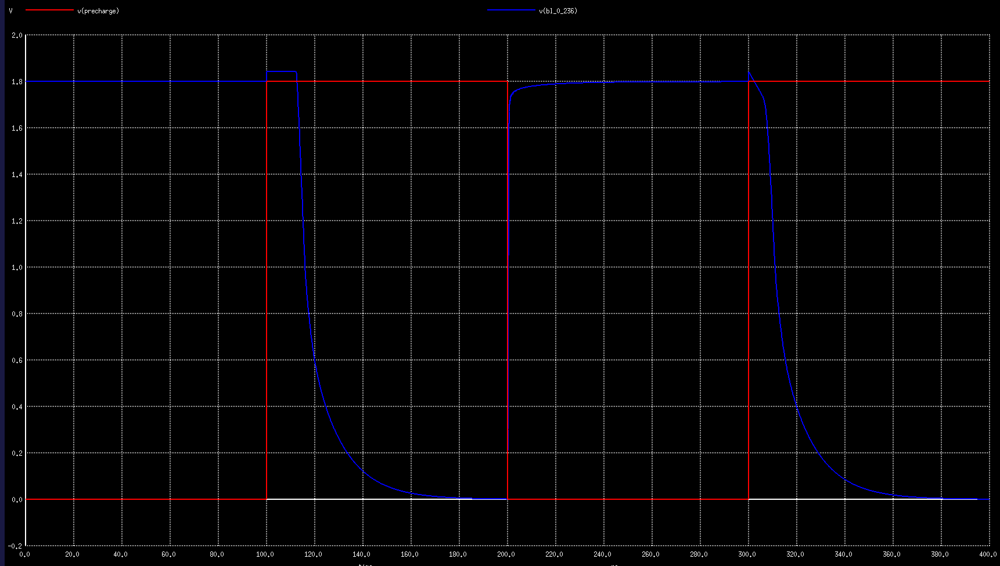
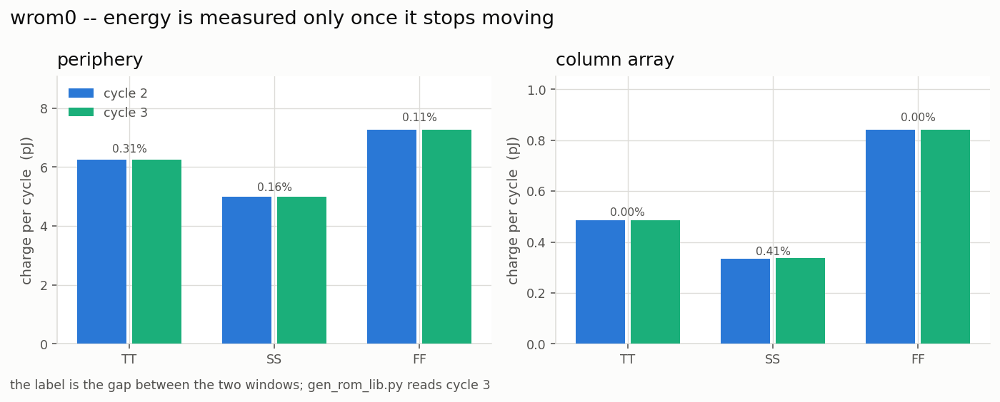
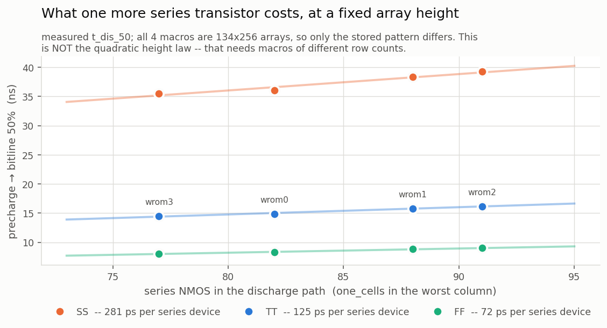

# openram-rom-libgen

Automated **timing and power characterization** for ROM macros built with
[OpenRAM](https://github.com/VLSIDA/OpenRAM), and **Liberty (`.lib`)
generation** from the result.

OpenRAM's own characterizer only writes a `.lib` for SRAM; its ROM compiler
emits just `.sp` / `.v` / `.lef` / `.gds`. This repository fills that gap: it
builds SPICE testbenches from the macro's own netlist, measures them with
ngspice at three corners, and writes the `.lib` that synthesis and STA need,
plus a behavioural Verilog model carrying the measured timing.

No number in the output is typed by hand -- every one is read back out of a
measurement log.

| deliverable | directory |
|---|---|
| Liberty, three corners per macro | `output/lib/<macro>_<CORNER>.lib` |
| behavioural model with measured timing | `output/verilog/<macro>.v` |

Override the root with `ROM_OUT_DIR`.

---

## Quick start

```sh
# 1. point the flow at your macros (default: <repo>/examples)
export ROM_MACROS_DIR=/path/to/your/macros
python3 scripts/rom_char/rom_paths.py --list

# 2. check one macro has everything the flow needs
python3 scripts/rom_char/rom_paths.py --check <macro>

# 3. tell the tools where ngspice, magic and the PDK are
export NGSPICE_BIN=ngspice
export MAGIC_BIN=magic
export PDK_ROOT=$HOME/OpenLane/pdks
export OPENRAM_TECH=$HOME/OpenRAM/technology

# 4. run the flow (see "The flow" below for what each step does)
./scripts/rom_char/run_cap_extract.sh <macro>
./scripts/rom_char/run_col_timing.sh
./scripts/rom_char/run_backend_delay.sh
./scripts/rom_char/run_periphery_power.sh
./scripts/rom_char/run_addr_setup.sh
./scripts/rom_char/run_col_power.sh
./scripts/rom_char/run_col_energy.sh
./scripts/rom_char/regen_rom_libs.sh
python3 scripts/rom_char/gen_macro_behavioral_v.py
```

If you only want to look around without a simulator, everything in
[Understanding the macro](#understanding-the-macro) works on the netlist alone.

---

## Understanding the macro

### The cell array is a NAND chain


A bitline is not one transistor per row tied to ground -- it is every cell of
that column **in series**, from the bitline contact at the top down to a single
foot transistor at the bottom. There are two cell types:

```
one_cell   : X0 D G S gnd    -> drain and source are DIFFERENT nets = a real transistor
zero_cell  : X0 S G S gnd    -> drain and source are the SAME net   = a permanent short
```


Every cell position holds a physical transistor. What programs the bit is
whether a metal strap shorts its source to its drain. **That strap is the
stored data** -- the via pattern you can see in the layout is the ROM contents.


### How a read works

During evaluate, **all wordlines stay HIGH except the selected one**, which is
driven LOW. So the chain conducts through dozens of pass transistors:

| cell in the selected row | when its wordline goes low | chain | bitline | read |
|---|---|---|---|---|
| `one_cell` (transistor) | turns **off** | broken | stays at VDD | **1** |
| `zero_cell` (strap) | strap does not care | conducts | discharges | **0** |

This is also why the macro is slow: the discharge current flows through ~80
series transistors, so the bitline behaves as a distributed RC line and the
delay grows roughly **quadratically** with the chain length.

You can read any column straight out of the netlist:

```
$ python3 scripts/rom_char/rom_explore.py wrom0 --col 236
== wrom0 column 236 -- bitline chain (top to bottom, 134 rows)
   1 = one_cell  (series NMOS, gate=wl) -> resistance in the chain
   0 = zero_cell (source/drain shorted) -> wire only

   r0    1010110101001111101100111111010111001001
   r40   1011110010111001101010010110100110011111
   r80   1000011110011100101010011111101001010100
   r120  11111011111101

   series NMOS count = 82  (real transistors in the discharge path)
```

The column with the most `one_cell`s is the slowest one, and characterization
runs on it. That choice is made by the tools, never by hand.

---

## What is measured, and how


The macro has seven top-level blocks. Six appear in the measurements:

| block | timing | power |
|---|---|---|
| `rom_control_logic` (clock driver + NAND) | periphery deck | yes |
| `rom_row_decode` (address buffers, decoder, wl drivers) | periphery deck | yes |
| `rom_base_array` (cells + precharge) | column deck (worst column) | yes (x columns) |
| `rom_bitline_inverter` | back-end deck | yes (inside the column deck) |
| `rom_column_mux_array` | back-end deck | no |
| `rom_output_buffer` | back-end deck | no |
| `rom_column_decode` (addr[2:0] -> word_sel) | not measured | no |

### `access` is the sum of three measured terms

There is no output latch, so `dout0` is valid only during clk0's high phase,
and the path from clock to data crosses three stages. Each is measured in its
own deck:

| # | term | what | deck | log |
|---|---|---|---|---|
| 1 | front end | `clk0` -> `precharge` | periphery | `periph_active_<corner>.log` (`t_clk2pre`) |
| 2 | bitline | precharge -> bitline 50% | column | `col<N>_worst_case_parasitic*.log` (`t_dis_50`) |
| 3 | back end | bitline -> `dout0` | back end | `backend_<corner>_<load>.log` (`t_bl2dout`) |



Term 2 dominates. The figure shows the same column at all three corners, with
the 50% crossing that defines `t_dis_50` and the 99% recharge that defines
`t_pre`.


The front-end deck also settles the decoder polarity by measurement rather than
assumption: after clk0 rises, the selected wordline **falls**. That is what
justifies holding every wordline at VDD in the column deck.


The back-end deck is run once per output load, so the `index_2`
(`total_output_net_capacitance`) axis of the CELL_TABLE is a real measurement
and not three copies of one number. The bitline edge driving it is not a guess
either -- it uses the slope implied by the measured `t_dis_50`/`t_dis_10`.

Also measured: setup (`t_addr2dec*`), leakage (`.op`), per-column energy and
periphery energy, active and idle.

Every measurement uses **real Magic parasitic capacitance** and runs each
corner against its own sky130 models -- no fixed derating factor.

### The scaling trick

The 34k-transistor array is never simulated whole:

* **column slice** -- the worst column is isolated by walking the extracted
  netlist graph, measured, and the result multiplied by the column count
  (leakage, energy);
* **periphery slice** -- the array is deleted and its load (cell gate count x
  measured gate capacitance + parasitic wire C) is put back as a lump.

So runtime does not explode as the macro grows.



Energy is measured as the charge drawn from the supply over a cycle, and the
last two cycles are compared: equal values are the proof that the circuit has
settled.

### Predicting a geometry change



Access scales with the square of the chain length, so changing `words_per_row`
has a predictable cost before anything is simulated.

---

## Size independence

When a ROM is regenerated (different `word_size`, `words_per_row` or `.bin`)
**no script needs editing**. Everything the flow needs is derived:

| fact | source |
|---|---|
| macro list | `<tree>/<macro>/<macro>.sp` directories |
| row / column count | netlist scan (scoped to `*_rom_base_array`) |
| worst column + series chain length | same scan (`one_cell` count) |
| address / data width | LEF pins (`PIN addr0[..]`, `PIN dout0[..]`) |
| word count | size of `rom_configs/<macro>.bin` |
| `word_size` / `words_per_row` | `config/<macro>.py` (cross-check) |

The single source of truth is
[`scripts/rom_char/rom_paths.py`](scripts/rom_char/rom_paths.py). The netlist
wins; if `word_size*8*words_per_row` disagrees with it you get a **warning**,
and if `words_per_row` is not a power of two it tells you the address space
will have holes. Geometry is cached in `<macro>/char/.geometry.json` and
refreshes itself when the netlist changes.

---

## Using your own ROM

A macro directory is expected to look like an OpenRAM ROM output:

```
<macro>/
  <macro>.sp            netlist          (required -- geometry comes from here)
  <macro>.lef           pins + area      (required -- pin list for the .lib)
  <macro>.gds           layout           (needed for parasitic extraction)
  config/<macro>.py     word_size, words_per_row   (optional, cross-check)
  rom_configs/<macro>.bin                (optional, word count for the model)
  char/                 generated decks and logs (created for you)
```

Check it before running anything:

```
$ python3 scripts/rom_char/rom_paths.py --check wrom0
macro directory : /path/to/examples/wrom0

files:
  ok      wrom0.sp                     schematic netlist -- geometry, worst column
  ok      wrom0.lef                    LEF -- pin list, bus widths and area for the .lib
  ok      wrom0.gds                    GDS -- needed by run_cap_extract.sh
  ...
sub-circuits expected by the flow:
  ok      wrom0_rom_base_array               cell array (geometry, worst column)
  ok      wrom0_rom_base_one_cell            cell with a real NMOS (series chain)
  ...
All good -- this macro can go through the flow.
```

The sub-circuit names it looks for are the ones OpenRAM's `rom_compiler`
emits:

```
<macro>_rom_base_array        <macro>_rom_control_logic
<macro>_rom_base_one_cell     <macro>_rom_row_decode
<macro>_rom_base_zero_cell    <macro>_rom_bitline_inverter
<macro>_precharge_cell        <macro>_rom_column_mux_array
                              <macro>_rom_output_buffer
```

If your ROM has the same architecture under different names, adjust those names
in the generators. If it is a **different architecture** -- NOR ROM, latched
output, differential read -- the decks themselves need rethinking: they encode
the precharged-NAND behaviour described above.

---

## Requirements

* Python 3.8+ (no third-party packages)
* **ngspice** -- for the measurement runs
* **Magic** 8.3+ -- for parasitic extraction
* sky130 PDK ngspice models
* an OpenRAM technology tree, for the extraction step only

| variable | default | purpose |
|---|---|---|
| `ROM_MACROS_DIR` | `<repo>/examples` | macro tree |
| `ROM_OUT_DIR` | `<repo>/output` | where `lib/` and `verilog/` are written |
| `NGSPICE_BIN` | `ngspice` | ngspice binary |
| `MAGIC_BIN` | `magic` | magic binary |
| `OPENRAM_TECH` | -- | required by `run_cap_extract.sh` |
| `PDK_ROOT` | `~/OpenLane/pdks` | where sky130A lives |
| `SKY130_LIB` | `$PDK_ROOT/sky130A/libs.tech/ngspice/sky130.lib.spice` | model file |
| `JOBS` | `4` | parallel ngspice runs |
| `LOADS` | `1.7225 6.89 27.56` | `.lib` CELL_TABLE output load points (fF) |
| `ROM_CORNERS` | `tt:1.8:25:38.2 ss:1.6:100:19.1 ff:1.95:-40:60.7` | corner:VDD:temp:fmax(MHz) |

---

## The flow

```sh
# 1) real parasitic C extraction (Magic; once per macro, slow)
./scripts/rom_char/run_cap_extract.sh wrom0        #  -> wrom0_cap_only.spice

# 2) column timing: bitline discharge + precharge, three corners
./scripts/rom_char/run_col_timing.sh               #  -> col<N>_worst_case_parasitic*.log

# 2b) optional: per-cell wire resistance, and a deck that includes it
python3 scripts/rom_char/gen_resistance_model.py wrom0
python3 scripts/rom_char/gen_col_tb_parasitic.py wrom0 --with-resistance

# 3) back-end delay + output slew, three corners x three loads
./scripts/rom_char/run_backend_delay.sh            #  -> backend_<corner>_<load>.log

# 4) periphery energy (active/idle) + cell gate capacitance
JOBS=4 ./scripts/rom_char/run_periphery_power.sh   #  -> periph_{active,idle}_<corner>.log

# 5) address setup (needs the cellgate log from step 4)
./scripts/rom_char/run_addr_setup.sh               #  -> periph_setup_<corner>.log

# 6) column leakage and column energy
./scripts/rom_char/run_col_power.sh                #  -> col<N>_leak_<corner>.log
./scripts/rom_char/run_col_energy.sh               #  -> col<N>_energy_<corner>.log

# 7) write the .lib files (reads every log; nothing is entered by hand)
./scripts/rom_char/regen_rom_libs.sh               #  -> output/lib/<macro>_<CORNER>.lib

# 8) behavioural Verilog
python3 scripts/rom_char/gen_macro_behavioral_v.py #  -> output/verilog/<macro>.v
```

Every script takes macro names as arguments; with none, **every macro in the
tree** is processed:

```sh
./scripts/rom_char/run_backend_delay.sh wrom1 wrom2
ROM_MACROS_DIR=/path/to/macros ./scripts/rom_char/regen_rom_libs.sh
```

Steps 2-6 are independent of each other (5 depends on 4); step 7 needs them
all. Step 1 is the slow one (tens of minutes); steps 4 and 5 take a few minutes
per corner, the rest are seconds.

### When something goes wrong

| symptom | cause |
|---|---|
| `regen_rom_libs.sh` prints `missing measurement (...)` | that step has not been run, or its ngspice run failed -- the message names the term |
| `no setup measurement -> using pessimistic bound` | step 5 was skipped; the `.lib` is safe but pessimistic |
| `ERROR: ... _cap_only.spice does not exist` | step 1 has not been run for that macro |
| `no cellgate log (run run_periphery_power.sh first)` | step 5 was run before step 4 |
| `WARNING: config says ... columns, netlist has ...` | the config and the layout disagree; the netlist is used |
| a measurement is `FAILED` in a summary table | the ngspice run did not converge -- look at the `.log` in `char/` |

---

## Files

| file | job |
|---|---|
| `rom_paths.py` | path resolution + geometry (single source of truth), pre-flight check |
| `common.sh` | shared base for `run_*.sh`: paths, corners, `macro_list`, `load_geom`, `meas` |
| `find_worst_column.py` | finds the worst column and its series chain from the netlist |
| `rom_explore.py` | array structure summary, column histogram, row map |
| `run_cap_extract.sh` | capacitance-only parasitic extraction with Magic |
| `gen_col_tb_parasitic.py` | isolated testbench for the worst column (graph walk, name independent) |
| `gen_resistance_model.py` | per-cell series wire resistance: Magic per cell + analytic where it segfaults |
| `make_corner_variant.py` | SS/FF variant of the TT deck (identical circuit) |
| `run_col_timing.sh` | ties those two together: column timing at three corners |
| `gen_backend_delay_tb.py` / `run_backend_delay.sh` | bitline -> `dout0` and output slew vs load |
| `gen_cell_gate_tb.py` | equivalent cell gate capacitance (`C = Q(VDD)/VDD`) |
| `gen_periphery_power_tb.py` / `run_periphery_power.sh` | periphery energy (cs0=0/1), front-end delay, setup |
| `run_addr_setup.sh` | `addr0` -> decoder NAND input setup measurement |
| `gen_col_power_tb.py` / `run_col_power.sh` / `run_col_energy.sh` | column leakage (`.op`) and column energy |
| `gen_power_tb.py` | brute-force full-macro deck, for cross-checks only |
| `gen_rom_lib.py` | LEF + measured values -> Liberty |
| `gen_macro_behavioral_v.py` | behavioural `.v` that reports timing violations |
| `regen_rom_libs.sh` | the top-level script that ties the flow together |

Figures live in `docs/img/`; see [`docs/img/README.md`](docs/img/README.md) for
what each one must show and how to capture it.

---

## Known limitations

Ordered by how much they can move a number:

1. **The column deck misses array-level parasitics.** It carries the parasitic
   Cs inside the cell sub-circuits, but not the C elements at the
   `*_rom_base_array` level (bitline wire and inter-column coupling). On the
   example macros those sum to about +3 fF against the ~5 fF the deck does
   carry, so the bitline term -- the largest term of `access` -- is somewhat
   optimistic. The back-end and periphery decks already handle this with an
   explicit alive/dead + negative-net-capacitance rule; porting that rule into
   `gen_col_tb_parasitic.py` is the obvious next fix.
2. **`rom_column_decode` is never measured.** The mux select is an ideal source
   in the back-end deck. The margin is large (14-43 ns of bitline against maybe
   1 ns for an 8-way precharged decoder) but it is unproven.
3. **Wire resistance is measured but not yet switched on by default.** Magic
   segfaults extracting resistance for the whole macro, so
   `gen_resistance_model.py` extracts it per cell (where Magic is happy) and
   computes it from the .mag geometry plus the PDK sheet resistances where it
   is not. On the example macros: 505 ohm per `one_cell`, 0.24 ohm per
   `zero_cell` strap, 41.5 kohm over the worst chain. Feeding that into the
   column deck (`gen_col_tb_parasitic.py --with-resistance`) moves the bitline
   term by **+15% at TT, +6.6% at SS, +28% at FF** -- so the committed .lib
   files are optimistic by that much. The wordline is not affected: the array
   straps it to metal every 8 columns (33 polycont per row, 8.16 um apart), so
   only ~1.3 kohm of poly is ever in series and its RC is in the tens of
   picoseconds.
4. **The `index_1` (input slew) axis is flat** -- all three rows of the
   CELL_TABLE carry the same value. Only the load axis is measured.
5. **Input pin capacitances are analytic estimates** from gate widths
   (`PIN_CAP` in `gen_rom_lib.py`), not measurements.
6. **Energy assumes every column discharges every cycle** (all wordlines held
   high), which is pessimistic by roughly 2x against random data.
7. **Periphery leakage is not counted** -- `cell_leakage_power` covers the
   column array only.
8. **One column and one dout bit** are measured and applied to every bit.

---

## `examples/`

`wrom0`..`wrom3`: four ROM macros built on sky130 (1064 words x 32 bit, 134
rows x 256 columns) with all of their characterization logs. Use them to study
the flow without ngspice, or to check a change end to end -- regenerate and
compare against what is committed in `output/`:

```sh
./scripts/rom_char/regen_rom_libs.sh && git diff --stat output/
```
