# openram-rom-libgen

**Timing and power characterization for OpenRAM ROM macros, and the Liberty
(`.lib`) + behavioural Verilog generated from it.**

OpenRAM's characterizer writes a `.lib` for SRAM only; its ROM compiler emits
just `.sp` / `.v` / `.lef` / `.gds`. This repository builds SPICE decks from
the macro's own netlist, measures them with ngspice at three corners, and
writes the files synthesis, STA and simulation need.

**No number in the output is typed by hand** -- every one is read back out of
a measurement log. **No figure is drawn by a plotting tool** -- every waveform
is ngspice's own plot of its own simulation.

| deliverable | path | written by |
|---|---|---|
| Liberty, three corners per macro | `output/lib/<macro>_<CORNER>.lib` | `regen_rom_libs.sh` -> `gen_rom_lib.py` |
| behavioural model with measured timing | `output/verilog/<macro>.v` | `gen_macro_behavioral_v.py` |

Deeper reading: [the macro](docs/macro.md) · [measurement names](docs/naming.md)
· [what is measured](docs/measurements.md) · [flow and files](docs/flow.md)
· [your own ROM](docs/your-rom.md) · [limitations](docs/limitations.md)

---

## 1. The ROM macro

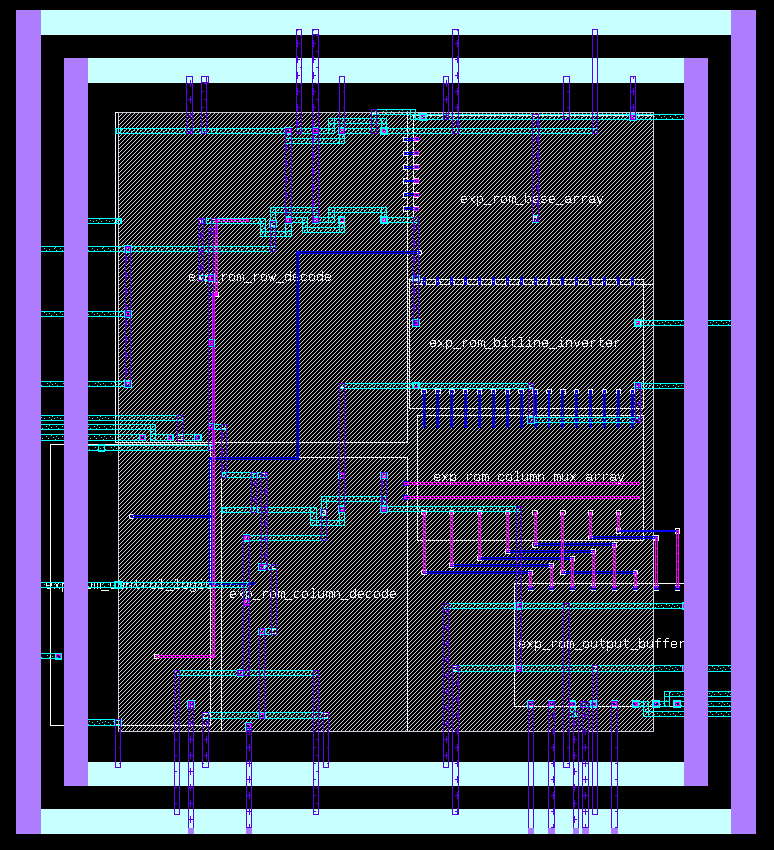

Seven top-level blocks: `rom_control_logic`, `rom_row_decode`,
`rom_column_decode`, `rom_base_array`, `rom_bitline_inverter`,
`rom_column_mux_array`, `rom_output_buffer`.

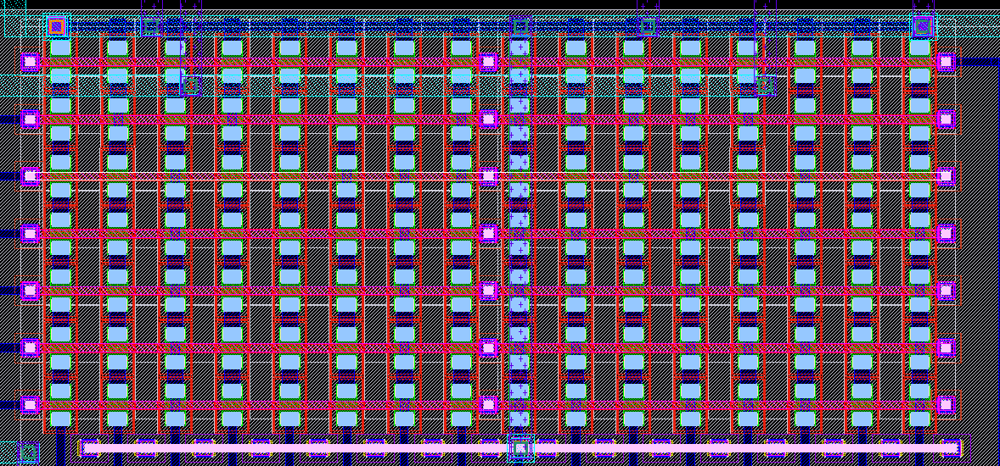

What makes it unlike an SRAM, and what every model below has to respect:

* **A bitline is the entire column in series** -- ~80 NMOS in the discharge
  path, so the delay grows roughly *quadratically* with chain length.
* **The stored bit is a metal strap.** Every cell position holds a real
  transistor; a `zero_cell` shorts its source to its drain, a `one_cell` does
  not.

| `rom_base_one_cell` | `rom_base_zero_cell` |
|---|---|
| 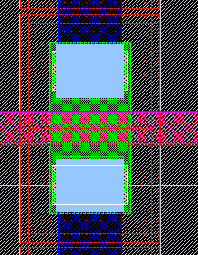 | 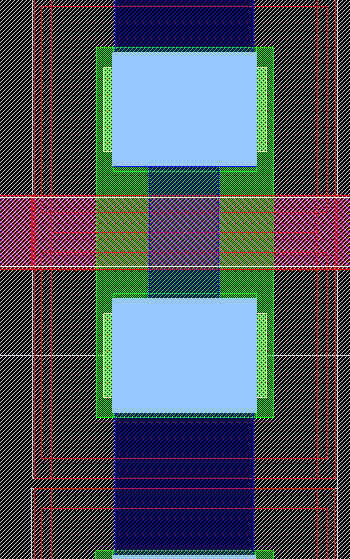 |
| wordline falls -> chain breaks -> bitline stays high -> reads **1** | strap does not care -> chain conducts -> bitline discharges -> reads **0** |

* **All wordlines stay HIGH except the selected one**, which is driven LOW.
* **There is no latch anywhere** -- no dff, no sense amp, no replica column in
  the extracted cell inventory. `dout0` is valid only while `clk0` is high.
* **The bitline is a dynamic node.** Nothing drives it high during evaluate,
  so the ROM has a *minimum* clock frequency as well as a maximum, and the
  discharge is **irreversible**: an address change mid-evaluate ANDs the rows.

`access` is therefore a sum of three separately measured terms:

| # | term | deck | measurement |
|---|---|---|---|
| 1 | `clk0` -> `precharge` | periphery | `t_clk2pre` |
| 2 | precharge -> bitline 50% | column | `t_dis_50` -- **dominates** |
| 3 | bitline -> `dout0` | back end | `t_bl2dout` |

Names like `t_clk2wl` read *time, from `clk0`, to the wordline*: see
[Reading a measurement name](docs/naming.md).

---

## 2. How each block is modelled

The 34 000-transistor macro is never simulated whole -- it does not converge.
Each block gets its own reduced deck, and the terms are added back in the
`.lib`.

| block | deck | what is kept, what is replaced |
|---|---|---|
| `rom_base_array` | **column** `col<N>_worst_case_parasitic*.sp` | one real column -- the one with the most `one_cell`s, chosen by a netlist scan. Every wordline held at DC VDD. Result x column count for energy and leakage. |
| `rom_control_logic`, `rom_row_decode` | **periphery** `periph_active_<corner>.sp` | the real logic; the array is **deleted and put back as a lump** -- cell gate count x measured gate C + parasitic wire C |
| `rom_bitline_inverter`, `rom_column_mux_array`, `rom_output_buffer` | **back end** `backend_<corner>_<load>.sp` | the real read path, driven by a bitline edge whose slope comes from the measured `t_dis_50`/`t_dis_10`; run once per `.lib` output load |
| `rom_column_decode` | **coldec** `coldec_a<addr>_<corner>.sp` | hangs off the same precharge net as the bitline, so the middle term is `max(bitline, column decode)`, not their sum |
| every repeated block, leakage | **block slices** `periph_leak_cs<n>_<corner>_g<gmin>.sp` | one instance of each block on its own supply source, so a single `.op` reports every block's current on a separate branch; x a count from the netlist |
| one cell's gate | `cellgate_<corner>.sp` | the lump the periphery deck loads itself with -- `c_one_ff`, `c_zero_ff` |

Every deck uses **real Magic parasitic capacitance** and runs each corner
against its own sky130 models. No fixed derating factor.

### The column: bitline discharge and precharge

```bash
./scripts/rom_char/run_col_timing.sh wrom0
ngspice examples/wrom0/char/col236_worst_case_parasitic.sp
```
```
ngspice 1 -> run
ngspice 2 -> plot v(precharge) v(bl_0_236)
```

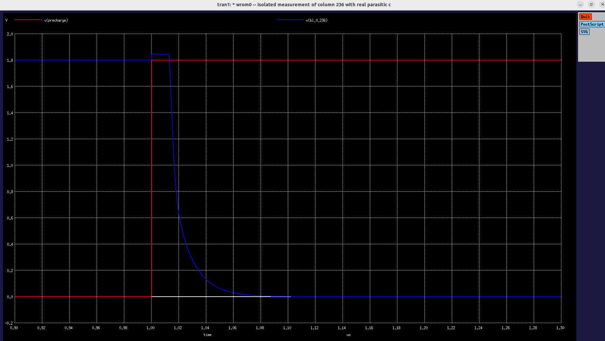

### The periphery front end: clk0 -> internal clock -> wordline -> precharge

```bash
./scripts/rom_char/run_periphery_power.sh wrom0
ngspice examples/wrom0/char/periph_active_tt.sp
```
```
ngspice 1 -> run
ngspice 2 -> plot v(clk0) v(wrom0_rom_row_decode_0/clk) v(wrom0_rom_row_decode_0/wl_0) v(wrom0_rom_column_decode_0/clk)
```

The selected wordline **falls** -- the decoder polarity is settled by this
measurement, not assumed.

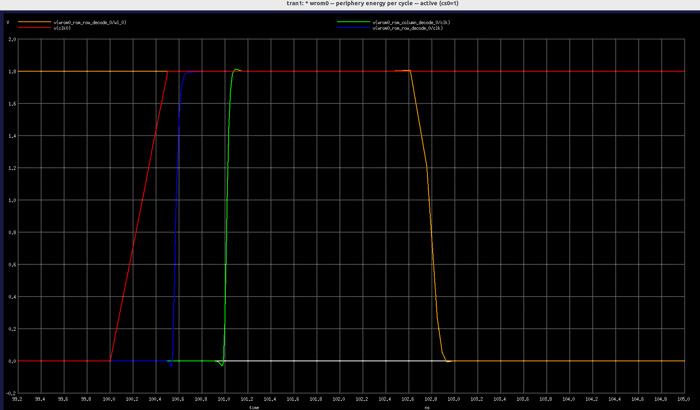

### The back end: bitline -> dout0, at one of the three `.lib` loads

```bash
./scripts/rom_char/run_backend_delay.sh wrom0
ngspice examples/wrom0/char/backend_tt_2756.sp
```
```
ngspice 1 -> run
ngspice 2 -> plot v(wrom0_rom_base_array_0/bl_0_236) v(dout0[2])
```

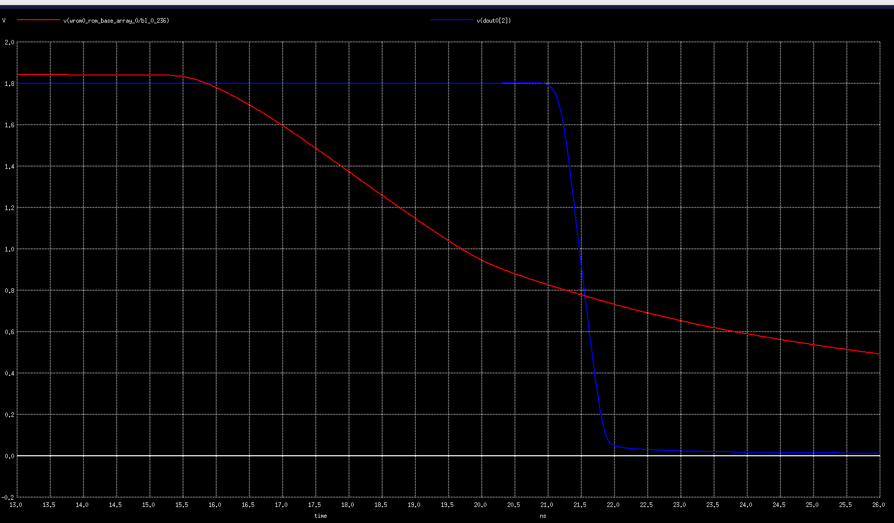

### The column decoder, against the discharge it races

```bash
./scripts/rom_char/run_coldec_delay.sh wrom0
ngspice examples/wrom0/char/coldec_a0_tt.sp
```
```
ngspice 1 -> run
ngspice 2 -> plot v(wrom0_rom_column_decode_0/clk) v(wrom0_rom_column_decode_0/wl_0)
```

`t_pre2sel` must land before `t_dis_50`, otherwise the middle term of `access`
is the decoder and the script says so.

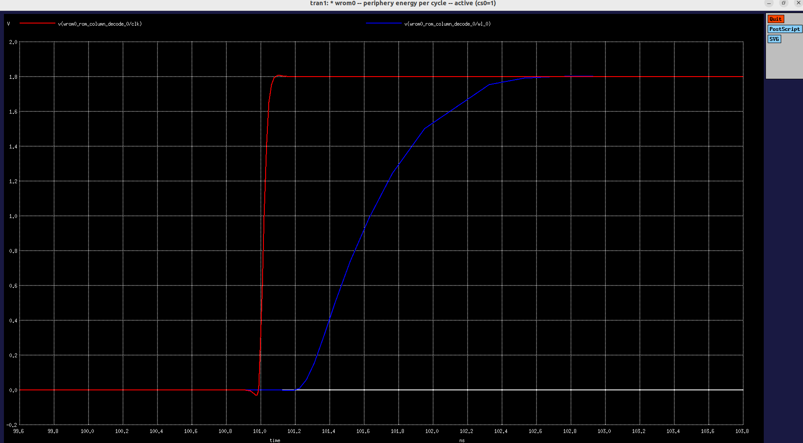

### Leakage and energy: current, not voltage

```bash
./scripts/rom_char/run_col_energy.sh wrom0
ngspice examples/wrom0/char/col236_energy_tt.sp
```
```
ngspice 1 -> run
ngspice 2 -> plot i(vvdd)
```

Energy is `q_c3 x VDD` -- the charge integrated over the **third** cycle, so
the deck has settled. Cycle 1 is never used.

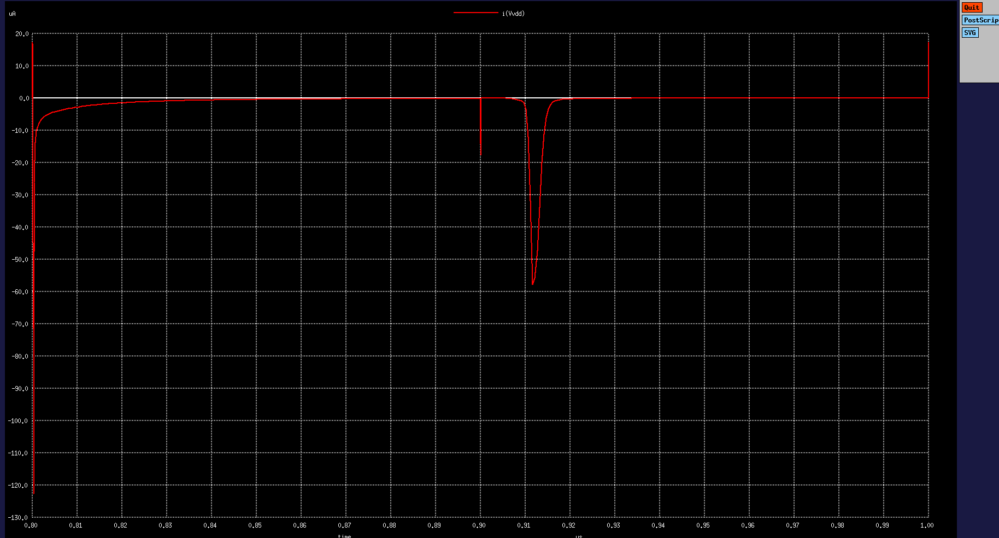

---

## 3. Pin capacitance, and slew

### Input pin capacitance -- the `capacitance` attribute of every input pin

Each pin is ramped 0 -> VDD on its own and the charge it has to supply is
integrated: **C = Q/VDD**. That captures the whole load -- the pin's wire C,
the gate C of the first stage, and the Miller charge pushed back through that
stage as it switches.

* **Both edges are measured.** `c_rise` and `c_fall` should agree; a pin where
  they do not is state dependent and no single Liberty scalar can represent
  it. The summary prints the gap and ships the **larger** of the two.
* **`c_cyc` is the number that ships** -- one full `0 -> VDD -> 0`.
* **The whole periphery stays in the deck**: `addr0[0:2]` go to the column
  decoder, `addr0[3:]` to the row decoder, `clk0`/`cs0` to the control logic,
  so removing any block would leave some pin driving nothing.

```bash
./scripts/rom_char/run_pin_cap.sh wrom0
ngspice examples/wrom0/char/pincap_tt.sp
```
```
ngspice 1 -> run
ngspice 2 -> plot v(clk0) i(vpin1)
```

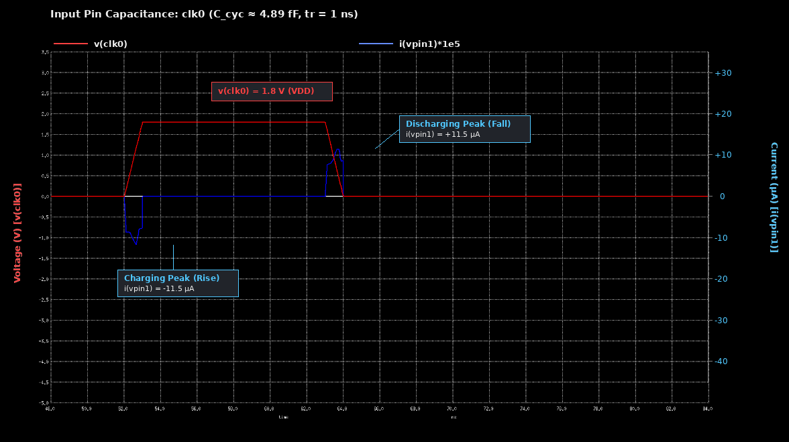

Two cross-checks, both expensive, neither producing a number the `.lib` needs:

```bash
PIN_TR=2n ./scripts/rom_char/run_pin_cap.sh wrom0     # ramp independence
GOLDEN_PINS="clk0,addr0[0],addr0[9]" ./scripts/rom_char/run_pin_cap.sh wrom0
```

The second is the **golden reference**: nothing deleted, no lumped load
anywhere. Hours, ~15 GB. `tests/run_tests.sh` reports its deviation as a
warning, never a failure. Every other check is *self-consistency* -- it bounds
how far an answer moves when a knob moves, and is structurally blind to an
error every variant shares.

### Wordline slew -- how fast a wordline really falls

The column deck cannot answer this: it holds every wordline at DC VDD. The
periphery deck can -- real decoder, real buffers, and the deleted array's load
put back as one cell gate per column plus the wordline's own wire C.

| measurement | what it is |
|---|---|
| `t_wlfall0` | `clk0` 50% -> wordline 50% (delay) |
| `t_wlslew0` | 80% -> 20% fall -- the sky130 Liberty convention |
| `t_wl1090_0` | 90% -> 10% fall |
| `tf` | `t_wl1090_0 / 0.8` -- the ramp to feed a PULSE/PWL |

```bash
./scripts/rom_char/run_wl_slew.sh wrom0
ngspice examples/wrom0/char/wlslew_tt.sp
```
```
ngspice 1 -> run
ngspice 2 -> plot v(clk0) v(wrom0_rom_row_decode_0/wl_0)
```

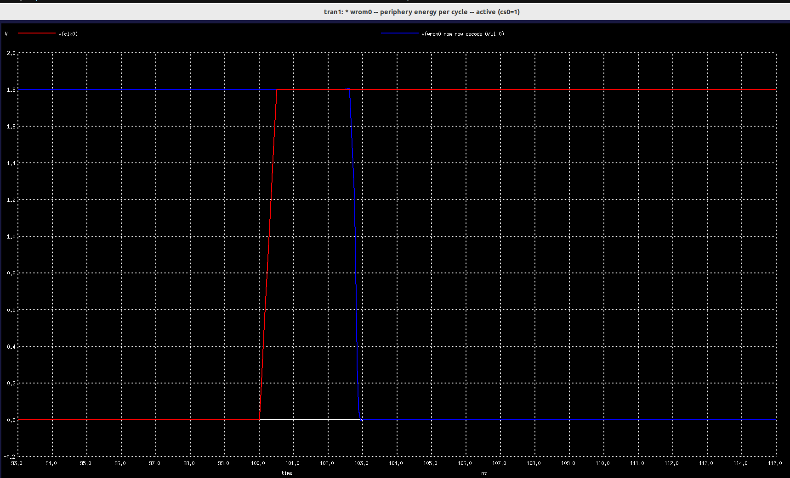

### Output slew, and the two `.lib` table axes

`t_dout_slew` comes from the same back-end deck as `t_bl2dout`, so the
CELL_TABLE's `index_2` (output load) is three measurements, not one number
copied three times. `index_1` (input transition) comes from a clk0 slew sweep:

```bash
SLEWS="0.05 0.5 1.5" ./scripts/rom_char/run_slew_sweep.sh wrom0
ngspice examples/wrom0/char/periph_slew0_tt.sp
```
```
ngspice 1 -> run
ngspice 2 -> plot v(clk0) v(wrom0_rom_column_decode_0/clk)
```

Only term 1 of `access` depends on the clk0 edge -- terms 2 and 3 trigger off
the precharge net and the bitline, which cannot see clk0. That is also why the
output slew table stays flat over `index_1`.

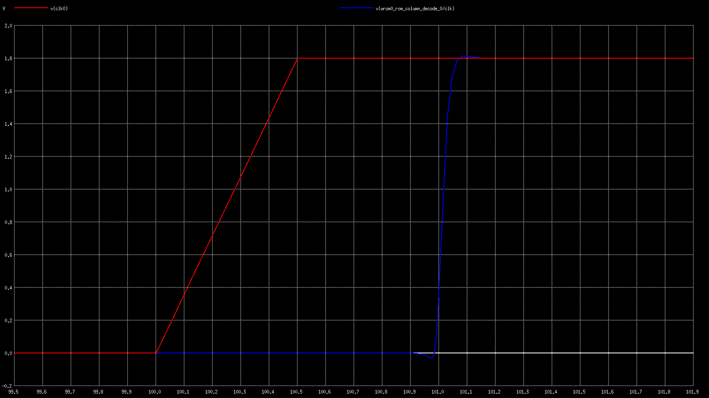

### Address setup

```bash
./scripts/rom_char/run_addr_setup.sh wrom0
ngspice examples/wrom0/char/periph_setup_tt.sp
```
```
ngspice 1 -> run
ngspice 2 -> plot v(addr0[0]) v(clk0)
```

`t_addr2dec*` is address pin -> the decoder output it drives; the worst of
them becomes the setup constraint.

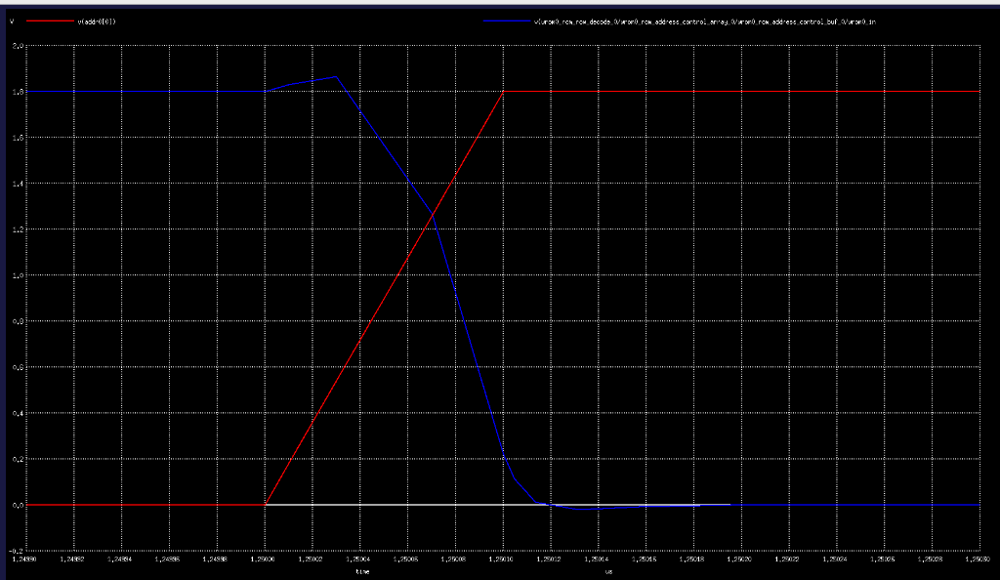

---

## 4. The `.lib`: how it is built, and how it is checked

### Built

`regen_rom_libs.sh` reads every term out of a log and passes it to
`gen_rom_lib.py --measured`. Under `--measured` the analytic BASE table and
the corner derating factors are **not** applied -- the value already belongs
to that corner, so multiplying would double count.

| `.lib` content | source |
|---|---|
| `cell_rise`/`cell_fall` on `dout0`, rising_edge arc | `t_clk2pre` + `max(t_dis_50, t_pre2sel)` + `t_bl2dout` |
| the **falling_edge arc** -- clk0 falls, data gone | `t_clk2pre + t_pre_50 +` smallest-load `t_bl2dout` |
| output slew tables | `t_dout_slew` |
| `min_pulse_width` rise / fall, `minimum_period` | evaluate window; `t_pre_99` |
| `setup_rising` | worst `t_addr2dec*` |
| `capacitance` per input pin | `c_cyc<i>_ff` |
| leakage | column `.op` x columns + periphery block slices, same clk0 state so they add |
| energy, active and idle | `e_col_pj` x columns + `e_periph_pj`; idle from the `!cs0` deck |
| pins, bus widths, area | the macro's LEF |

The falling-edge arc is not optional: without it STA reads an unlatched ROM as
if it held its output, and reports a false pass.

`t_pre` uses `t_pre_99`, not `t_pre_90` -- 90% recharge comes out ~0.5 ns and
would write a `min_pulse_width(fall)` 20x too small.

### Checked

```bash
./tests/run_tests.sh                 # output/lib/*.lib
./tests/run_tests.sh path/to/x.lib
```

Four layers, in order, exit status 1 if any fails:

| layer | what it proves |
|---|---|
| `test_checker.py` | the checker still catches the 11 planted defects in `tests/fixtures/`. A validator nobody validates turns every run green. |
| `check_lib.py` | **is this valid Liberty?** Syntax with a line number; table shape against the `lu_table_template` it names; monotonic `index_1`/`index_2`; every `timing()` has a known `timing_type`; delay arcs have all four tables; `related_pin` names a pin that exists; bus width matches its slice; no duplicate arcs; no negative delays; the pg_pin / `voltage_map` chain actually connects. |
| `test_rom_lib.py` | **does it say what this ROM does?** The falling-edge arc, the constraints, both power states, corner ordering. |
| OpenSTA | our parser checking our writer is a closed loop. This opens it, with the parser a consumer really uses. Skipped with a notice if `sta` is absent -- set `STA_BIN`. |

A fifth layer, `test_pin_cap.py`, compares the pin-cap deck against the golden
reference and **warns, never fails**.

---

## 5. The behavioural Verilog: why, and how

### Why it is generated

The `<macro>.v` OpenRAM ships comes from the **SRAM** template and models the
timing wrongly:

```verilog
always @(posedge clk0) begin cs0_reg = cs0; addr0_reg = addr0; ... end
always @(negedge clk0) if (cs0_reg) dout0 <= #(DELAY) mem[addr0_reg];
// "All inputs are registers"  +  "FIXME: This delay is arbitrary"
```

Both assumptions are false here. The extracted cell inventory contains **no
dff, latch, sense_amp, replica_column or delay_chain** -- the read element is
a plain inverter. The inputs are not registered and the output is not
registered. Anything simulated against that model, gate level included, never
sees the ROM's dynamic behaviour: neither an address changing mid-evaluate,
nor the data disappearing when `clk0` falls.

### How it is generated

```bash
python3 scripts/rom_char/gen_macro_behavioral_v.py            # every macro
python3 scripts/rom_char/gen_macro_behavioral_v.py wrom0
python3 scripts/rom_char/gen_macro_behavioral_v.py --corner TT_1p8V_25C
```

Nothing is typed by hand -- the three timing parameters are read back out of
the macro's own `.lib`, defaulting to **SS**, the worst corner, so the model
stays pessimistic:

| parameter | read from the `.lib` |
|---|---|
| `ACCESS_NS` | `TOTAL (worst load)` in the header |
| `T_PRE_NS` | `min_pulse_width` fall_constraint |
| `SETUP_NS` | the first `setup_rising` value |

Geometry (`DEPTH`, `WIDTH`, address bits, rows x columns) comes from
`rom_paths.py` -- netlist, LEF and config, one source. So after regenerating
the `.lib`s, rerunning this script is all it takes.

The model reproduces what the silicon does, and reports it with `$display`
when `REPORT=1`: data valid only while `clk0` is high, a setup violation on
an address that moved too late, a short precharge phase, and the
**irreversible discharge** -- an address changing during evaluate yields the
bitwise AND of every row selected in that phase. Ones do not come back.

### Syntax check

The generator itself refuses to write a file it cannot fill: a missing `.lib`
value or unreadable geometry is a warning and a skipped macro, with a non-zero
exit status, never a file with a placeholder in it.

The Verilog is **simulation only** -- not synthesizable; the ASIC flow reads
`<macro>_bbox.v`. Check it with any simulator, e.g.:

```bash
iverilog -g2012 -o /tmp/rom.vvp output/verilog/wrom0.v && echo "syntax OK"
```

---

## Quick start

```bash
export ROM_MACROS_DIR=/path/to/your/macros     # default: <repo>/examples
export NGSPICE_BIN=ngspice MAGIC_BIN=magic
export PDK_ROOT=$HOME/OpenLane/pdks OPENRAM_TECH=$HOME/OpenRAM/technology

python3 scripts/rom_char/rom_paths.py --check <macro>   # macro has what the flow needs?

./scripts/rom_char/run_cap_extract.sh <macro>  # 1  parasitics (Magic, slow)
./scripts/rom_char/run_col_timing.sh           # 2  bitline discharge + precharge
./scripts/rom_char/run_backend_delay.sh        # 3  bitline -> dout, x3 loads
./scripts/rom_char/run_periphery_power.sh      # 4  periphery energy + cell gate C
./scripts/rom_char/run_addr_setup.sh           # 5  address setup
./scripts/rom_char/run_col_power.sh            # 6  column leakage
./scripts/rom_char/run_col_energy.sh           # 6  column energy
./scripts/rom_char/run_periphery_leak.sh       # 6b periphery leakage, gmin-swept
./scripts/rom_char/run_coldec_delay.sh         # 7  column decode vs discharge
./scripts/rom_char/run_pin_cap.sh              # 7  pin capacitances
./scripts/rom_char/regen_rom_libs.sh           # 8  write the .lib files
./tests/run_tests.sh                           # 9  validate them
python3 scripts/rom_char/gen_macro_behavioral_v.py
```

Step detail, per-script logs and troubleshooting:
[Requirements, the flow, and the files](docs/flow.md). Without a simulator,
[Understanding the macro](docs/macro.md) works on the netlist alone.

> A figure that shows as broken has not been captured yet -- the command above
> it is how to reproduce it. Figure conventions: [docs/img/README.md](docs/img/README.md).
