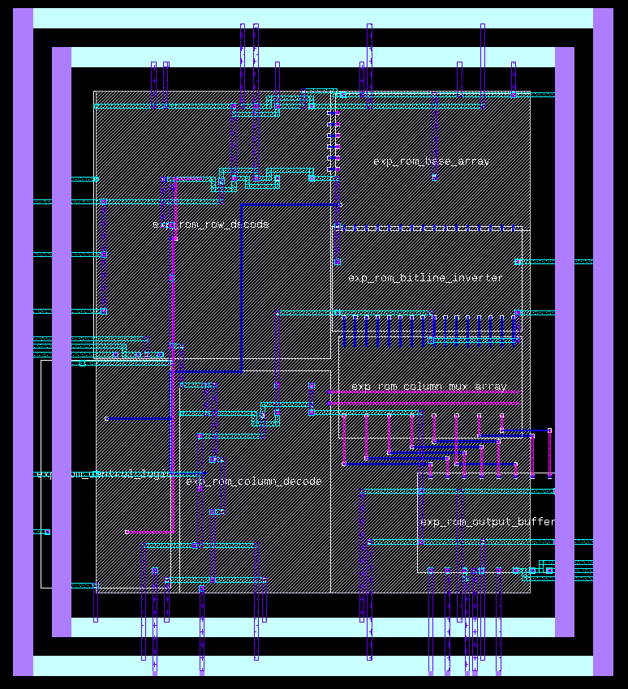
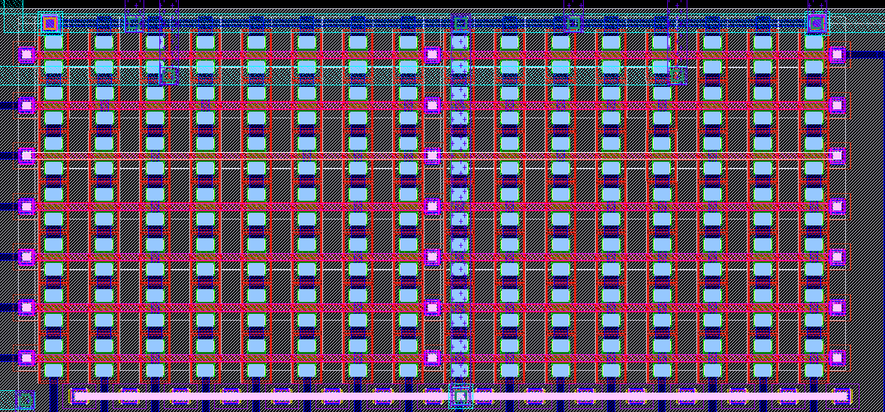
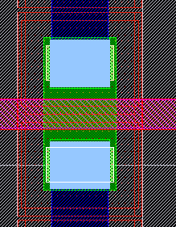
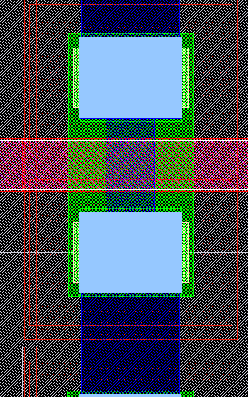
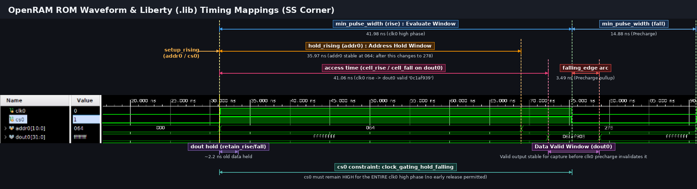

# openram-rom-libgen

**Timing and power characterization for OpenRAM ROM macros, and the Liberty
(`.lib`) + behavioural Verilog generated from it.**

---

## Contents

**Start here:** [How to use (Quick Start)](#how-to-use) ·
[Step-by-step Usage (docs/usage.md)](docs/usage.md) ·
[Requirements & Setup (docs/requirements.md)](docs/requirements.md) ·
[Flow Details (docs/flow.md)](docs/flow.md) ·
[ROM Delay Tuning (docs/rom-tuning.md)](docs/rom-tuning.md)

- [Overview & Deliverables](#overview)
- [How to use (Quick Start)](#how-to-use)
- [Using your own ROM (docs/usage.md)](docs/usage.md)
- [Requirements & Environment Setup (docs/requirements.md)](docs/requirements.md)
- [Tuning ROM Access Delay (docs/rom-tuning.md)](docs/rom-tuning.md)
1. [The ROM macro](#1-the-rom-macro)
2. [How each block is modelled](#2-how-each-block-is-modelled)
   - [Parasitics](#parasitic-extraction--resistance-modelling)
   - [The column](#the-column-bitline-discharge-and-precharge)
   - [Front end](#the-periphery-front-end-clk0---internal-clock---wordline---precharge)
   - [Back end](#the-back-end-bitline---dout0-at-one-of-the-three-lib-loads)
   - [Column decoder](#the-column-decoder-against-the-discharge-it-races)
   - [Leakage](#leakage-and-energy-current-not-voltage)
   - [Read energy](#dynamic-read-energy-the-average-of-10-random-reads-not-the-worst-case)
3. [Pin capacitance, and slew](#3-pin-capacitance-and-slew)
   - [Input pin C](#input-pin-capacitance----the-capacitance-attribute-of-every-input-pin)
   - [Wordline slew](#wordline-slew----how-fast-a-wordline-really-falls)
   - [Output slew](#output-slew-and-the-two-lib-table-axes)
   - [Address setup](#address-setup)
4. [The `.lib`](#4-the-lib-how-it-is-built-and-how-it-is-checked)
   - [Built](#built)
   - [Checked](#checked)
5. [The behavioural Verilog](#5-the-behavioural-verilog-why-and-how)
   - [Why](#why-it-is-generated)
   - [How](#how-it-is-generated)
   - [Syntax check](#syntax-check)

---

## Overview

OpenRAM's characterizer writes a `.lib` for SRAM only; its ROM compiler emits
just `.sp` / `.v` / `.lef` / `.gds`. This repository builds SPICE decks from
the macro's own netlist, measures them with ngspice at three corners, and
writes the files synthesis, STA and simulation need.

Measured timing and power values are read back from simulation logs. When a
measurement is unavailable, the generators either refuse to publish the
output or mark the conservative/analytic fallback explicitly in the generated
file; a file carrying such warnings is not a validated deliverable until
`tests/run_tests.sh` passes. Waveform figures are screenshots of ngspice's own
plot window rather than plots regenerated from the measurement logs.

| deliverable | path | written by |
|---|---|---|
| Liberty, three corners per macro | `output/lib/<macro>_<CORNER>.lib` | `regen_rom_libs.sh` -> `gen_rom_lib.py` |
| behavioural model with measured timing | `output/verilog/<macro>.sv` | `gen_macro_behavioral_v.py` |

### Documentation

| Document | Covers |
|---|---|
| [usage.md](docs/usage.md) | How to use openram-rom-libgen |
| [requirements.md](docs/requirements.md) | EDA tools, Nix environment, and PDK setup |
| [flow.md](docs/flow.md) | Simulation pipeline stages and log files |
| [macro.md](docs/macro.md) | Circuit architecture and block details |
| [measurements.md](docs/measurements.md) | SPICE decks, equations, and waveforms |
| [naming.md](docs/naming.md) | Variable naming grammar in `.measure` |
| [rom-tuning.md](docs/rom-tuning.md) | Reducing ROM access delay via OpenRAM configuration (words_per_row, banking, supplies) |
| [limitations.md](docs/limitations.md) | Known modeling approximations |
| [todos.md](docs/todos.md) | Planned features and improvements |
| [STATUS.md](docs/STATUS.md) | Test results and sign-off status |

> **Current checkout status:** all fifteen Liberty files (`wrom0`-`wrom3` and
> `random_2k`, three corners each) and all five matching `.sv` models pass the
> strict repository test suite, including OpenSTA parsing and behavioural
> simulation. This is a snapshot, not a permanent guarantee; rerun
> `tests/run_tests.sh` after changing or regenerating any output. See
> [`docs/STATUS.md`](docs/STATUS.md) for the resolution and verification details.
>
> This repository validates characterization models; it does not make the
> layout physically clean. The checked-in macro logs currently report DRC
> violations and LVS pin-matching failures. Resolve or formally waive those
> results separately before physical sign-off.

---

## How to use

All commands are run from the root of this repository.

### 1. Prerequisites & Environment

You can supply the toolchain via **Nix** (automatic) or use your **local tools**:

* **With Nix (recommended):**
  ```bash
  nix develop    # Flakes (recommended)
  nix-shell      # Classic Nix
  ```
  *Drops you into a shell with all required EDA binaries pre-configured.*
* **With local tools:** Ensure `python3` (>=3.10), `ngspice` (compiled with KLU), `magic` (>=8.3), `iverilog`, `sta` (OpenSTA), and Sky130 PDK are installed.
  ```bash
  export PDK_ROOT=$HOME/OpenLane/pdks
  export ROM_MACROS_DIR=$(pwd)/user
  export ROM_OUT_DIR=$(pwd)/output
  ```

> 📖 **Full toolchain requirements, ngspice KLU solver details, environment variables, and Nix storage cleanup:** See [docs/requirements.md](docs/requirements.md).

### 2. Verify Setup (Pre-Flight Check)

Check that your environment and macro directory meet all flow prerequisites:

```bash
./flow.py <macro> --check-only
```

### 3. Run Characterization

Put your macro directory under `user/<macro>/` (containing at least `<macro>.sp` and `<macro>.lef`), then run:

```bash
./flow.py <macro>            # Standard mode (conservative hold/slew fallbacks, tens of mins)
./flow.py <macro> --full     # Full mode (measured hold bisection and slew sweep)
```

Outputs written:
* `output/lib/<macro>_<CORNER>.lib` (TT, SS, FF corners)
* `output/verilog/<macro>.sv` (behavioural model with measured timing)

### 4. Continuing After a Failed Step

Use `--from-step` to resume a run at a specific stage without repeating earlier completed simulations:

```bash
./flow.py --list-steps                          # View available stages
./flow.py <macro> --from-step periphery-power  # Resume at specific stage
```

> 📖 **Detailed flow stages, dependencies, logs, and troubleshooting:** See [docs/flow.md](docs/flow.md).

---

## 1. The ROM macro

> **Note:** Layout screenshots below are representative OpenRAM ROM structures for structural illustration; all reported timing and power metrics are derived directly from SPICE simulation logs.



These seven top-level blocks form the architectural backbone of the OpenRAM ROM:
* `rom_control_logic`: Generates internal precharge and timing signals.
* `rom_row_decode`: Decodes row addresses to drive selected wordlines active-low.
* `rom_column_decode`: Decodes column addresses for bitline multiplexer selection.
* `rom_base_array`: Core storage matrix composed of series NAND bitline columns.
* `rom_bitline_inverter`: Inverts and isolates dynamic bitline levels.
* `rom_column_mux_array`: Routes selected bitlines to output buffers.
* `rom_output_buffer`: Drives external output pins (`dout0`).


*`rom_base_array`: Vertical columns are series NAND bitlines; horizontal tracks are wordlines.*

Key characteristics of the **series NAND architecture**:
* **Series Bitlines:** A bitline is the vertical readout path carrying stored cell data to the output. Rather than tapping a shared parallel wire, cells are connected source-to-drain in series, forming a continuous NAND pull-down chain.
* **Mask-Programmed Cells:** A `zero_cell` is shorted by a Metal-1 strap; a `one_cell` is an active NMOS.

| `rom_base_one_cell` (Logic 1) | `rom_base_zero_cell` (Logic 0) |
|---|---|
|  |  |
| Selected wordline LOW $\rightarrow$ NMOS OFF $\rightarrow$ bitline stays high (**1**) | Strap conducts $\rightarrow$ chain closed $\rightarrow$ bitline discharges (**0**) |

* **Dynamic & Unlatched:** No sense amp or latch; `dout0` is valid only while `clk0` is HIGH (+ data hold time).
* **Access Delay:** Total delay is staged: `access = t_clk2pre + t_dis_50 + t_bl2dout` (details in Section 2, [docs/measurements.md](docs/measurements.md), and [docs/naming.md](docs/naming.md)).

> 📖 **Reducing access delay & ROM tuning:** If your macro's read delay is too high, see [docs/rom-tuning.md](docs/rom-tuning.md) for how OpenRAM parameters (specifically `words_per_row` bitline geometry, power ring supplies, and array banking) reduce discharge latency.

---

## 2. How each block is modelled

The 34 000-transistor macro is never simulated whole -- it does not converge.
Each block gets its own reduced deck, and the terms are added back in the
`.lib`.

| block | deck | what is kept, what is replaced |
|---|---|---|
| `rom_base_array` | **column** `col<N>_worst_case_parasitic*.sp` | one real column -- the one with the most `one_cell`s, chosen by a netlist scan. Every wordline held at DC VDD. Result x column count for energy and leakage. |
| `rom_control_logic`, `rom_row_decode` | **periphery** `periph_active_<corner>.sp` | the real logic; the array is **deleted and put back as a lump** -- cell gate count x measured gate C + parasitic wire C |
| `rom_bitline_inverter`, `rom_column_mux_array`, `rom_output_buffer` | **back end** `backend_<corner>_<load>.sp` | the real read path, driven by the column deck's OWN discharge waveform replayed sample for sample; run once per `.lib` output load |
| `rom_column_decode` | **coldec** `coldec_a<addr>_<corner>.sp` | hangs off the same precharge net as the bitline, so the middle term is `max(bitline, column decode)`, not their sum |
| every repeated block, leakage | **block slices** `periph_leak_paired_<corner>.sp` | one instance of each block on its own supply source; one parsed deck changes `gmin` and `cs0` in place and runs every `.op`, then each branch current is multiplied by the netlist-derived count |
| one cell's gate | `cellgate_<corner>.sp` | the lump the periphery deck loads itself with -- `c_one_ff`, `c_zero_ff` |

Every deck uses **real Magic parasitic capacitance** and runs each corner
against its own sky130 models. No fixed derating factor.

### Parasitic extraction & resistance modelling

To accurately capture interconnect delays without encountering tool crashes during full-macro extraction, the flow combines macro-level distributed capacitance extraction (`extresist off`) with an analytical per-cell wire resistance model (`gen_resistance_model.py`). Series wire resistance (~505 $\Omega$ per `one_cell`, ~41.5 $\text{k}\Omega$ over the worst column) is injected directly into the critical discharge deck (`--with-resistance`), shifting access timing by **+15% at TT, +6.6% at SS, and +28% at FF**.

> 📖 **Tool crash rationale, segfault reproduction script, and physical resistance model:** See [docs/limitations.md (Item 3)](docs/limitations.md).

### The column: bitline discharge and precharge

Simulates the worst-case series chain column under extracted capacitance and injected wire resistance. Measures `t_dis_50` (the dominant middle term of `access`, ~88% of total delay) and `t_pre_99` (bitline recharge time, which defines `min_pulse_width(fall)` and the maximum operating frequency).

> 📖 **Detailed SPICE deck, measurement table, and waveforms:** See [docs/measurements.md#the-column-bitline-discharge-and-precharge](docs/measurements.md#the-column-bitline-discharge-and-precharge).

### The periphery front end: clk0 -> internal clock -> wordline -> precharge

Simulates the control logic and address decode path with the bitline array replaced by equivalent lumped RC loads. Measures `t_clk2pre` (first term of `access`), derives internal clock delays, and proves by measurement that selected wordlines fall (active-low evaluate).

> 📖 **Detailed SPICE deck, measurement table, and waveforms:** See [docs/measurements.md#the-periphery-front-end-clk0---internal-clock---wordline---precharge](docs/measurements.md#the-periphery-front-end-clk0---internal-clock---wordline---precharge).

### The back end: bitline -> dout0, at one of the three `.lib` loads

Simulates the read path (bitline inverter, 256:32 column multiplexer, and output buffer) across three Liberty load capacitance points (`index_2`). Driven directly by replaying the column deck's actual discharge curve via a PWL source to measure `t_bl2dout` (third term of `access`) and output transition slew.

> 📖 **Detailed SPICE deck, measurement table, and waveforms:** See [docs/measurements.md#the-back-end-bitline---dout0-at-one-of-the-three-lib-loads](docs/measurements.md#the-back-end-bitline---dout0-at-one-of-the-three-lib-loads).

### The column decoder, against the discharge it races

Verifies that the column select signal `t_pre2sel` arrives well before the bitline discharges through 50% (`t_dis_50`). In all example macros, the select margin is 23-35x faster, ensuring the discharge remains the middle term of `access`.

> 📖 **Detailed SPICE deck, measurement table, and waveforms:** See [docs/measurements.md#the-column-decoder-against-the-discharge-it-races](docs/measurements.md#the-column-decoder-against-the-discharge-it-races).

### Leakage and energy: current, not voltage

Measures DC leakage via schematic block slicing and an adaptive `gmin` sweep (preventing artificial conductance errors), and evaluates dynamic switching charge `q_c3` using the `gear` numerical integrator (preventing trapezoidal body-node ringing).

> 📖 **Detailed SPICE deck, measurement table, and waveforms:** See [docs/measurements.md#leakage-and-energy-current-not-voltage](docs/measurements.md#leakage-and-energy-current-not-voltage).

### Dynamic read energy: the average of 10 random reads, not the worst case

Calculates realistic read energy by sampling 10 random addresses rather than assuming worst-case discharge across all columns. In a masked ROM, only logic-0 cells discharge their bitlines; accounting for actual row data patterns avoids a 1.8-2.0x overestimation in internal power.

> 📖 **Detailed calculation, random sampling, and logs:** See [docs/measurements.md#dynamic-read-energy-the-average-of-10-random-reads-not-the-worst-case](docs/measurements.md#dynamic-read-energy-the-average-of-10-random-reads-not-the-worst-case).

---

## 3. Pin capacitance, and slew

### Input pin capacitance -- the `capacitance` attribute of every input pin

Pin capacitance is measured by integrating charging current ($C = Q/V_{DD}$) over independent rise and fall ramps with adaptive settling. For multi-bit buses like `addr0`, the worst-case pin capacitance is assigned to the bus in the `.lib`.

> 📖 **Detailed SPICE deck, measurement table, and waveforms:** See [docs/measurements.md#input-pin-capacitance----the-capacitance-attribute-of-every-input-pin](docs/measurements.md#input-pin-capacitance----the-capacitance-attribute-of-every-input-pin).

### Wordline slew -- how fast a wordline really falls

Measures realistic 80-20% and 90-10% fall times of the wordlines driving the array. The extracted ramp (`t_wl1090 / 0.8`) directly feeds the hold time bisection deck (`run_hold_bisect.sh`), replacing synthetic ideal step assumptions with real silicon transitions.

> 📖 **Detailed SPICE deck, measurement table, and waveforms:** See [docs/measurements.md#wordline-slew----how-fast-a-wordline-really-falls](docs/measurements.md#wordline-slew----how-fast-a-wordline-really-falls).

### Output slew, and the two `.lib` table axes

Builds the Liberty timing 2D lookup tables: `index_1` (input transition time) is populated by sweeping `clk0` slew, while `index_2` (output load capacitance) is populated by the three back-end load simulations.

> 📖 **Detailed SPICE deck, measurement table, and waveforms:** See [docs/measurements.md#output-slew-and-the-two-lib-table-axes](docs/measurements.md#output-slew-and-the-two-lib-table-axes).

### Address setup

Measures address buffer delay to the decoder NAND gates (`t_addr2dec`). While the internal clock delay (`t_clk2int`) physically creates a negative setup margin at the pins, the `.lib` conservatively declares the positive buffer delay (+0.03 ns at TT) to protect timing margin against PVT variations. `cs0` inherits this setup bound, while its hold is conservatively mapped to the full access window.

> 📖 **Detailed analysis, margin race discussion, and waveforms:** See [docs/measurements.md#address-setup](docs/measurements.md#address-setup).

---

## 4. The `.lib`: how it is built, and how it is checked

### Built

`regen_rom_libs.sh` reads every term out of a log and passes it to
`gen_rom_lib.py --measured`. Under `--measured` the analytic BASE table and
the corner derating factors are **not** applied -- the value already belongs
to that corner, so multiplying would double count.

| `.lib` content | source |
|---|---|
| `cell_rise`/`cell_fall` on `dout0`, rising_edge arc | `t_clk2pre` + `max(t_dis_50, t_pre2sel)` + `t_bl2dout` |
| the **falling_edge arc** -- clk0 falls, data gone | `t_clk2pre + t_pre_50 +` smallest-load `t_bl2dout` |
| output slew tables | `t_dout_slew` |
| `min_pulse_width` rise / fall, `minimum_period` | evaluate window; `t_pre_99` |
| `setup_rising` | worst `t_addr2dec*` |
| `hold_rising` | bisected chain cut (`run_hold_bisect.sh` with `tf` from `run_wl_slew.sh`) |
| `capacitance` per input pin | `c_cyc<i>_ff` |
| leakage | column `.op` x columns + periphery block slices, same clk0 state so they add |
| energy, active and idle | active: mean of 10 random reads, `<zeros in the selected row>` x `e_col_pj` + `e_periph_pj`; idle from the `!cs0` deck |
| pins, bus widths, area | the macro's LEF |

The falling-edge arc is not optional: without it STA reads an unlatched ROM as
if it held its output, and reports a false pass.

`t_pre` uses `t_pre_99`, not `t_pre_90` -- 90% recharge comes out ~0.5 ns and
would write a `min_pulse_width(fall)` 20x too small.

### Visualizing the timing: Liberty arcs on the simulation waveform

Every timing constraint and delay arc in the `.lib` corresponds directly to an event in a real read cycle (here shown on `wrom0` at the SS corner, via `tb_wrom0_wave.v`):



* **`setup_rising (addr0)`**: Address must arrive and settle before `clk0` rises (~50 ps).
* **`hold_rising (addr0)`**: Address must remain stable after `clk0` rises (35.97 ns at SS). Once this window closes, the address is free to move (here stepping to row `278`) without corrupting the read in flight.
* **`access time` (`cell_fall / cell_rise`)**: From `clk0` rise until `dout0` transitions from precharge `FFFFFFFF` to valid data (`0c1af939`, 41.06 ns at SS).
* **`dout hold` (`retain_rise/fall`)**: Minimum duration previous data is guaranteed held at output after clock rise (~2.2 ns).
* **`falling_edge arc`**: When `clk0` falls, the precharge PMOS pulls bitlines high, returning `dout0` to `FFFFFFFF` within 3.49 ns (unlatched ROM output invalidation).
* **`min_pulse_width` (rise & fall)**: Required evaluate (high phase, 41.98 ns) and precharge recharge (low phase, 14.88 ns) durations.
* **`cs0 clock_gating_hold_falling`**: `cs0` must remain high for the entire evaluate high phase; releasing it early would re-open precharge and destroy the read in flight.

### Checked

```bash
./tests/run_tests.sh                 # output/lib/*.lib
./tests/run_tests.sh path/to/x.lib
```

The runner has three suites and eleven checks; it exits with status 1 if any
executed check fails:

| suite | checks | what they prove |
|---|---|---|
| `tests/scripts_tests/` | SPICE utilities, error/provenance handling, flow resume, periphery settling, paired periphery leakage | parsers and generators work, failed or stale measurements stay loud, `--from-step` restarts at the requested boundary, dynamic periphery retries keep their final provenance verdict consistent, and single-parse paired-op sweeps vary cs0 and gmin correctly |
| `tests/lib_tests/` | checker fixtures, generic Liberty, ROM semantics, OpenSTA | the checker catches all 15 planted defects in `fixtures/`, generated files are structurally valid and describe the ROM, and a consumer parser accepts them |
| `tests/verilog_tests/` | iverilog elaboration and behavioural simulation | generated `.sv` models compile and reproduce precharge, access, invalidation, hold and chip-select behaviour |

OpenSTA and Verilog checks report a skip when their tools are absent. Use
`ROM_TESTS_STRICT=1` when a skip must fail the run.

---

## 5. The behavioural Verilog: why, and how

### Why it is generated

The `<macro>.v` OpenRAM ships comes from the **SRAM** template and models the
timing wrongly:

```verilog
always @(posedge clk0) begin cs0_reg = cs0; addr0_reg = addr0; ... end
always @(negedge clk0) if (cs0_reg) dout0 <= #(DELAY) mem[addr0_reg];
// "All inputs are registers"  +  "FIXME: This delay is arbitrary"
```

Both assumptions are false here. The extracted cell inventory contains **no
dff, latch, sense_amp, replica_column or delay_chain** -- the read element is
a plain inverter. The inputs are not registered and the output is not
registered. Anything simulated against that model, gate level included, never
sees the ROM's dynamic behaviour: neither an address changing mid-evaluate,
nor the data disappearing when `clk0` falls.

### How it is generated

```bash
python3 scripts/rom_char/gen_macro_behavioral_v.py            # every macro
python3 scripts/rom_char/gen_macro_behavioral_v.py wrom0
python3 scripts/rom_char/gen_macro_behavioral_v.py --corner TT_1p8V_25C
```

Nothing is typed by hand -- timing parameters are read back out of the macro's own `.lib`, defaulting to **SS**, the worst corner, so the model stays pessimistic:

| parameter | read from the `.lib` |
|---|---|
| `ACCESS_NS` | `cell_rise` on `rising_edge` (`TOTAL worst load`) |
| `T_PRE_NS` | `min_pulse_width` fall_constraint (precharge phase) |
| `SETUP_NS` | first `setup_rising` value on `addr0` |
| `HOLD_NS` | `hold_rising` inside `bus(addr0)` (address hold) |
| `HOLD_CS_NS` | `hold_rising` inside `pin(cs0)` (chip-select hold) |

Geometry (`DEPTH`, `WIDTH`, address bits, rows x columns) comes from
`rom_paths.py` -- netlist, LEF and config, one source. So after regenerating
the `.lib`s, rerunning this script is all it takes.

The model reproduces what the silicon does and reports violations with `$display`
when `REPORT=1`: setup violations on late addresses, hold violations when `addr0`
moves before `HOLD_NS` or `cs0` drops before clock fall, short precharge phases,
and **irreversible discharge** -- an address changing during evaluate yields the
bitwise AND of every row selected in that phase. Ones do not come back.

### Syntax check

The generator itself refuses to write a file it cannot fill: a missing `.lib`
value or unreadable geometry is a warning and a skipped macro, with a non-zero
exit status, never a file with a placeholder in it.

The Verilog is **simulation only** -- not synthesizable; the ASIC flow reads
`<macro>_bbox.v`. Check it with any simulator, e.g.:

```bash
iverilog -g2012 -o /tmp/rom.vvp output/verilog/wrom0.sv && echo "syntax OK"
# or run the full testsuite (tests all .lib files, OpenSTA, and all .sv models):
./tests/run_tests.sh
```

Validation is local and reproducible through Nix. Before committing generated
outputs, run the strict suite so a missing tool cannot silently skip a layer:

```bash
nix develop --command env ROM_TESTS_STRICT=1 ./tests/run_tests.sh
```

---

## Using it on your own ROM

Drop your macro files under `user/<macro>/` (containing `<macro>.sp`, `<macro>.lef`, and optionally `.gds` / `.bin`) and run `./flow.py <macro>`.

For the complete 5-step walkthrough, directory structure, standard vs `--full` mode comparison, and output validation, see:
👉 **[Step-by-Step Usage Guide (docs/usage.md)](docs/usage.md)**.

---

## Running the measurements one by one

This characterization flow is designed to be executed via `./flow.py <macro>`, which automatically orchestrates stage dependencies, parallel execution, provenance tracking, and library validation.

If you need to inspect individual SPICE decks, debug specific stages, or run the low-level characterization scripts one by one, refer to **[Requirements, the flow, and the files](docs/flow.md)**.

---

## License

[BSD 3-Clause](LICENSE) -- the same licence OpenRAM itself uses, so the
generator and the compiler it characterises carry no compatibility question
between them.

What is under `examples/` is not this project's own work: the four `wrom*`
macros, their netlists and their layout come out of OpenRAM's `rom_compiler`
on the SkyWater sky130 PDK, and the `sky130_fd_bd_sram__*.mag` cells are the
PDK's. They are committed so that every number in `output/` can be traced back
to the log and the netlist it was measured from. Their own licences apply to
them.
