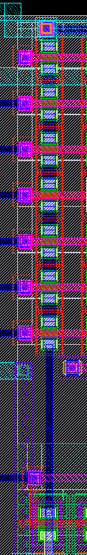

# ROM Circuit Architecture & Macro Details

This document provides a comprehensive circuit-level breakdown of the OpenRAM series-NAND ROM macro architecture, explaining all 7 top-level blocks, transistor topologies, address decoding, and end-to-end signal propagation.

[<- back to the README](../README.md)

---

## Contents

1. [Top-Level Architecture & Signal Flow](#1-top-level-macro-architecture--signal-flow)
2. [Block 1: rom_control_logic (Clock & Precharge Generation)](#2-block-1-rom_control_logic)
3. [Block 2: rom_row_decode (Row Address Decode & Wordlines)](#3-block-2-rom_row_decode)
4. [Block 3: rom_base_array (Series-NAND Storage Matrix)](#4-block-3-rom_base_array)
5. [Block 4: rom_column_decode (Column Address Decode)](#5-block-4-rom_column_decode)
6. [Block 5: rom_column_mux_array (256:32 Multiplexer)](#6-block-5-rom_column_mux_array)
7. [Block 6: rom_bitline_inverter (Bitline Sensing & Isolation)](#7-block-6-rom_bitline_inverter)
8. [Block 7: rom_output_buffer (Output Driver Stage)](#8-block-7-rom_output_buffer)
9. [End-to-End Read Operation Walkthrough](#9-end-to-end-read-operation-walkthrough)

---

## 1. Top-Level Macro Architecture & Signal Flow

The OpenRAM ROM compiler emits a dynamic, unlatched **series-NAND architecture**. Total macro access delay is determined by the staged propagation through seven interconnected sub-blocks.


### Signal Progression
1. **Control (`rom_control_logic`)**: Ingests `clk0` and `cs0` to generate internal clocking and the global active-low `precharge` distribution rail.
2. **Row Decode (`rom_row_decode`)**: Decodes upper address bits (`addr0[10:3]`) to assert one of the wordlines (`wl[133:0]`).
3. **Core Array (`rom_base_array`)**: The selected wordline enables the series-NAND pull-down stack, conditionally discharging the dynamic bitlines (`bl[255:0]`).
4. **Bitline Inverter (`rom_bitline_inverter`)**: Senses bitline discharge, isolates array capacitance, and generates inverted bitlines (`bl_b[255:0]`).
5. **Column Decode (`rom_column_decode`)**: Decodes lower address bits (`addr0[2:0]`) into 8-way mux select lines (`word_sel[7:0]`).
6. **Column Multiplexer (`rom_column_mux_array`)**: Multiplexes 256 bitlines down to 32 pre-buffer lines (`rom_out_prebuf[31:0]`).
7. **Output Driver (`rom_output_buffer`)**: Buffers and re-inverts the data to drive external capacitive loads on `dout0[31:0]`.

---

## 2. Block 1: `rom_control_logic`

Generates synchronous evaluate timing and global precharge control from `clk0` and chip-select `cs0`.

> 🖼️ **Block Schematic Slot:** `docs/img/block_control_logic.png`  


### Circuit Structure & Operation
1. **Clock Buffer (`rom_clock_driver`):**
   * Two cascaded CMOS inverter stages (`pinv` -> `pinv_0` -> `pinv_1` / `pinv_2`) that buffer external `clk0` to produce internal clock net `clk_int`.
   * Isolates external clock loading from internal distribution capacitance.
2. **Control NAND (`rom_control_nand`):**
   * A 2-input CMOS NAND gate (`A=clk_int`, `B=cs0`).
   * When `cs0=0` (chip disabled), the NAND output stays continuously HIGH, keeping precharge asserted (bitlines held precharged, evaluate never triggers).
   * When `cs0=1` (chip selected) and `clk_int` rises HIGH, the NAND output falls to 0V.
3. **Precharge Driver (`rom_precharge_driver`):**
   * High-fanout inverter driver chain (`pinv_5`, `pinv_6`, `pinv_7`) driving the heavily loaded global `precharge` distribution rail across the macro.
   * `precharge` is **active-low (0V)** during the precharge phase (`clk0=0`).
   * During the evaluate phase (`clk0=1`, `cs0=1`), `precharge` rises to **VDD (1.8V)**.

---

## 3. Block 2: `rom_row_decode`

Decodes the upper 8 address bits (`addr0[10:3]`) to select exactly 1 out of 134 wordlines.

> 🖼️ **Block Schematic Slot:** `docs/img/block_row_decode.png`  


### Circuit Structure & Operation
1. **Address Input Buffers (`rom_address_control_array`):**
   * For each address bit, uses `rom_address_control_buf` (`inv_array_mod` inverters) to produce non-inverted and complementary address rails (`A_out` and `Abar_out`).
   * Gates address propagation using internal clock `clk_int`.
2. **Precharge Array (`rom_precharge_array_0`):**
   * PMOS pull-up transistors connected to each internal decode line, pulling all decode rows to VDD during precharge.
3. **Dynamic Decode Matrix (`rom_row_decode_array`):**
   * Multi-input dynamic NAND lines constructed from `rom_base_one_cell` and `rom_base_zero_cell` instances.
   * For a given row, NMOS transistors are placed on the address bits that correspond to its binary index.
   * When all matching address inputs are HIGH, the series NMOS stack pulls down, discharging that specific decode line to 0V. All unselected rows remain floating or held at VDD.
4. **Wordline Driver Buffers (`rom_row_decode_wordline_buffer`):**
   * CMOS inverter stages (`pinv_dec_0`, `pinv_dec_1`) driving horizontal wordlines across all 256 array columns.
   * Inverts the discharged decode line: **The selected row's wordline falls to LOW (0V)**.
   * All 133 unselected wordlines remain held at **HIGH (VDD)**.

### Decoder Topology & Why It Is Not Analyzed Per-Line Like `rom_base_array`

In `rom_base_array`, every bitline column stores arbitrary user-programmed binary data. One column might contain 150 active `one_cell` NMOS transistors in series, while another contains only 10. Because series pull-down resistance scales quadratically ($t_{\text{access}} \propto L^2$) with the number of series `one_cell` elements, characterization **must** identify and isolate the single worst-case column via `find_worst_column.py`.

In contrast, `rom_row_decode_array` exhibits strict **architectural symmetry across all decoded rows**:
* **Fixed Address Complement Pairs:** For an $N$-bit row address ($2^N$ rows, e.g., $N=5$ for 32 rows in `rom_1k`), the array has $2N$ horizontal input lines corresponding to $(A_k, \overline{A_k})$ for $k \in [0, N-1]$, plus 1 common tail discharge transistor.
* **Invariant Transistor Counts:** In binary decoding, every valid row address index asserts exactly one line out of each $(A_k, \overline{A_k})$ pair. As a result, across all $2^N$ decoder vertical lines (`bl_0_0` to `bl_0_31`), **every single decoder chain contains exactly the same number of active transistors**:
  $$\text{Active Series Transistors} = N (\text{from address bits}) + 1 (\text{tail}) = 6\ \text{one\_cells}$$
  $$\text{Shorted Straps} = N = 5\ \text{zero\_cells}$$
* **No Data-Dependent Resistance:** Because every row decoder chain possesses an identical $6 \times \text{one\_cell}$ stack, there is no "data-dependent worst row" analogous to the worst column in the storage matrix.

#### Residual Timing Variations & Access vs. Hold Implications
Although the active transistor count is identical, second-order physical variations exist:
1. **Address Bus Routing RC:** The physical distance along the vertical address distribution bus creates slight RC propagation differences between Row 0 (closest to the address buffers) and Row 31 (farthest).
2. **Internal Chain Node Sequencing (Elmore Delay):** The specific vertical position of the $N$ active `one_cell` elements in the 11-stage stack alters the internal diffusion node capacitance discharge order.
3. **Access vs. Hold Trade-off:**
   * **Access Delay ($t_{\text{access}}$):** Dictated by the **slowest (maximum delay)** row decoder path (weakest drive + longest bus routing).
   * **Hold Constraint ($t_{\text{hold}}$):** Governed by the **fastest (minimum delay)** row decoder path! Recall the frame conversion formula:
     $$t_{\text{hold}}(\text{clk0 frame}) = t_{\text{clk2pre}} + cut_{\text{array}} - t_{\text{addr2wl}}$$
     A smaller (faster) $t_{\text{addr2wl}}$ causes the newly addressed wordline to drop earlier during an address switch, corrupting the existing bitline discharge sooner and producing a stricter (larger) hold requirement.
   * `run_addr2wl.sh` evaluates the Row 0 $\to$ Row 1 transition (`addr0[3]` toggling), capturing the driver switching delay while assuming the bus routing gradient across the compact decoder block is second-order compared to the massive array wordline load (~290 fF).

---

## 4. Block 3: `rom_base_array`

The core memory array (134 rows x 256 columns in `wrom0`). Each column forms a single continuous series-NAND pull-down chain.

> 🖼️ **Block Schematic Slot:** `docs/img/block_base_array.png`  


### Storage Cell Topologies: Mask-Programmed Transistors vs Straps
Every bit in the array is physically manufactured with an NMOS transistor; the ROM mask pattern dictates whether its drain and source are shorted:

| `rom_base_one_cell` (Logic 1) | `rom_base_zero_cell` (Logic 0) |
|---|---|
|  |  |
| Active NMOS (`W=0.36u, L=0.15u`). Gate connected to wordline `wl`. | Drain and Source shorted directly via Metal-1 strap ($R_{strap} \approx 0.24\ \Omega$). |
| When selected `wl` falls LOW $\rightarrow$ NMOS turns OFF $\rightarrow$ chain broken $\rightarrow$ **bitline stays HIGH (1)**. | Wordline state ignored $\rightarrow$ strap conducts $\rightarrow$ chain closed $\rightarrow$ **bitline discharges to 0V (0)**. |

> 🖼️ **Column Strip Layout:** `docs/img/example_one_col.png`  


### Precharge & Foot Architecture
* **Precharge PMOS (`precharge_cell`):** Sits at the top of each bitline (`W=0.42u, L=0.15u`). When `precharge` is LOW, charges the bitline node to VDD.
* **Foot NMOS:** Sits at the bottom of the column series chain, gated by `precharge`. Cuts the chain from GND during precharge (preventing static VDD-to-GND current) and connects the chain to ground during evaluate.
* **Internal Node Voltage Gradient:** Internal nodes along the NAND chain do not reach full VDD due to $V_{th}$ threshold drops across successive NMOS pass transistors. Saturated settling requires multiple clock cycles to stabilize before measurement.

---

## 5. Block 4: `rom_column_decode`

Decodes the lowest 3 address bits (`addr0[2:0]`) to select 1 out of 8 column multiplexer groups ($2^3 = 8$).

> 🖼️ **Block Schematic Slot:** `docs/img/block_column_decode.png`  


### Circuit Structure & Operation
1. **Address Buffers (`rom_address_control_array_0`):**
   * Buffers `addr0[0]`, `addr0[1]`, `addr0[2]` into true and complement rail pairs.
2. **Column Decode Matrix (`rom_column_decode_array`):**
   * An 8-line dynamic decode NAND array matching the 3-bit binary addresses (`000` through `111`).
3. **Select Line Drivers (`rom_column_decode_wordline_buffer`):**
   * Inverter driver stages (`pinv_dec_2`) driving lines `word_sel_0` to `word_sel_7`.
   * Exactly one `word_sel[k]` line transitions **HIGH (VDD)** during evaluate; all other 7 lines remain **LOW (0V)**.
   * Races bitline discharge: The select signal arrives at the multiplexer gates 23–35x faster than the bitline discharges through 50%, ensuring multiplexer selection is already established before data propagates.

### Architectural Symmetry & Mid-Evaluate Bus Contention Dynamics

Similar to the row decoder, `rom_column_decode_array` is an address-decoding matrix ($2^3 = 8$ outputs driven by $3$ address bits: $A_0, A_1, A_2$ and their complements).

* **Transistor Symmetry:** All 8 column decode lines possess identical active NMOS counts ($3\ \text{one\_cells} + 1\ \text{tail} = 4\ \text{one\_cells}$ and $3\ \text{zero\_cells}$). No single line is topologically slower or faster in terms of transistor stack length.
* **Why Separate Line Modeling is Not Done:** Just like `rom_row_decode_array`, there is no user-data pattern asymmetry in the decoding matrix; all 8 multiplexer select paths have identical schematic topologies.

#### Mid-Evaluate Address Switching & Bus Contention
A critical difference between `rom_row_decode` and `rom_column_decode` lies in how address changes corrupt an active read:
1. **Dynamic Precharged Array (No Pull-Up During Evaluate):**
   * The column decoder is a dynamic NOR array clocked by `precharge`.
   * During precharge (`precharge = 0V`), all internal decode nodes are precharged HIGH (select drivers `word_sel[7:0]` held LOW).
   * During evaluate (`precharge = 1.8V`), the precharge PMOS is **OFF**. The unselected decode lines discharge through their NMOS stacks, while the selected line stays floating HIGH and drives its `word_sel[k]` output HIGH.
2. **The Contention Trap on Address Moves:**
   * If `addr0[2:0]` changes mid-evaluate, the newly selected decoder line's NMOS pull-down turns OFF, and another line's pull-down turns ON.
   * However, because `precharge` is still HIGH (evaluate active), **there is no PMOS pull-up path to recharge the previously selected line back to VDD**.
   * Consequently, the previously active `word_sel` line cannot be cleanly de-asserted, while the newly selected `word_sel` line rises, causing **simultaneous conduction across multiple multiplexer pass-gates (bus contention)**.
3. **No Driver Slew Protection (~30 ps Gate Delay):**
   * Unlike row wordlines that drive heavy array loads (~290 fF) through massive wordline buffers—causing a slow falling slew that keeps cells conducting for hundreds of picoseconds—column address inputs enter `rom_address_control_buf` and drive pass-gate MUX transistors with only **~30–40 ps** of logic delay.
   * As soon as column address corrupts, multiplexer pass-gates switch almost instantaneously, isolating the bitline inverter from the output buffer. This makes holding column address until the read data clears the output buffer ($cut_{\text{array}} + t_{\text{backend}}$) an absolute necessity.

---

## 6. Block 5: `rom_column_mux_array`

Multiplexes 256 physical bitline columns into 32 data channels (an 8:1 multiplexer per output bit).

> 🖼️ **Block Schematic Slot:** `docs/img/block_column_mux.png`  


### Circuit Structure & Operation
* **Multiplexer Unit (`rom_column_mux`):**
  * Built using wide NMOS pass-transistors (`W=2.88u, L=0.15u`) to minimize on-resistance ($R_{on}$) and speed up signal transfer.
* **Bus Interleaving:**
  * Bitlines are interleaved across 32 multiplexers:
    $$\text{Data Bit } j \text{ selects from bitlines } \{j, 32+j, 64+j, \dots, 224+j\} \text{ for } j \in [0, 31]$$
  * When `word_sel[k]` is active HIGH, each multiplexer routes its $k$-th input bitline to internal pre-buffer node `rom_out_prebuf[j]`.

---

## 7. Block 6: `rom_bitline_inverter`

Dynamic node isolation and sensing stage placed between the bitlines and the column multiplexers.

> 🖼️ **Block Schematic Slot:** `docs/img/block_bitline_inverter.png`  


### Circuit Structure & Operation
* Contains 256 individual CMOS inverters (`pinv_dec_3`).
* **Isolation Function:** Isolates the high-capacitance dynamic bitline node (`bl_0`..`bl_255`) from the pass-transistor multiplexer switches and downstream routing capacitance.
* **Signal Polarity:**
  * When bitline is HIGH (reading '1'), `rom_bitline_inverter` output `bl_b` is **LOW (0V)**.
  * When bitline discharges to 0V (reading '0'), `rom_bitline_inverter` output `bl_b` transitions **HIGH (VDD)**.

---

## 8. Block 7: `rom_output_buffer`

Final output drive stage buffering the 32 read signals and driving external output pins (`dout0[31:0]`).

> 🖼️ **Block Schematic Slot:** `docs/img/block_output_buffer.png`  


### Circuit Structure & Operation
* Contains 32 tapered CMOS inverter stages (`pinv_dec_4`).
* **Drive Capability:** Designed with scaled transistor geometries to drive external board loads (characterized in Liberty tables across 689 fF, 2756 fF, and 17225 fF load points).
* **Final Inversion:** Inverts `rom_out_prebuf[31:0]` to produce external data `dout0[31:0]`, completing the true-value logic restoration:
  * Reading Logic 1: `bl` HIGH $\rightarrow$ `bl_b` LOW $\rightarrow$ `rom_out_prebuf` LOW $\rightarrow$ **`dout0` HIGH (1)**.
  * Reading Logic 0: `bl` LOW $\rightarrow$ `bl_b` HIGH $\rightarrow$ `rom_out_prebuf` HIGH $\rightarrow$ **`dout0` LOW (0)**.

---

## 9. End-to-End Read Operation Walkthrough

```text
========================================================================================
1. Precharge Phase (clk0 = 0):
   - clk0 is LOW -> rom_control_logic holds precharge net at 0V.
   - Precharge PMOS turns ON -> all 256 bitlines (bl_0..bl_255) charged to VDD.
   - Foot NMOS is OFF -> column chains isolated from ground.
   - rom_bitline_inverter drives bl_b to 0V.

2. Evaluate Phase Initiated (clk0 = 1, cs0 = 1):
   - clk0 rises -> precharge net rises to VDD.
   - Precharge PMOS turns OFF -> bitlines float dynamically at VDD.
   - Foot NMOS turns ON -> bottom of all 256 column chains grounded.

3. Address Decoding:
   - Row Decoder: Selected wordline falls from VDD to 0V (t_clk2wl).
   - Column Decoder: Selected word_sel line rises from 0V to VDD (t_pre2sel).

4. Bitline Evaluation:
   - If selected cell is one_cell (NMOS):
     Gate falls to 0V -> NMOS opens -> chain broken -> bl stays at VDD.
   - If selected cell is zero_cell (Strap):
     Strap conducts -> entire chain closed to GND -> bl discharges to 0V.

5. Sense & Output Propagation:
   - Bitline inverter senses bl level -> drives bl_b.
   - Column multiplexer routes bl_b to rom_out_prebuf.
   - Output buffer inverts and drives dout0[31:0] pins.
========================================================================================
```
