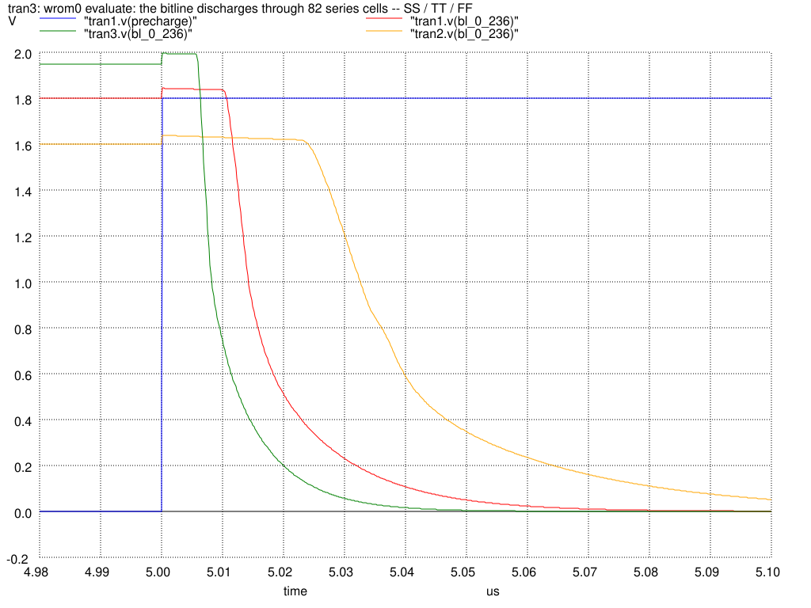
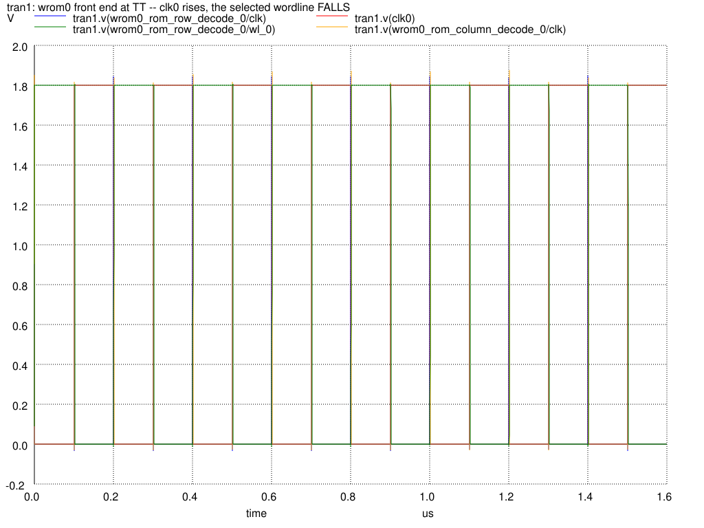

# What is measured, and how

Which deck measures which block, how `access` is built from three terms, the frequency window, and the slicing that keeps runtime finite.

[<- back to the README](../README.md)

---

## What is measured, and how

The macro has seven top-level blocks. Six appear in the measurements:

| block | timing | power |
|---|---|---|
| `rom_control_logic` (clock driver + NAND) | periphery deck | yes |
| `rom_row_decode` (address buffers, decoder, wl drivers) | periphery deck | yes |
| `rom_base_array` (cells + precharge) | column deck (worst column) | yes (x columns) |
| `rom_bitline_inverter` | back-end deck | yes (inside the column deck) |
| `rom_column_mux_array` | back-end deck | no |
| `rom_output_buffer` | back-end deck | no |
| `rom_column_decode` (addr[2:0] -> word_sel) | not measured | no |

### `access` is the sum of three measured terms

There is no output latch, so `dout0` is valid only during clk0's high phase,
and the path from clock to data crosses three stages. Each is measured in its
own deck:

| # | term | what | deck | log |
|---|---|---|---|---|
| 1 | front end | `clk0` -> `precharge` | periphery | `periph_active_<corner>.log` (`t_clk2pre`) |
| 2 | bitline | precharge -> bitline 50% | column | `col<N>_worst_case_parasitic*.log` (`t_dis_50`) |
| 3 | back end | bitline -> `dout0` | back end | `backend_<corner>_<load>.log` (`t_bl2dout`) |

The same path run backwards gives the **falling-edge arc**: when clk0 falls
the precharge PMOS pulls the bitline back to VDD and every dout0 bit returns
to 1, so the data is gone. The `.lib` carries that as a second `timing()`
group on `dout0` with `timing_type : falling_edge`, built from the *minimum*
of the same three terms (`t_clk2pre + t_pre_50 + t_bl2dout` at the smallest
load). The earliest invalidation is the number that matters -- what has to be
proven is that the consumer captured before the data went away. Without this
group STA reads an unlatched ROM as if it held its output and reports a false
pass.

Term 2 dominates. The figure shows the same column at all three corners, with
the 50% crossing that defines `t_dis_50` and the 99% recharge that defines
`t_pre`.

The front-end deck also settles the decoder polarity by measurement rather than
assumption: after clk0 rises, the selected wordline **falls**. That is what
justifies holding every wordline at VDD in the column deck.

The back-end deck is run once per output load, so the `index_2`
(`total_output_net_capacitance`) axis of the CELL_TABLE is a real measurement
and not three copies of one number. The bitline edge driving it is not a guess
either -- it uses the slope implied by the measured `t_dis_50`/`t_dis_10`.

Also measured: setup (`t_addr2dec*`), leakage (`.op`), per-column energy and
periphery energy, active and idle.

### The frequency window this ROM may be driven in

There is an upper bound, it is in the `.lib`, and it should be preferred to
any number written in prose. There is **also a lower bound**, it is not in the
`.lib`, and Liberty has no way to express it.

**Upper bound -- it is `minimum_period` on `clk0`.** `min_pulse_width(rise)`
is the full evaluate window the data needs, `min_pulse_width(fall)` is the
recharge the bitline needs, and their sum is the period. On the example
macros:

| macro | corner | `min_pulse_width` rise / fall | `minimum_period` | f_max |
|---|---|---|---|---|
| wrom0 | TT | 17.83 / 11.52 ns | 29.35 ns | 34.1 MHz |
| wrom0 | SS | -- | 54.75 ns | 18.3 MHz |
| wrom0 | FF | -- | 20.74 ns | 48.2 MHz |
| wrom3 | TT | -- | 28.82 ns | 34.7 MHz |

Prefer these to any number written in prose: STA enforces what is in the
`.lib`, and nothing enforces a sentence in a README. (The `fmax` field of
`ROM_CORNERS` is **not** this bound -- it only scales the `P = E x f` column
of a summary table.)

**Lower bound -- this is a precharged ROM, so one exists.** Two separate
things happen as the clock slows down, and they must not be confused.

*The access time saturates, and that costs nothing.* The chain's internal
nodes never reach VDD, so the longer clk0 is parked low the more charge the
next read has to remove. On wrom0 column 236 at TT the settled `t_dis_50`
runs 6.96 ns at a 25 ns precharge phase, 11.59 ns at 100 ns and 14.85 ns at
1 us, monotonic and saturating. The column deck measures at the saturated
1 us point -- the ROM that has been idle indefinitely and is about to perform
the slowest read it can -- so an arbitrarily long LOW phase is already
covered by the number the library ships.

*The stored level does not saturate, and that is the real bound.* The bitline
is a **dynamic node**: during evaluate the precharge PMOS is off and nothing
refreshes it. On a read of 1 the selected cell breaks the series chain and
the bitline is left floating high, holding its value on its own capacitance
against subthreshold leakage through the cell that broke the chain, and
against charge sharing with the partially charged cells still hanging on it.
Hold clk0 high long enough and that 1 decays through the bitline inverter's
trip point and is read as a 0 -- the classic retention limit of any
precharged logic, and the reason dynamic logic has a minimum clock frequency
at all. The bound is worst at SS, where subthreshold leakage is largest.

`min_pulse_width(rise)` is a *minimum*; Liberty has no maximum-pulse-width
constraint that a normal STA flow enforces, so this one genuinely cannot be
carried in the `.lib` and has to be stated here instead.

Every measurement uses **real Magic parasitic capacitance** and runs each
corner against its own sky130 models -- no fixed derating factor.

### The scaling trick

The 34k-transistor array is never simulated whole:

* **column slice** -- the worst column is isolated by walking the extracted
  netlist graph, measured, and the result multiplied by the column count
  (leakage, energy);
* **periphery slice** -- the array is deleted and its load (cell gate count x
  measured gate capacitance + parasitic wire C) is put back as a lump;
* **block slices, for leakage** -- the periphery is cut into one instance of
  each repeated block (control logic, address buffer, wordline driver, one
  row-decode column, one column-decode column and its driver, one bitline
  inverter, one column mux transistor and one output buffer), each on its
  own supply source, so a single `.op` reports every block's current on a
  separate branch and each is multiplied by a count from the netlist. Every
  block the macro instantiates is in that list: a block left out is scored as
  zero, silently, which is what happened to the read back end until
  2026-09-22.

So runtime does not explode as the macro grows.

The leakage deck is built from the **schematic** netlist rather than the Magic
extraction: leakage is a DC quantity, so parasitic capacitance cannot change
it, and the deck stays at a few hundred devices. That matters, because `.op`
does **not** converge on the full periphery netlist -- the row decoder is a
precharged NAND chain whose internal nodes have no DC path, the matrix is
singular there, and dynamic gmin, true gmin and source stepping all fail after
eight minutes and 2.7 GB. Cut into static-CMOS blocks plus one decode column,
every slice converges in seconds.

#### gmin has to be swept, not chosen

`gmin` is the artificial conductance ngspice puts on every node to help it
converge, and it sits in **parallel with the leakage being measured**: at the
pA level it simply becomes the answer. It is not one value for the whole deck
either -- the blocks differ by five orders of magnitude. Measured on wrom0 at
TT:

| slice | gmin=1e-12 | 1e-15 | 1e-18 | 1e-21 |
|---|---|---|---|---|
| control logic | 14.3293 nA | 14.2232 | 14.2231 | 14.2231 |
| wordline driver | 0.692543 nA | 0.688946 | 0.688943 | 0.688943 |
| address buffer | 0.00562414 nA | 0.000229725 | 0.000224123 | 0.000224107 |
| row-decode column | 0.0421749 nA | 0.0000825065 | 0.0000352684 | 0.0000352347 |

At 1e-12 the address buffer is **96% artificial** and the decode column 1200x
too high; 1e-15, the value the column deck settled on, is still 2.3x too high
for the decode column. So `run_periphery_leak.sh` runs the whole axis and, per
slice, takes the smallest gmin with the point above it agreeing -- the same
"two values agree, therefore converged" rule the energy and timing decks use.
A slice that never settles is printed as NOT CONVERGED and is not used.

What the periphery actually leaks (wrom0, TT, converged values):

| block | count | per slice | total |
|---|---|---|---|
| bitline inverter | 256 | 0.365519 nA | 93.57 nA |
| wordline driver | 133 | 0.688943 nA | 91.63 nA |
| control logic (clock driver + NAND + precharge driver) | 1 | 14.2231 nA | 14.22 nA |
| column-decode driver | 8 | 0.474726 nA | 3.80 nA |
| output buffer | 32 | 0.000209 nA | 0.007 nA |
| row-decode column | 133 | 0.0000352 nA | 0.005 nA |
| address buffer | 8 | 0.000224 nA | 0.002 nA |
| column-decode column | 8 | 0.0000321 nA | 0.000 nA |
| column mux pass transistor | 256 | ~0 (5e-10 nA) | 0.000 nA |
| **periphery** | | | **203.24 nA** |
| cell array (256 x the worst column) | 256 | 0.366003 nA | 93.70 nA |

The bitline inverters are the largest single entry and they were **missing**
until 2026-09-22: the deck sliced the control path and the decoders and
stopped there, so the read back end -- 256 bitline inverters, 256 mux
transistors, 32 output buffers -- was scored as zero. Adding it took the
periphery from 109.66 to 203.24 nA at TT, +85%. A block left out of this deck
does not announce itself; it just lowers the answer, which is the unsafe
direction. The check that catches it is comparing the slice list against the
instances of the top-level cell.

The column mux is in the list and measures ~0, which is the right answer
rather than a missing one: during precharge every bitline is high, so every
bitline inverter output is 0, every column select is low (measured, see
`run_coldec_delay.sh`) and the node the mux drives leaks down to 0 as well --
the transistor is off with 0 V across it. It is measured rather than argued
away, and `run_periphery_leak.sh` prints it as `ZERO (under ... floor)`,
because a 1 % *relative* convergence test means nothing at 1e-19 A.

Every one of the four example macros gives the same periphery number: the
periphery is the same circuit in all of them, only the stored bits differ, and
in this state the decode chain is cut by its foot transistor rather than by
its contents. The array half is the part that moves with the `.bin`.

The decode chains leak in picoamps -- they are cut by a foot transistor with
sixteen devices stacked above it -- and the whole periphery term is really the
256 bitline inverters plus the 133 wordline drivers plus the clock tree. It is
**more than twice the array**, so `cell_leakage_power` roughly triples:
0.000169 mW to 0.000535 mW at TT, 0.000297 to 0.001029 mW at SS, 0.000076 to
0.000240 mW at FF.

Both chip-select states are measured (`cs0` = 0 and 1) and they come out equal
to six decimals at every corner. That is a result, not a copy: `cs0` gates the
precharge *path*, so it changes what the macro does on a clock edge, and a
leakage number describes the static state it sits in between edges. The `.lib`
carries both `leakage_power` groups with their `when` conditions and says so
in the header.

Energy is measured as the charge drawn from the supply over a cycle, and the
last two cycles are compared: equal values are the proof that the circuit has
settled.

Both energy decks run ngspice with `method=gear` rather than its default
trapezoidal integrator, and that is not a preference. Trapezoidal rings on the
extracted body nodes and the ringing lands straight in the `i(vdd)` charge
integral, so the answer depends on the time step -- on the column deck a
200/400/800/1600 step sweep gives 0.4956 / 0.4823 / 0.4849 / 0.4917 pJ, 2.8%
and not even monotonic, against 0.4805 / 0.4851 / 0.4858 / 0.4860 with gear
(0.18% from the second point on). The periphery deck is the same story an
order of magnitude larger: 17% spread and an outright abort at the finest
step. A charge integral has to be step converged before it means anything.

It shows up in the settling check too: on trapezoidal, cycles 2 and 3 of the
column deck differed by 2.8% at TT, which reads as a chain that has not
filled yet. With gear they agree to five digits. The gap was the integrator,
not the circuit.

### Predicting a geometry change

Two different scaling questions live here, and the measurements answer only
one of them.

**At a fixed array height**, which is what the four example macros are (all
134x256 -- only the stored pattern differs), changing the data changes how
many of the 134 cells in the worst column are real transistors rather than
straps. The bitline, its capacitance and the number of cells it runs past do
not move. That costs about **125 ps per extra series device at TT** (72 ps at
FF, 281 ps at SS), on top of a line that is already ~5 ns of fixed delay --
measured, and close to linear, which is what adding resistors to a fixed RC
line should look like.

**Growing the array**, by contrast, lengthens the bitline and adds series
devices at the same time, so R and C both rise and the delay grows roughly
with the square of the row count. That is the law worth knowing before
changing `words_per_row`, and it is the one the repository cannot show: it
needs macros of different row counts, and every example here is 134x256.

## Size independence

When a ROM is regenerated (different `word_size`, `words_per_row` or `.bin`)
**no script needs editing**. Everything the flow needs is derived:

| fact | source |
|---|---|
| macro list | `<tree>/<macro>/<macro>.sp` directories |
| row / column count | netlist scan (scoped to `*_rom_base_array`) |
| worst column + series chain length | same scan (`one_cell` count) |
| address / data width | LEF pins (`PIN addr0[..]`, `PIN dout0[..]`) |
| word count | size of `rom_configs/<macro>.bin` |
| `word_size` / `words_per_row` | `config/<macro>.py` (cross-check) |
| power / ground pin names | LEF pins (`USE POWER`, `USE GROUND`) |

The single source of truth is
[`scripts/rom_char/rom_paths.py`](../scripts/rom_char/rom_paths.py). The netlist
wins; if `word_size*8*words_per_row` disagrees with it you get a **warning**,
and if `words_per_row` is not a power of two it tells you the address space
will have holes. Geometry is cached in `<macro>/char/.geometry.json` and
refreshes itself when the netlist changes.
