# What is measured, and how

Which deck measures which block, how `access` is built from three terms, the frequency window, and the slicing that keeps runtime finite.

[<- back to the README](../README.md)

---

## What is measured, and how


The macro has seven top-level blocks. All seven appear in the measurements:

| block | timing | power |
|---|---|---|
| `rom_control_logic` (clock driver + NAND) | periphery deck | yes |
| `rom_row_decode` (address buffers, decoder, wl drivers) | periphery deck | yes |
| `rom_base_array` (cells + precharge) | column deck (worst column) | yes (x columns) |
| `rom_bitline_inverter` | back-end deck | yes (inside the column deck) |
| `rom_column_mux_array` | back-end deck | no |
| `rom_output_buffer` | back-end deck | yes (periphery leak) |
| `rom_column_decode` (addr[2:0] -> word_sel) | coldec deck (races discharge) | yes (periphery leak) |

### `access` is the sum of three measured terms

There is no output latch, so `dout0` is valid only during clk0's high phase,
and the path from clock to data crosses three stages. Each is measured in its
own deck:

| # | term | what | deck | log |
|---|---|---|---|---|
| 1 | front end | `clk0` -> `precharge` | periphery | `periph_active_<corner>.log` (`t_clk2pre`) |
| 2 | bitline | precharge -> bitline 50% | column | `col<N>_worst_case_parasitic*.log` (`t_dis_50`) |
| 3 | back end | bitline -> `dout0` | back end | `backend_<corner>_<load>.log` (`t_bl2dout`) |

The same path run backwards gives the **falling-edge arc**: when clk0 falls
the precharge PMOS pulls the bitline back to VDD and every dout0 bit returns
to 1, so the data is gone. The `.lib` carries that as a second `timing()`
group on `dout0` with `timing_type : falling_edge`, built from the *minimum*
of the same three terms (`t_clk2pre + t_pre_50 + t_bl2dout` at the smallest
load). The earliest invalidation is the number that matters -- what has to be
proven is that the consumer captured before the data went away. Without this
group STA reads an unlatched ROM as if it held its output and reports a false
pass.

* **Term 2 (Bitline) dominates:** Setting ~85% of total access delay, defined by the 50% discharge crossing (`t_dis_50`) and the 99% recharge (`t_pre_99`).
* **Front-end polarity:** The periphery deck settles the decoder polarity by measurement rather than assumption: after `clk0` rises, the selected wordline **falls**. That justifies holding every other wordline at VDD in the column deck.
* **Back-end delay under load:** The back-end deck is run once per output load, so the `index_2` (`total_output_net_capacitance`) axis of the CELL_TABLE is a real measurement and not three copies of one number. The bitline edge driving it replays the column deck's own discharge waveform sample for sample through a PWL source (cached in `char/wave/bl_<corner>.txt`).

Also measured: setup (`t_addr2dec*`), leakage (`.op`), per-column energy and periphery energy (active and idle), and input pin capacitances with adaptive settling (`run_pin_cap.sh` / `pincap_settle_step.py`). Detailed waveform captures, simulation decks, and reproduction commands for each block are documented in their respective sections below.

---

## Quick Reference: How to Reproduce All Measurements in ngspice

All waveform plots in this repository are **real screenshots taken directly from ngspice's interactive GUI plot window (`.png`)**, never synthetic/vector SVGs or machine-drawn approximations. 

### Interactive ngspice Workflow

To reproduce any measurement or inspect waveforms visually:

1. **Run the flow stage script** (or `./flow.py <macro>`) to extract netlists, compute parasitics, and write the SPICE decks into `<macro>/char/`.
2. **Launch ngspice interactively** on the target `.sp` deck:
   ```bash
   ngspice examples/wrom0/char/<deck_name>.sp
   ```
3. **Configure plot style (optional):** To get high-contrast black-on-white plots suitable for documentation:
   ```text
   ngspice 1 -> set color0=white color1=black
   ```
4. **Execute simulation:**
   ```text
   ngspice 2 -> run
   ```
5. **Plot node voltages / currents:**
   ```text
   ngspice 3 -> plot <vector_1> <vector_2> ... [xlimit <t_start> <t_end>] [ylimit <v_min> <v_max>]
   ```
6. **Capture screenshot:** Take a window screenshot directly from ngspice's graphical display.
7. **Inspect `.measure` values from terminal:**
   ```bash
   grep -E "t_dis_50|t_clk2pre|t_bl2dout" examples/wrom0/char/<deck_name>.log
   ```

### Multi-Corner & Multi-Deck Overlay in ngspice

To overlay waveforms from multiple corners (TT, SS, FF) or multiple load runs in a single interactive plot window:
```text
ngspice
ngspice 1 -> source examples/wrom0/char/col236_worst_case_parasitic.sp
ngspice 2 -> run
ngspice 3 -> source examples/wrom0/char/col236_worst_case_parasitic_ss.sp
ngspice 4 -> run
ngspice 5 -> source examples/wrom0/char/col236_worst_case_parasitic_ff.sp
ngspice 6 -> run
ngspice 7 -> set color0=white color1=black
ngspice 8 -> plot tran1.v(bl_0_236) tran2.v(bl_0_236) tran3.v(bl_0_236) tran1.v(precharge) xlimit 4.95u 5.06u
```

### Complete Measurement & Command Matrix

| # | Measurement Stage | Shell Script | Generated SPICE Deck (`examples/wrom0/char/`) | Interactive ngspice Plot Command | Measured Variables & Target Log |
|---|---|---|---|---|---|
| 1 | **Bitline Discharge & Precharge** | `./scripts/rom_char/run_col_timing.sh wrom0` | `col236_worst_case_parasitic{,_ss,_ff}.sp` | `plot v(precharge) v(bl_0_236) xlimit 4.98u 5.06u` | `t_dis_50`, `t_dis_10`, `t_pre_50`, `t_pre_99` (`col236_worst_case_parasitic*.log`) |
| 2 | **Periphery Front End** | `./scripts/rom_char/run_periphery_power.sh wrom0` | `periph_active_tt.sp` | `plot v(clk0) v(wrom0_rom_row_decode_0/clk) v(wrom0_rom_row_decode_0/wl_0) xlimit 100n 106n` | `t_clk2pre`, `t_clk2int`, `t_wlfall0`, `e_periph_pj` (`periph_active_tt.log`) |
| 3 | **Back End Delay (Load Sweep)** | `./scripts/rom_char/run_backend_delay.sh wrom0` | `backend_tt_{17225,689,2756}.sp` | `plot v(wrom0_rom_base_array_0/bl_0_236) v("dout0[2]") xlimit 15n 25n` | `t_bl2dout`, `t_dout_slew` (`backend_tt_*.log`) |
| 4 | **Column Decoder Race** | `./scripts/rom_char/run_coldec_delay.sh wrom0` | `coldec_sweep_tt.sp` / `coldec_a0_tt.sp` | `plot v(wrom0_rom_column_decode_0/clk) v(wrom0_rom_column_decode_0/wl_0)` | `t_pre2sel<k>_rise`, `t_pre2sel<k>_fall` (`coldec_a0_tt.log`) |
| 5 | **Column Supply Current & Energy** | `./scripts/rom_char/run_col_energy.sh wrom0` | `col236_energy_tt.sp` | `plot i(Vvdd) xlimit 800n 1000n ylimit -130u 20u` | `q_c3`, `e_col_pj` (`col236_energy_tt.log`) |
| 6 | **Column DC Leakage (`.op`)** | `./scripts/rom_char/run_col_power.sh wrom0` | `col236_leak_tt.sp` | DC `.op` array leakage (no plot window: `print i(vvdd)`) | `vvdd#branch` (`col236_leak_tt.log`) |
| 7 | **Periphery Leakage (`.op`)** | `./scripts/rom_char/run_periphery_leak.sh wrom0` | `periph_leak_paired_tt.sp` | DC `.op` slice current (no plot window) | `vvdd#branch`, slice currents (`periph_leak_cs0_tt.total`) |
| 8 | **Cell Gate Capacitance** | `python3 scripts/rom_char/gen_cell_gate_tb.py wrom0 examples/wrom0/char/cellgate_tt.sp --corner tt` | `cellgate_tt.sp` | `plot v(g0) i(Vg0)` | `c_one_ff`, `c_zero_ff`, `q_one`, `q_zero` (`cellgate_tt.log`) |
| 9 | **Dynamic Read Energy** | `python3 scripts/rom_char/gen_random_read_energy.py wrom0 --corner tt` | None (analytic netlist activity scan) | Terminal table / histogram | Average & worst-case energy (`random_energy_tt.log`) |
| 10 | **Input Pin Capacitance** | `./scripts/rom_char/run_pin_cap.sh wrom0` | `pincap_tt.sp` | `plot v(clk0) i(vpin1)` | `c_cyc<i>_ff`, `q_rise`, `q_fall` (`pincap_tt.log`) |
| 11 | **Wordline Fall Slew** | `./scripts/rom_char/run_wl_slew.sh wrom0` | `wlslew_tt.sp` | `plot v(clk0) v(wrom0_rom_row_decode_0/wl_0) xlimit 98n 104n` | `t_wlfall0`, `t_wlslew0`, `t_wl1090_0` (`wlslew_tt.log`) |
| 12 | **Clock Input Slew Sweep** | `SLEWS="0.05 0.2 0.5" ./scripts/rom_char/run_slew_sweep.sh wrom0` | `periph_slew{0,1,2}_tt.sp` | `plot v(clk0) v(wrom0_rom_column_decode_0/clk)` | `t_clk2pre` across slews (`periph_slew*_tt.log`) |
| 13 | **Address Setup Race** | `./scripts/rom_char/run_addr_setup.sh wrom0` | `periph_setup_tt.sp` | `plot v(addr0[0]) v(clk0)` | `t_addr2dec<k>`, `t_clk2int` (`periph_setup_tt.log`) |
| 14 | **Address Hold Bisection** | `python3 scripts/rom_char/gen_addr_hold_tb.py wrom0 look.sp --sweep-ns 14,16 --wl-slew-ns 0.15` | `look.sp` / `run_hold_bisect.sh` | `plot v(precharge) v(bl_0_236) v(bl_b_236)` | `hold_rising`, cut time bracket (`hold_tt.log`) |
| 15 | **Address to Wordline Delay** | `./scripts/rom_char/run_addr2wl.sh wrom0` | `addr2wl_tt.sp` | `plot v(addr0[3]) v(wrom0_rom_row_decode_0/wl_1) xlimit 1.348u 1.354u` | `t_addr2wl1` (`addr2wl_tt.log`) |
| 16 | **Early Path (Retain Time)** | `./scripts/rom_char/run_early_path.sh wrom0` | `col236_best_case_parasitic.sp` | `plot v(precharge) v(bl_0_236)` | `t_dis_50`, `t_pre_50` (`col236_best_case_parasitic*.log`) |
| 17 | **Cell Series Resistance Model** | `python3 scripts/rom_char/gen_resistance_model.py wrom0` | None (analytic / Magic single-cell) | Terminal table / JSON report | Series resistance per cell (`resistance_model.json`) |
| 18 | **Parasitic C Extraction** | `./scripts/rom_char/run_cap_extract.sh wrom0` | None (Magic batch layout extraction) | Layout viewer (Magic/KLayout) | Extracted netlist (`wrom0_cap_only.spice`) |

---

## Detailed Measurement Decks & Waveforms

### The column: bitline discharge and precharge

```bash
# 1. Run the flow script to generate and simulate the decks:
./scripts/rom_char/run_col_timing.sh wrom0

# 2. Launch interactive ngspice:
ngspice examples/wrom0/char/col236_worst_case_parasitic.sp
```
```text
ngspice 1 -> run
ngspice 2 -> plot v(precharge) v(bl_0_236)

# Zoom into the settled 3rd cycle evaluate edge (where t_dis_50 is measured):
ngspice 3 -> plot v(precharge) v(bl_0_236) xlimit 4.98u 5.06u

# Zoom into precharge recharge (where t_pre_99 is measured):
ngspice 4 -> plot v(precharge) v(bl_0_236) xlimit 3.8u 4.2u
```
```bash
# Inspect measured numerical values directly from logs:
grep -E "t_dis_50|t_pre_99|t_pre_50" examples/wrom0/char/col236_worst_case_parasitic*.log
```

**What comes out of this deck** (`col<N>_worst_case_parasitic*.log`). The blue
trace is the whole of `access`'s dominant term; the red one is the precharge
phase that has to finish before the next read can start:

| measurement | what it is | where it lands |
|---|---|---|
| `t_dis_50` | precharge -> bitline 50% | **term 2 of `access`**, the largest one (wrom0 TT: 15.3355 of 17.2675 ns) |
| `t_dis_10` | the 10% point of the same fall | no `.lib` number of its own -- it is the cross-check that the back-end deck is replaying THIS curve: both decks print `t_dis_50`/`t_dis_10` and they must agree |
| `t_dis_50_prev` | the same discharge one cycle earlier | no `.lib` number -- it is the settling proof. Over 1% apart and the run is a start-up transient, not a steady state, and the deck says so |
| `t_pre_50` | recharge to 50% | the **falling_edge arc**: `t_clk2pre + t_pre_50 +` smallest-load `t_bl2dout` |
| `t_pre_99` | recharge to 99% | `min_pulse_width(fall)` and `minimum_period` -- the ROM's *minimum* clock frequency |
| `t_pre_90` | recharge to 90% | measured, deliberately NOT used: 90% lands ~0.5 ns and would write a `min_pulse_width` 20x too small |

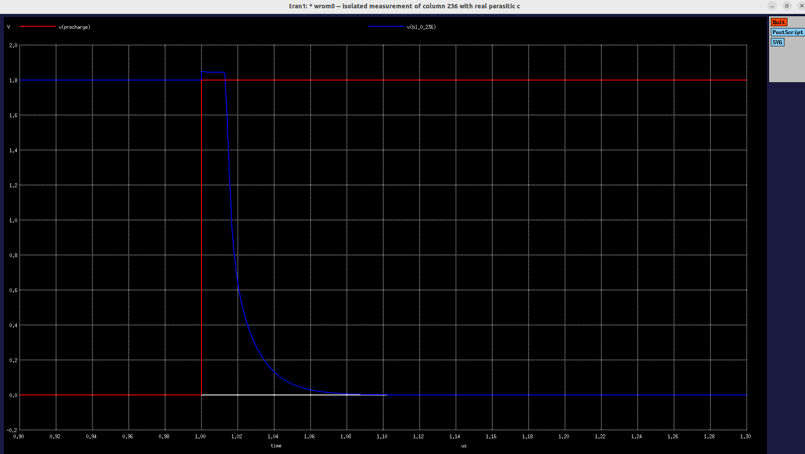

*`col236_worst_case_parasitic.sp`, ngspice's own plot window. Red is
`v(precharge)`, blue the bitline `v(bl_0_236)` of wrom0's worst column. The
bitline sits at VDD while precharge is low, overshoots a little as precharge
releases at 1.00 us, then falls -- through 50% at ~14.8 ns, which is term 2 of
`access` and ~85% of it. The long flat tail is the dynamic node holding at 0:
nothing drives it back up until the next precharge.*

### The periphery front end: clk0 -> internal clock -> wordline -> precharge

```bash
# 1. Run the flow script to generate and simulate:
./scripts/rom_char/run_periphery_power.sh wrom0

# 2. Launch interactive ngspice:
ngspice examples/wrom0/char/periph_active_tt.sp
```
```text
ngspice 1 -> run
ngspice 2 -> plot v(clk0) v(wrom0_rom_row_decode_0/clk) v(wrom0_rom_row_decode_0/wl_0) v(wrom0_rom_column_decode_0/clk)

# Zoom into the clock edge and wordline falling transition:
ngspice 3 -> plot v(clk0) v(wrom0_rom_row_decode_0/clk) v(wrom0_rom_row_decode_0/wl_0) xlimit 100n 106n
```
```bash
# Inspect measured front-end delay and periphery energy from log:
grep -E "t_clk2pre|t_clk2int|t_wlfall0|e_periph_pj" examples/wrom0/char/periph_active_tt.log
```

**What comes out of this deck** (`periph_active_<corner>.log`). It is the only
deck with the real decoder in it, so both the front-end delay and the
periphery's share of the energy come from here:

| measurement | what it is | where it lands |
|---|---|---|
| `t_clk2pre` | clk0 -> the internal precharge net | **term 1 of `access`**. Also the term the `index_1` slew axis moves, and the `+t_clk2pre` that carries the hold into the clk0 pin's frame |
| `t_clk2int` | clk0 -> the internal clock | not a `.lib` value: it is the other half of the SETUP race. The address requirement at the pin is `t_addr2dec - t_clk2int` = -0.2948 ns, quoted in the header |
| `t_wlfall0` | clk0 -> the selected wordline's fall | **not in `access`** -- see below. Feeds the hold work |
| `t_wlslew0`, `t_wl1090_0` | 80-20 and 90-10 fall times | `t_wl1090_0 / 0.8` is the real wordline ramp `run_hold_bisect.sh` drives its cut with |
| `v_wl0_eval` .. `v_wl7_eval` | wordline VOLTAGE at a fixed instant inside evaluate | no number -- the polarity EVIDENCE: the selected row reads 6.17e-08 V, the other seven read a flat 1.800000 V |
| `q_c2`, `q_c3` | charge drawn from VDD over two consecutive cycles | their gap is the settling check; `q_c3` is the one used |
| `e_periph_pj` | `q_c3 x VDD` | the periphery term of BOTH `internal_power` states -- added to the column term when `cs0`, and the whole of it when `!cs0` |

**The wordline is measured here but is deliberately not in `access`.** It
arrives at 1.5692 ns against the precharge net's 0.7642 ns, so adding it would
lengthen the sum by 0.8 ns. It is not in series: the read that sets `access`
is a read of **0**, and there the selected cell is a `zero_cell` -- a metal
strap that conducts whatever its gate does -- while every other wordline stays
HIGH and does not move at all. The chain is closed the moment precharge
releases. (The case where the wordline edge does matter is a read of **1**,
which the column deck does not simulate; see
[limitations.md](limitations.md).)

The selected wordline **falls** -- the decoder polarity is settled by this
measurement, not assumed.

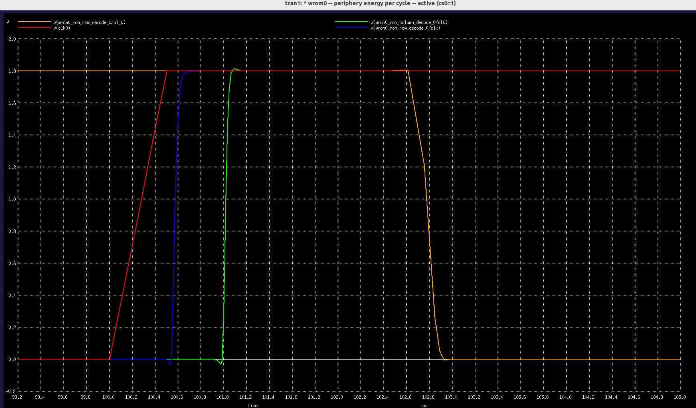

*`periph_active_tt.sp`. Red `v(clk0)` rises with the real input slew; blue is
the row decoder's internal clock, green the column decoder's, orange the
selected wordline `wl_0`. Two things are measurements rather than assumptions
here: the internal clock arrives ~0.55 ns after `clk0` crosses, and `wl_0` is
HIGH for the whole of that edge and only **falls** ~2.5 ns later. That
polarity -- selected wordline low, all others high -- is why the column deck
holds every other wordline at VDD.*

### The back end: bitline -> dout0, at one of the three `.lib` loads

```bash
# 1. Run the flow script to generate and simulate across all three loads:
./scripts/rom_char/run_backend_delay.sh wrom0

# 2. Launch interactive ngspice for a specific load deck:
ngspice examples/wrom0/char/backend_tt_2756.sp
```
```text
ngspice 1 -> run
ngspice 2 -> plot v(wrom0_rom_base_array_0/bl_0_236) v("dout0[2]")

# Zoom around the bitline inverter trip point and output buffer delay:
ngspice 3 -> plot v(wrom0_rom_base_array_0/bl_0_236) v("dout0[2]") xlimit 15n 25n

# Multi-load overlay in one ngspice session (verifying index_2 axis):
# ngspice
# ngspice 1 -> source examples/wrom0/char/backend_tt_17225.sp
# ngspice 2 -> run
# ngspice 3 -> source examples/wrom0/char/backend_tt_689.sp
# ngspice 4 -> run
# ngspice 5 -> source examples/wrom0/char/backend_tt_2756.sp
# ngspice 6 -> run
# ngspice 7 -> set color0=white color1=black
# ngspice 8 -> plot tran1.v("dout0[2]") tran2.v("dout0[2]") tran3.v("dout0[2]") tran1.v(wrom0_rom_base_array_0/bl_0_236) xlimit 18n 23n
```
```bash
# Inspect measured delay and output slew across all loads from logs:
grep -E "t_bl2dout|t_dout_slew" examples/wrom0/char/backend_tt_*.log
```

**What comes out of this deck** (`backend_<corner>_<load>.log`). It is run
once per `.lib` output load, which is what makes `index_2` three measurements
rather than one number copied three times:

| measurement | what it is | where it lands |
|---|---|---|
| `t_bl2dout` | bitline -> `dout0`, through the bitline inverter, the 256:32 mux and the output buffer | **term 3 of `access`** (wrom0 TT: 0.9532 .. 1.1678 ns across the three loads). The SMALLEST-load value is also the third term of the falling_edge arc |
| `t_dout_slew` | the output's own transition time | the `output_transition` tables, and `retaining_rise`/`retaining_fall` take the smallest-load one |

The bitline here is not a stimulus shaped to look like a discharge, it is the
discharge: `run_backend_delay.sh` re-runs this corner's column deck with the
waveform kept and the samples are replayed through a PWL source. The deck
header prints the `t_dis_50`/`t_dis_10` of the curve it replayed, and they
match the column log to four decimals -- that is the proof it is the same
curve, at all three corners.

Replaying the waveform matters because a straight ramp through the measured
50% and 10% points reproduces those two instants and nothing else: a discharge
decelerates, so the secant between them runs 2.3-3.1x flatter than the curve
does where the bitline inverter actually trips (wrom0 TT: -0.0382 V/ns against
-0.1185 V/ns at the VDD/2 the deck trips on). The error it left behind was **not** one-sided --

| corner | `t_bl2dout` on the ramp | on the real edge | |
|---|---|---|---|
| TT | 1.7321 ns | 1.1678 ns | 48% pessimistic |
| FF | 1.4854 ns | 0.8093 ns | 84% pessimistic |
| SS | 1.9117 ns | 2.4829 ns | **23% optimistic** |

(largest load, the widest of the three). A too-flat edge leaves the inverter
in its transition region for nanoseconds, so what the `trig`->`targ` interval
measures is partly how far the output has already moved by the time the
bitline passes 50%. At SS the back end is slow enough (2-2.8 ns of output
slew) for that head start to outweigh everything else, and the `.lib` was
optimistic at the one corner signoff actually uses.

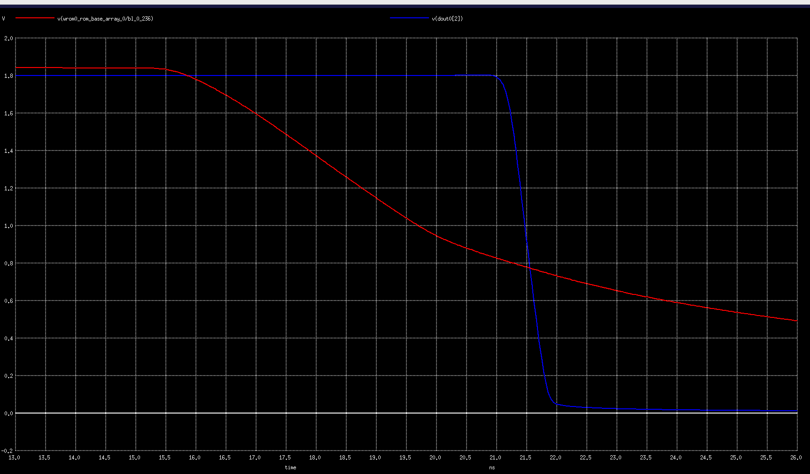

*`backend_tt_2756.sp`. Red is the bitline `v(bl_0_236)` -- the column deck's
own discharge, replayed; blue is `v(dout0[2])`. The red curve is the whole
argument of this section in one picture: it is not a line. It leaves VDD at
15.5 ns almost flat, is steepest around the 0.9 V the inverter trips at
(20.3 ns, `t_dis_50` + the deck's 5 ns start), and then trails off towards
zero for tens of nanoseconds. A straight ramp fitted to the 50% and 10%
points is the chord across that trail, three times flatter than the curve is
where it matters. dout0 falls 1.17 ns after the bitline crosses 50% --
`t_bl2dout` at this load -- and it falls in ~0.6 ns, an edge no part of the
bitline's own shape resembles.*

### The column decoder, against the discharge it races

```bash
./scripts/rom_char/run_coldec_delay.sh wrom0
ngspice examples/wrom0/char/coldec_sweep_tt.sp
```

The scripted run does not load the periphery netlist once per address. Its
default eight-address set is one continuous five-cycle-per-address transient
per corner (`coldec_sweep_<corner>.sp`), with address changes confined to
precharge boundaries. It checks the last two cycles for settling, samples all
eight selects to prove one-hot behaviour, then writes the familiar
`coldec_a<addr>_<corner>.log` compatibility files. All corners perform their
own sweep; no TT-to-SS/FF worst-address assumption is made.

```text
ngspice 1 -> run
ngspice 2 -> plot v(wrom0_rom_column_decode_0/clk) v(wrom0_rom_column_decode_0/wl_0)
```
```bash
# Inspect measured column select delays:
grep -E "t_pre2sel|t_clk2pre" examples/wrom0/char/coldec_a0_tt.log
```

**What comes out of this deck** (`coldec_a<addr>_<corner>.log`):

| measurement | what it is | where it lands |
|---|---|---|
| `t_pre2sel<k>_rise` | precharge -> column select k rises | the RACE against `t_dis_50`. `access`'s middle term is `max(t_dis_50, t_pre2sel)`, and the `.lib` header records the margin (23-35x everywhere, so the bitline wins and `access` is unchanged) |
| `t_pre2sel<k>_fall` | the same select falling | reported as "failed" on the seven unselected ones, and that failure is the polarity evidence: all eight selects are LOW during precharge, only the addressed one rises |
| `t_clk2pre` | re-measured with the decoder present | a cross-check, not a shipped number: 0.7630 ns here against 0.7642 ns in the periphery log, 0.2% apart -- proof the added block did not disturb the path it hangs off |

Nothing from this deck becomes a delay in the `.lib` while the decoder keeps
losing the race. `gen_rom_lib.py --t-coldec` will switch the middle term over
if a future macro ever flips it, and `run_coldec_delay.sh` exits non-zero and
says so.

`t_pre2sel` must land before `t_dis_50`, otherwise the middle term of `access`
is the decoder and the script says so.

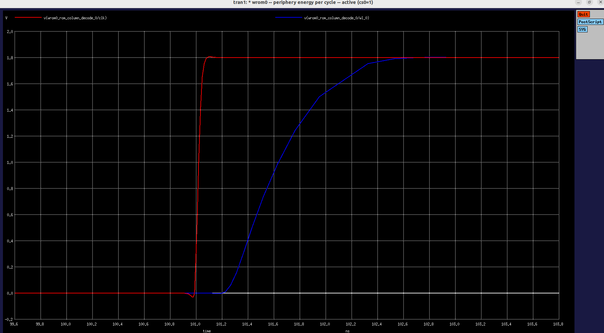

*The column decoder's internal clock (red) against the addressed select
`wl_0` (blue): the select needs ~1.5 ns to reach VDD after the clock edge.
Set that against `t_dis_50` in the figure two sections up and the race is not
close -- the bitline is at 50% long after the select has settled, so `access`
keeps the discharge as its middle term. Captured from `periph_active_tt.sp`,
which carries the same `rom_column_decode` instance, so the window title
names that deck rather than `coldec_a0_tt.sp`; the vectors are the ones the
`plot` line above asks for.*

### Leakage and energy: current, not voltage

```bash
# 1. Run the dynamic column energy simulation:
./scripts/rom_char/run_col_energy.sh wrom0

# 2. Launch interactive ngspice:
ngspice examples/wrom0/char/col236_energy_tt.sp
```
```text
ngspice 1 -> run
# Both xlimit AND ylimit are mandatory to clip the 16.1 mA solver inrush spike at 5 ps:
ngspice 2 -> plot i(Vvdd) xlimit 800n 1000n ylimit -130u 20u
```
```bash
# Inspect measured column charge and energy from log:
grep -E "q_c3|e_col_pj" examples/wrom0/char/col236_energy_tt.log

# 3. Run and inspect DC column leakage (.op):
./scripts/rom_char/run_col_power.sh wrom0
grep -A 20 "vvdd" examples/wrom0/char/col236_leak_tt.log | grep -E "^\s*i\s+"

# 4. Run and inspect DC periphery leakage (.op multi-slice sweep):
./scripts/rom_char/run_periphery_leak.sh wrom0
cat examples/wrom0/char/periph_leak_cs0_tt.total
```

Both limits are needed and the `ylimit` is the important half: `xlimit` only
crops the x window, while the y axis keeps autoscaling over the WHOLE vector.
That vector is dominated by a 16.1 mA spike 5 ps into the run, so on a plain
`plot i(Vvdd)` the axis comes out in milliamps and every real current is a
flat line on zero. Pinning the y range puts the axis in microamps, which is
where the settled cycle lives -- `+17.3 uA` at 800.01 ns and `-122.7 uA` at
800.31 ns on the discharge edge, `-57.7 uA` at 911.6 ns on the recharge.

**That opening spike is an artefact of the simulation, not of the ROM.** `uic`
starts every node at 0 V, so on the very first timestep every parasitic C on
the supply charges at once; it is picoseconds wide and its height is set by
the solver's first step, not by the circuit. A real macro comes up on a supply
ramp and never draws it. It is also the reason the measured window sits on a
late cycle: the inrush at 5 ps and the slow chain fill-up behind it are five
orders of magnitude away from the 600 ns where `q_c2` starts, so neither of
them reaches the `.lib`.

**What comes out of these decks.** They are the only ones that report a
CURRENT rather than a voltage, and between them they fill both power sections
of the `.lib`:

| measurement | deck / log | where it lands |
|---|---|---|
| `q_c3` | `col<N>_energy_<corner>.log` | the charge over the settled second-to-last cycle -- the early cycles are never used |
| `e_col_pj` | same | `q_c3 x VDD`: the energy ONE discharging column costs. Multiplied by the zeros in the selected row, it becomes `internal_power` `when "cs0"` |
| `q_c2` | same | the cycle before it, purely as the settling check |
| `vvdd#branch` | `col<N>_leak_<corner>.log` (`.op`, no waveform) | the array half of `cell_leakage_power`, times the column count |
| per-block branch currents | `periph_leak_cs<n>_<corner>.total` | the periphery half, one slice per block times a count from the netlist. Both halves are taken in the SAME idle state (clk0 low) so that they can be added |

Energy is `q_c3 x VDD` -- the charge integrated over the **second-to-last**
cycle, so the deck has settled. With `uic` every node starts at 0 and the
chain fills slowly, so the early cycles are a start-up transient and are never
used. The column window moves with `--cycles`. The periphery deck goes one step
further: ngspice pauses at cycle boundaries, measures the preceding pair and
resumes the **same transient** if needed, without parsing the deck or computing
the earlier cycles again. When the column deck gained the array-level
parasitics the extra charge made wrom2 at SS miss the 1% settling limit at 4
cycles. The names `q_c2`/`q_c3` are historical -- they are the final accepted
pair, whichever cycles those are.

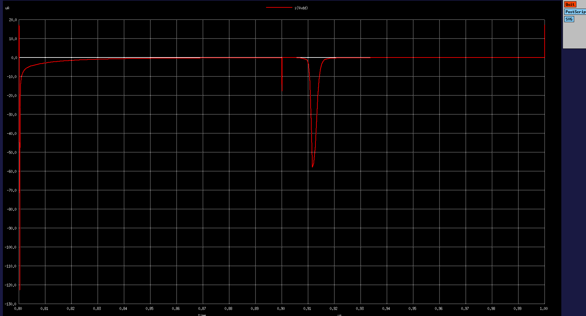

*`col236_energy_tt.sp`: `i(Vvdd)`, the current the column draws from the
supply, over one cycle. Flat and nearly zero between events -- that floor is
the leakage the `.op` deck measures separately -- with a single ~58 uA spike
when precharge pulls the bitline back to VDD. The area under that spike is
`q_c3`; `q_c3 x VDD` is `e_col_pj`, what one discharging column costs. Energy
is taken here, not from a voltage, because charge is what the `.lib` wants.*

### The column DC leakage: .op

```bash
# 1. Run column DC leakage characterization across corners:
./scripts/rom_char/run_col_power.sh wrom0

# 2. Inspect operating point current in ngspice:
ngspice examples/wrom0/char/col236_leak_tt.sp
```
```text
ngspice 1 -> run
ngspice 2 -> print i(vvdd)
```
```bash
# Inspect settled DC leakage directly from log:
grep -A 20 "vvdd" examples/wrom0/char/col236_leak_tt.log | grep -E "^\s*i\s+"
```

**Why this deck uses `.op` and not a transient:** In a transient simulation with `uic`, internal diffusion nodes in the series stack of 134 transistors initialize at 0 V and charge upward through dozens of series devices. Even at 600 ns into a transient run, the chain still draws 8.7 nA of charging displacement current. Mistaking that RC charging tail for leakage overstates DC standby current by ~100x. The `.op` deck finds the true static DC solution immediately (wrom0 TT: 0.3660 nA per column).

| measurement | deck / log | where it lands |
|---|---|---|
| `vvdd#branch` | `col<N>_leak_<corner>.log` (`.op`) | Multiplied by total columns (256): forms the array half of `cell_leakage_power` (93.70 nA at TT) |

### The cell equivalent gate capacitance: linear wordline load reduction

```bash
# 1. Generate and simulate the single-cell gate testbench:
python3 scripts/rom_char/gen_cell_gate_tb.py wrom0 examples/wrom0/char/cellgate_tt.sp --corner tt
ngspice examples/wrom0/char/cellgate_tt.sp
```
```text
ngspice 1 -> set color0=white color1=black
ngspice 2 -> run
ngspice 3 -> plot v(g0) i(Vg0)
```
```bash
# Inspect measured gate charge and equivalent capacitances:
grep -E "c_one_ff|c_zero_ff|q_one|q_zero" examples/wrom0/char/cellgate_tt.log
```

**Why linear capacitance substitution is necessary:** When `run_periphery_power.sh` simulates the row decoder driving a wordline, loading that wordline with 256 individual non-linear MOSFET gates causes severe numerical convergence failure in ngspice ("Timestep too small"). 

Because dynamic switching energy is strictly the integral of charge supplied by the rail ($E = \int V_{DD} \cdot i(t) dt = V_{DD} \cdot Q$), replacing each non-linear gate with a linear equivalent capacitance:

$$C_{\text{eq}} = \frac{Q(V_{DD})}{V_{DD}} = \frac{\int_0^{T_R} i(V_g) dt}{V_{DD}}$$

**preserves the exact cycle energy** without approximation, while enabling robust SPICE convergence. The cell's parasitic diffusion capacitances are handled separately by the extractor; only gate channel charge is represented here.

| measurement | what it is | where it lands |
|---|---|---|
| `q_one`, `q_zero` | Gate displacement charge integrated over ramp $0 \rightarrow V_{DD}$ | Raw integral for $C_{\text{eq}}$ derivation |
| `c_one_ff`, `c_zero_ff` | Equivalent linear gate capacitance ($C_{\text{eq}} = |Q| / V_{DD}$, wrom0 TT: 0.4554 fF) | Passed via `--gate-cap-ff` to `gen_periphery_power_tb.py` and `run_addr2wl.sh` |

> 🖼️ *Plot inspection (`cellgate_tt.sp`): Red is the gate voltage ramp `v(g0)` rising from 0 to 1.8 V in 10 ns; blue is the gate displacement current `i(Vg0)`. Integrating this current yields $C_{\text{eq}} = 0.4554\text{ fF}$ per cell at TT, used as the linear wordline lump in the periphery decks.*

### The cell series wire resistance model

```bash
# Run cell series wire resistance modeling:
python3 scripts/rom_char/gen_resistance_model.py wrom0
cat examples/wrom0/char/resistance_model.json
```

**Bounding wire resistance without crashing the extractor:** Whole-macro parasitic resistance extraction (`extresist on`) segfaults Magic 8.3.629 due to array size. Rather than guessing wire resistance or ignoring it, `gen_resistance_model.py`:
1. Extracts resistance on a **single isolated cell** in Magic.
2. Computes resistance analytically from the cell layout geometry (`.mag`) and PDK sheet resistances (`sky130A.tech`).
3. Compares both methods side-by-side to cross-validate the analytic model.

On wrom0, this yields about 508 $\Omega$ of series metal/contact resistance per
`one_cell`. The resistance accumulates over the chain, so its timing effect is
not negligible: the reference runs shift the bitline term by about 15% at TT,
6.6% at SS, and 28% at FF. The column deck includes the model by default;
`--no-resistance` is a comparison mode.

### Dynamic read energy: the average of 10 random reads, not the worst case

`run_col_energy.sh` measures what **one** discharging column costs. What the
`.lib` needs is what a **read** costs, and that depends on how many columns
discharge at all.

Not all of them do. A read precharges every bitline to VDD while `clk0` is
low, then drops the selected row's wordline:

* the cell is a `zero_cell` -- a metal strap. It conducts whatever its
  wordline does, the series chain stays closed, **that bitline discharges**
  and the next precharge has to recharge it;
* the cell is a `one_cell` -- an NMOS whose gate has just gone low. It
  **opens** the chain, that bitline stays at VDD, and the next precharge draws
  nothing for it.

The energy of one read is therefore set by the number of zeros in the selected
row.

```bash
python3 scripts/rom_char/gen_random_read_energy.py wrom0 --corner tt
```
The script combines measured `e_col_pj` and `e_periph_pj` with activity counted
from the netlist. It uses one deterministic address sample per macro across all
corners, writes `char/random_energy_<corner>.log`, and reports sampled mean,
exact row mean, and worst case. Increase the sample without additional SPICE
simulation:

```bash
ROM_ENERGY_READS=200 ./scripts/rom_char/regen_rom_libs.sh
```

---

## Detailed Pin Capacitance, Slew, and Timing Constraints

### Input pin capacitance -- the `capacitance` attribute of every input pin

Each pin is ramped 0 -> VDD on its own and the charge it has to supply is
integrated: **C = Q/VDD**. That captures the whole load -- the pin's wire C,
the gate C of the first stage, and the Miller charge pushed back through that
stage as it switches.

* **Both edges are measured.** `c_rise` and `c_fall` should agree; a pin where
  they do not is state dependent and no single Liberty scalar can represent
  it. The summary prints the gap and ships the **larger** of the two.
* **`c_cyc` is the number that ships** -- one full `0 -> VDD -> 0`.
* **The whole periphery stays in the deck**: `addr0[0:2]` go to the column
  decoder, `addr0[3:]` to the row decoder, `clk0`/`cs0` to the control logic,
  so removing any block would leave some pin driving nothing.

```bash
# 1. Run the flow script to generate and simulate pin capacitances:
./scripts/rom_char/run_pin_cap.sh wrom0

# 2. Launch interactive ngspice:
ngspice examples/wrom0/char/pincap_tt.sp
```
```text
ngspice 1 -> run
ngspice 2 -> plot v(clk0) i(vpin1)
```
```bash
# Inspect measured pin capacitances from log:
grep -E "c_cyc" examples/wrom0/char/pincap_tt.log
```

**What comes out of this deck** (`pincap_<corner>.log`), for each of the
thirteen input pins `i`:

| measurement | what it is | where it lands |
|---|---|---|
| `q_rise<i>`, `q_fall<i>` | the charge the pin supplies on each edge | the raw integral everything else is derived from |
| `c_cyc<i>_ff` | `(abs(Q_rise) + abs(Q_fall)) / (2*VDD)` | **the number that ships** as that pin's `capacitance`. A Liberty bus carries one value, so `addr0` gets the WORST bit (0.0095 pF at TT) and the header records the per-bit spread |
| `c_rise<i>_ff`, `c_fall<i>_ff` | the same split per edge | no `.lib` number -- the settling proof. The two must agree within `PIN_GAP_THRESH` (the `flow.py --pin-cap-gap` value, default 12%); otherwise the flow lengthens that pin's hold window and retries, then fails if it still cannot converge within the configured guards |

The cross-check, which produces no number the `.lib` needs -- run the deck
twice and compare, because the charge over a full swing must not depend on how
fast the pin is ramped:

```bash
PIN_TR=2n ./scripts/rom_char/run_pin_cap.sh wrom0     # ramp independence
```

**There is no whole-macro reference run.** A `--keep-all` experiment on
`wrom0` exceeded about 15 GB and did not finish. Its cost grows with the
user-selected array size, so it is not part of the flow.

What that leaves is a known limit rather than a hidden one. Every check here
runs the same reduced deck, so none of them can see an error the reduction
makes in all of them at once. That error is **bounded, not measured**:
doubling the lumped load the deleted array is replaced by moves `addr0[0]` by
4.9% and every other pin by under 0.6% ([limitations.md](limitations.md)
item 5).

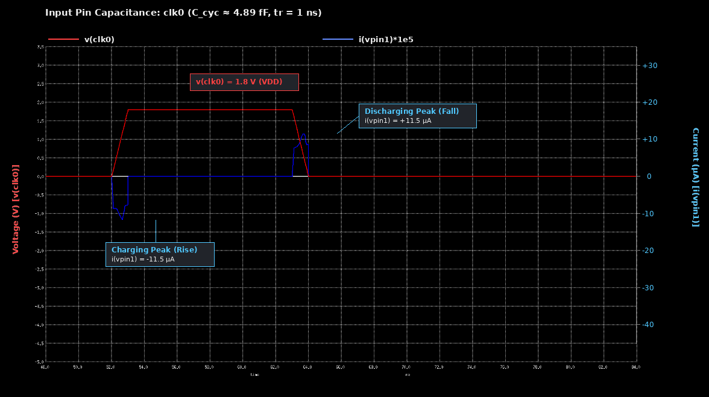

### Wordline slew -- how fast a wordline really falls

The column deck cannot answer this: it holds every wordline at DC VDD. The
periphery deck can -- real decoder, real buffers, and the deleted array's load
put back as one cell gate per column plus the wordline's own wire C.

| measurement | what it is |
|---|---|
| `t_wlfall0` | `clk0` 50% -> wordline 50% (delay) |
| `t_wlslew0` | 80% -> 20% fall -- the sky130 Liberty convention |
| `t_wl1090_0` | 90% -> 10% fall |
| `tf` | `t_wl1090_0 / 0.8` -- the ramp to feed a PULSE/PWL |

```bash
# 1. Run the flow script to generate and simulate wordline slew:
./scripts/rom_char/run_wl_slew.sh wrom0

# 2. Launch interactive ngspice:
ngspice examples/wrom0/char/wlslew_tt.sp
```
```text
ngspice 1 -> run
ngspice 2 -> plot v(clk0) v(wrom0_rom_row_decode_0/wl_0)

# Zoom around the falling transition of the wordline:
ngspice 3 -> plot v(clk0) v(wrom0_rom_row_decode_0/wl_0) xlimit 98n 104n
```
```bash
# Inspect measured wordline fall delay and slews from log:
grep -E "t_wlfall0|t_wlslew0|t_wl1090_0" examples/wrom0/char/wlslew_tt.log
```

**What comes out of this deck** (`wlslew_<corner>.log`). None of it is a
`.lib` number directly -- this deck exists to give the HOLD measurement a real
wordline edge instead of a synthetic one:

| measurement | what it is | where it lands |
|---|---|---|
| `t_wlfall0` | clk0 50% -> wordline 50% | the delay itself; with `v_wl<k>_eval` it states the decoder polarity |
| `t_wlslew0` | 80% -> 20% fall | the sky130 Liberty slew convention, for comparison |
| `t_wl1090_0` | 90% -> 10% fall | **`/ 0.8` is the ramp `run_hold_bisect.sh` cuts the chain with** (`--wl-slew-ns`). Without it the hold would be bisected against an ideal edge the silicon never produces |

`run_wl_slew.sh` must run before `run_hold_bisect.sh`. Where either required
log is missing, the `.lib` keeps
`hold = access` and says so in its header; that fallback is pessimistic by
5-12%, since the measured hold runs 88-95% of access.

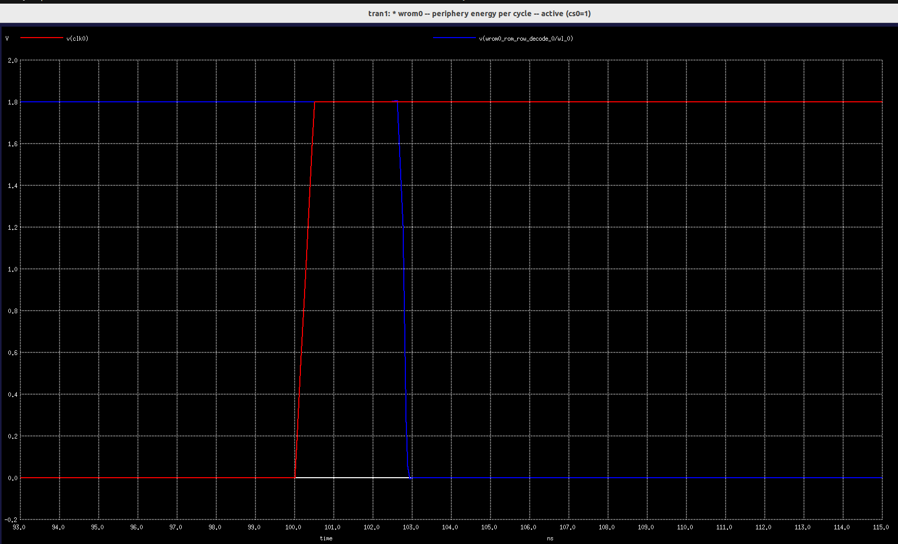

*`clk0` (red) rising against the addressed wordline `wl_0` (blue) falling:
the row decoder's polarity, shown rather than asserted, and the fall itself --
steep next to the delay that precedes it, which is why `t_wl1090_0` is
~0.12 ns while `t_wlfall0` is 1.5692 ns at TT. Read the shape here and the
numbers from `wlslew_<corner>.log`: this window sits on an early cycle near
100 ns, while the deck's `.measure` lines sample the settled cycle at ~1.30 us,
so the clk-to-wordline delay looks longer in the picture than the logged
value. The window title names the periphery energy deck because
`gen_periphery_power_tb.py` writes both decks with the same title line --
`wlslew_<corner>.sp` is that generator run under its own name.*

### Output slew, and the two `.lib` table axes

`t_dout_slew` comes from the same back-end deck as `t_bl2dout`, so the
CELL_TABLE's `index_2` (output load) is three measurements, not one number
copied three times. `index_1` (input transition) comes from a clk0 slew sweep:

```bash
# 1. Run the clock slew sweep:
SLEWS="0.05 0.2 0.5" ./scripts/rom_char/run_slew_sweep.sh wrom0

# 2. Launch interactive ngspice:
ngspice examples/wrom0/char/periph_slew0_tt.sp
```
```text
ngspice 1 -> run
ngspice 2 -> plot v(clk0) v(wrom0_rom_column_decode_0/clk)
```
```bash
# Inspect measured delay across all slew points from logs:
grep "t_clk2pre" examples/wrom0/char/periph_slew*_tt.log
```

**What comes out of this sweep** (`periph_slew<n>_<corner>.log`, one run per
slew point):

| measurement | what it is | where it lands |
|---|---|---|
| `t_clk2pre` at each slew | the front-end term vs the clk0 edge | **the `index_1` axis** of every delay table. wrom0 TT: 0.7227 / 0.7406 / 0.7642 ns over 0.05 / 0.2 / 0.5 ns |
| the largest of them | | also the `t_clk2pre` used in the hold frame conversion, because that lengthens the converted hold, i.e. tightens it |

The axis is nearly flat, and that is the measurement rather than a
placeholder: a 10x change in the clock edge moves the front-end term by 5.7%
and `access` by 0.24%, because 15.34 ns of that sum is a bitline discharge
that cannot see clk0 at all.

Only term 1 of `access` depends on the clk0 edge -- terms 2 and 3 trigger off
the precharge net and the bitline, which cannot see clk0. That is also why the
output slew table stays flat over `index_1`.

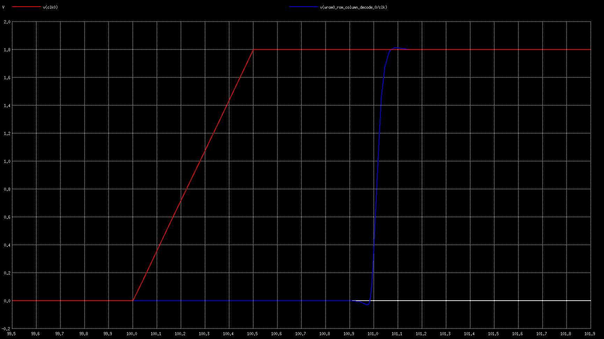

### Address setup

```bash
# 1. Run the address setup race measurement:
./scripts/rom_char/run_addr_setup.sh wrom0

# 2. Launch interactive ngspice:
ngspice examples/wrom0/char/periph_setup_tt.sp
```
```text
ngspice 1 -> run
ngspice 2 -> plot v(addr0[0]) v(clk0)
```
```bash
# Inspect measured address buffer delays and internal clock delay from log:
grep -E "t_addr2dec|t_clk2int" examples/wrom0/char/periph_setup_tt.log
```

**What comes out of this deck** (`periph_setup_<corner>.log`):

| measurement | what it is | where it lands |
|---|---|---|
| `t_addr2dec0` .. `t_addr2dec7` | each address buffer -> the decoder NAND input it drives | the WORST of them becomes `setup_rising`, on `addr0` and on `cs0` |
| `t_clk2int` | clk0 -> the clock that gates that same NAND | not shipped: with `t_addr2dec` it gives the real requirement at the pin, `0.0307 - 0.3255 = -0.2948 ns`. The library ships the positive path delay anyway, and the header states both |

The physical race is `t_addr2dec - t_clk2int`, which is negative in the
reference data. The library deliberately ships the positive buffer delay
instead, preserving the internal clock margin rather than exposing it to
external timing closure.

#### Why `cs0` inherits that number instead of getting its own

`cs0` reuses the address setup value. Its pin connects directly to the control
NAND, while the address path includes an inverter, so the reused value is
conservative by topology. Hold is different: `cs0` controls precharge and was
not exercised by the address-cut experiment, so it keeps the full access
window. See [limitations.md](limitations.md#7-scalar-setup-and-hold-constraints).

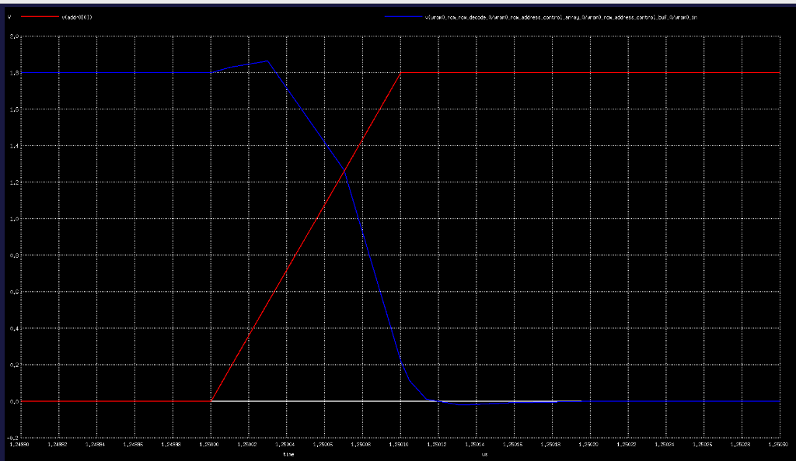

---

### Address Hold Bisection: cutting the chain mid-evaluate

Address hold (`hold_rising` on `bus(addr0)`) is the time `addr0` must remain stable after `clk0` rises. In `--full` characterization mode, rather than falling back to the full read window (`hold = access`), this constraint is measured by cutting the series discharge chain mid-evaluate.

* **What it simulates:** While reading a `0` (wordlines high, series chain closed), an address change at time $T_{\text{cut}}$ pulls a wordline down and cuts the chain at the cell nearest the bitline (worst case). If the bitline has discharged far enough past the inverter trip point (reaching $\ge 0.9 \times V_{DD}$ at the bitline inverter output `bl_b`), the output safely resolves a `0`.
* **Automated bisection:** `run_hold_bisect.sh` iteratively narrows the bracket $[T_{\text{lo}}, T_{\text{hi}}]$ until $|T_{\text{hi}} - T_{\text{lo}}| \le 0.05\text{ ns}$.

```bash
# 1. Run the automated bisection script (--full mode):
./scripts/rom_char/run_hold_bisect.sh wrom0

# 2. Visually inspect the hold cut experiment in ngspice:
python3 scripts/rom_char/gen_addr_hold_tb.py wrom0 look.sp --sweep-ns 14,16 --wl-slew-ns 0.15
ngspice look.sp
```
```text
ngspice 1 -> run
ngspice 2 -> plot v(precharge) v(bl_0_236) v(bl_b_236)
```
```bash
# Inspect the converged hold bracket and final converted hold constraint:
cat examples/wrom0/char/hold_tt.log
```

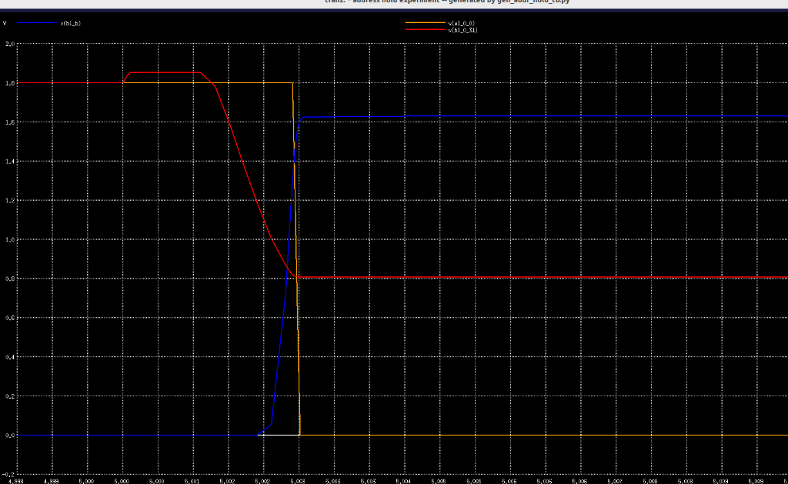

*`look.sp` / `run_hold_bisect.sh` in ngspice: The bitline (blue) discharges during evaluate until the series chain is cut. If the cut occurs late enough, the bitline inverter output `bl_b` (orange) cleanly reaches logic high ($> 0.9 \times V_{DD}$), guaranteeing a valid read.*

---

### Address-to-wordline delay: hold time frame conversion

`run_hold_bisect.sh` answers the physical question — how late may the series chain be cut and still leave a readable bitline — but it answers it in the **column deck's time frame**. That deck is driven by a synthetic `precharge` source and contains no `clk0` pin at all, so its cut time is counted from the internal evaluate edge.

Liberty's `hold_rising` constraint on `bus(addr0)` is referenced to the **`clk0` pin**. Two physical delays separate these two frames:

$$\text{hold}(\text{clk0 frame}) = t_{\text{clk2pre}} + (\text{cut}_{\text{array}} + t_{\text{bl2dout}}) - t_{\text{addr2wl}}$$

* $t_{\text{clk2pre}}$: `clk0` rising pin $\rightarrow$ internal precharge releasing (`periph_active_<corner>.log`). Carries the edge from the clock pin to the array.
* $\text{cut}_{\text{array}} + t_{\text{bl2dout}}$: The bisected array cut time plus worst-load backend delay reported as `hold` in `hold_<corner>.log`. The backend delay covers the bitline inverter, column mux, and output buffer so the address stays stable until data reaches `dout0`.
* $t_{\text{addr2wl}}$: `addr0` switching pin $\rightarrow$ newly selected wordline falling edge. Carries the moving address from the pin to the row decoder output.

Shipping the raw cut time directly is equivalent to assuming that $t_{\text{clk2pre}}$ and $t_{\text{addr2wl}}$ cancel out. On wrom0 TT they happen to be close (~0.76 ns vs ~1.19 ns), but this is a coincidence of one specific decoder sizing and does not hold across corners or macro geometries.

* **What is measured:** The address is switched in the **middle of evaluate** (`--addr-sw-eval`), when the clocked row decoder is already transparent. Switching the row address bit drops the wordline of the newly addressed row, and the delay from the address pin transition to that wordline fall ($t_{\text{addr2wl}}$) is measured.
* **Which bit is switched:** `addr0[0 : log2(words_per_row)-1]` drive the column multiplexer, not the row decoder — toggling those selects a different column and no wordline moves. The first true row address bit is $\text{row\_bit} = \log_2(\text{words\_per\_row})$ (bit 3 on wrom0). Switching address 0 to $2^3 = 8$ shifts selection from row 0 to row 1, whose wordline `wl_1` is probed.
* **One-hot verification:** Only `wl_1` falls in the evaluate window; all other probed wordlines (`wl_0`, `wl_2`..`wl_7`) fail the fall measurement, confirming proper one-hot operation.

```bash
# 1. Run the address-to-wordline characterization (--full mode):
./scripts/rom_char/run_addr2wl.sh wrom0

# 2. Launch interactive ngspice:
ngspice examples/wrom0/char/addr2wl_tt.sp
```
```text
ngspice 1 -> set color0=white color1=black
ngspice 2 -> run
ngspice 3 -> plot v(addr0[3]) v(wrom0_rom_row_decode_0/wl_1)

# Zoom into the address transition and wordline fall mid-evaluate:
ngspice 4 -> plot v(addr0[3]) v(wrom0_rom_row_decode_0/wl_1) xlimit 1.348u 1.354u
```
```bash
# Inspect measured address-to-wordline delay from log:
grep -E "t_addr2wl" examples/wrom0/char/addr2wl_tt.log
```

**What comes out of this deck** (`addr2wl_<corner>.log`):

| measurement | what it is | where it lands |
|---|---|---|
| `t_addr2wl1` | `addr0[3]` 50% $\rightarrow$ `wl_1` 50% falling delay | Subtracted in the hold frame conversion: $\text{hold} = t_{\text{clk2pre}} + (\text{cut}_{\text{array}} + t_{\text{bl2dout}}) - t_{\text{addr2wl}}$ (wrom0 TT: 1.1875 ns) |
| `t_addr2wl<k>` ($k \ne 1$) | other probed wordlines | reported as "failed" (out of interval); proves one-hot row decode |

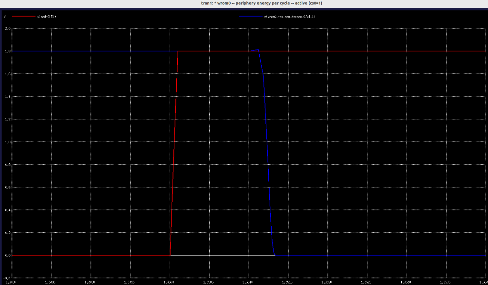

*`addr2wl_tt.sp`, ngspice's own plot window: Red is the moving address bit `v(addr0[3])` transitioning at 1.35 us mid-evaluate; blue is the newly addressed wordline `v(wrom0_rom_row_decode_0/wl_1)` falling through 50% at 1.3512 us (1.1875 ns later). This $t_{\text{addr2wl}}$ delay carries the raw internal hold cut time into the real `clk0` pin reference frame.*

---

### Early Path: the fastest discharging column and retain times

Every other delay term in the `.lib` bounds setup (late path, worst column). However, STA also requires an **early bound** to guard downstream capture registers against hold violations: `retain_rise` and `retain_fall` specify the earliest time `dout0` can leave its previous value.

* **Fastest programmed column vs fastest array:** Programmed ROM bits differ between contents. To make retain constraints robust across ROM contents, `gen_col_tb_parasitic.py --ones=0` constructs the theoretical fastest possible array where all data cells are metal straps (`zero_cell`), bounded only by the foot transistor.
* **Running early path characterization:**

```bash
# 1. Run early path characterization:
./scripts/rom_char/run_early_path.sh wrom0

# 2. Launch interactive ngspice on the best-case column deck:
ngspice examples/wrom0/char/col10_best_case_parasitic.sp
```
```text
ngspice 1 -> run
ngspice 2 -> plot v(precharge) v(bl_0_10)
```
```bash
# Inspect measured retain / early discharge times:
grep -E "t_dis_50|t_pre_50" examples/wrom0/char/col10_best_case_parasitic*.log
```

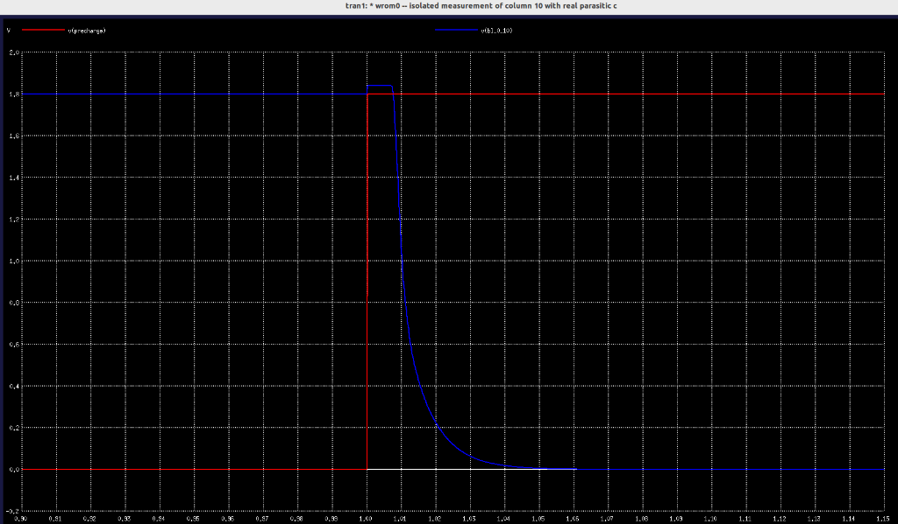

*`col10_best_case_parasitic.sp`, ngspice's own plot window: Red is `v(precharge)` releasing at 1.00 us; blue is the fastest discharging bitline `v(bl_0_10)`. The early discharge crossing defines `retain_rise` and `retain_fall`.*

---

## The frequency window this ROM may be driven in

The generated `.lib` carries the upper-frequency limit as
`minimum_period(clk0)`, built from the required evaluate and precharge pulse
widths. Use that value rather than a frequency copied into prose. The `fmax`
field in `ROM_CORNERS` only scales power summaries.

The dynamic bitline also creates a lower-frequency retention limit: during a
long evaluate phase, a stored high level can decay through leakage and charge
sharing. Liberty has no generally enforced maximum-pulse-width constraint, and
this flow does not characterize that bound. Do not assume arbitrarily long
`clk0` high times are safe.

Every measurement uses **real Magic parasitic capacitance** and runs each
corner against its own sky130 models -- no fixed derating factor.

---

## The scaling trick

The 34k-transistor array is never simulated whole:

* **column slice** -- the worst column is isolated by walking the extracted
  netlist graph, measured, and the result multiplied by the column count
  (leakage, energy);
* **periphery slice** -- the array is deleted and its load (cell gate count x
  measured gate capacitance + parasitic wire C) is put back as a lump;
* **block slices, for leakage** -- the periphery is cut into one instance of
  each repeated block (control logic, address buffer, wordline driver, one
  row-decode column, one column-decode column and its driver, one bitline
  inverter, one column mux transistor and one output buffer), each on its
  own supply source, so a single `.op` reports every block's current on a
  separate branch and each is multiplied by a count from the netlist. Every
  block the macro instantiates must be in that list; an omitted block would be
  scored as zero.

So runtime does not explode as the macro grows.

The leakage deck is built from the **schematic** netlist rather than the Magic
extraction: leakage is a DC quantity, so parasitic capacitance cannot change
it, and the deck stays at a few hundred devices. That matters, because `.op`
does **not** converge on the full periphery netlist -- the row decoder is a
precharged NAND chain whose internal nodes have no DC path, the matrix is
singular there, and dynamic gmin, true gmin and source stepping all fail after
eight minutes and 2.7 GB. Cut into static-CMOS blocks plus one decode column,
every slice converges in seconds.

### Parasitic Capacitance Extraction (Magic)

All dynamic timing, delay, and pin capacitance decks rely on physical layout parasitics extracted from the real silicon layout rather than synthetic estimations:

```bash
# Run Magic parasitic capacitance extraction:
./scripts/rom_char/run_cap_extract.sh wrom0
```

* **What it does:** Invokes Magic in batch mode (`magic -dnull -noconsole`), loads the macro layout, and executes `extract do local`, `extract all`, and `ext2spice cthresh 0` with `extresist off`.
* **Output:** `<macro_dir>/<macro>_cap_only.spice`, which provides the foundational netlist for `gen_col_tb_parasitic.py`.
* **Why resistance extraction is omitted (`extresist off`):** Running whole-macro resistance extraction on tens of thousands of ROM cells causes a segmentation fault in Magic 8.3.629. Wire resistance is therefore bounded separately on a single-cell basis using `gen_resistance_model.py`.

#### gmin has to be swept, not chosen

`gmin` is the artificial conductance ngspice puts on every node to help it
converge, and it sits in parallel with the leakage being measured. At picoamp
levels a fixed value can dominate the result, and different blocks settle at
different values. `run_periphery_leak.sh` therefore generates its axis
adaptively: it multiplies the current `gmin` by `GMIN_FACTOR` and continues
until every slice agrees for two consecutive intervals. There is no fixed
final gmin; `GMIN_FLOOR` is only a solver-safety limit. A slice that reaches
that floor without settling is printed as NOT CONVERGED and is not used.

The adaptive axis and both `cs0` states run in one ngspice session per corner. The deck
is parsed once, then its control block changes `gmin` with `option`, changes
`Vcs` with `alter`, and reruns `.op`. Marker-split logs preserve the individual
`cs0 × gmin` provenance and the convergence calculation above; only repeated
netlist parsing was removed.

The slice inventory includes the control path, decoders, wordline drivers,
bitline inverters, column mux, and output buffers. It is checked against the
top-level instances because omitting a block would silently reduce the result.

Both chip-select states are measured (`cs0` = 0 and 1) and they come out equal
to six decimals at every corner. That is a result, not a copy: `cs0` gates the
precharge *path*, so it changes what the macro does on a clock edge, and a
leakage number describes the static state it sits in between edges. The `.lib`
carries both `leakage_power` groups with their `when` conditions and says so
in the header.

Energy is measured as the charge drawn from the supply over a cycle, and the
last two cycles are compared: equal values are the proof that the circuit has
settled.

Both energy decks use ngspice `method=gear`. Trapezoidal integration rings on
extracted body nodes and makes the supply-charge integral timestep-dependent.
The last two cycles are compared to reject unsettled results.

---

## Predicting a geometry change

At fixed geometry, ROM contents change the active-device count in the worst
column without changing bitline capacitance. Growing the array changes both
resistance and capacitance, so results from the four equal-sized reference
macros cannot predict that scaling. Characterize each new geometry.

## Size independence

When a ROM is regenerated (different `word_size`, `words_per_row` or `.bin`)
**no script needs editing**. Everything the flow needs is derived:

| fact | source |
|---|---|
| macro list | `<tree>/<macro>/<macro>.sp` directories |
| row / column count | netlist scan (scoped to `*_rom_base_array`) |
| worst column + series chain length | same scan (`one_cell` count) |
| address / data width | LEF pins (`PIN addr0[..]`, `PIN dout0[..]`) |
| word count | size of `rom_configs/<macro>.bin` |
| `word_size` / `words_per_row` | `config/<macro>.py` (cross-check) |
| power / ground pin names | LEF pins (`USE POWER`, `USE GROUND`) |

The single source of truth is
[`scripts/rom_char/rom_paths.py`](../scripts/rom_char/rom_paths.py). The netlist
wins; if `word_size*8*words_per_row` disagrees with it you get a **warning**,
and if `words_per_row` is not a power of two it tells you the address space
will have holes. Geometry is cached in `<macro>/char/.geometry.json` and
refreshes itself when the netlist changes.
