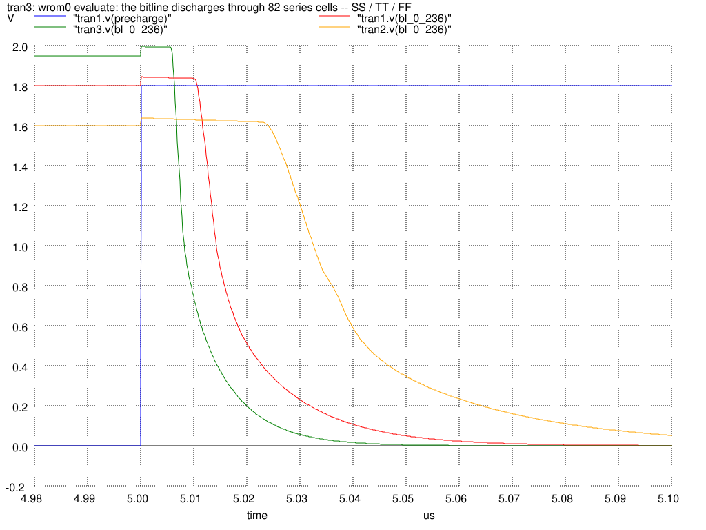
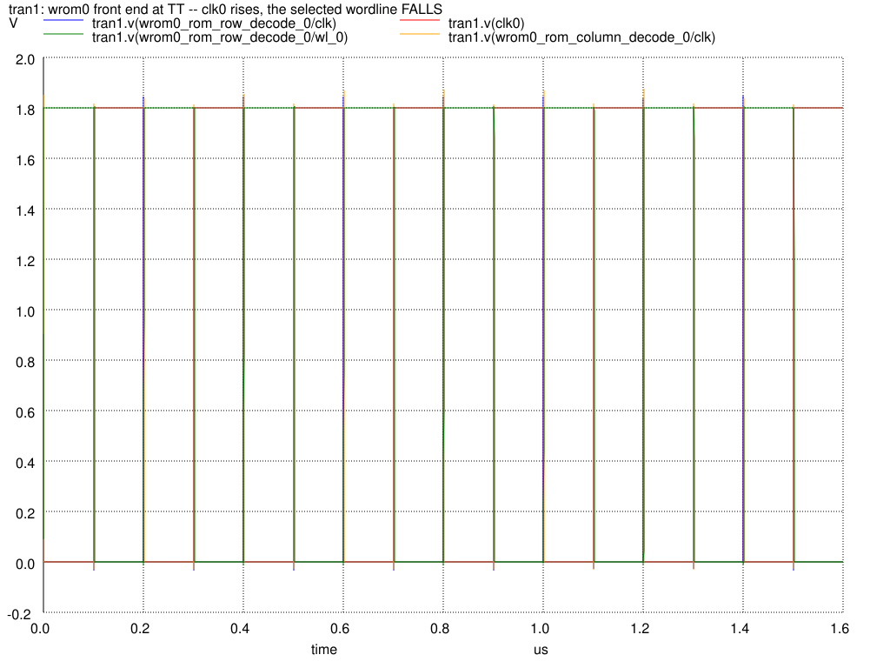

# What is measured, and how

Which deck measures which block, how `access` is built from three terms, the frequency window, and the slicing that keeps runtime finite.

[<- back to the README](../README.md)

---

## Contents

1. [Macro Architecture & 3-Term Access Path](#what-is-measured-and-how)
2. [Detailed Measurement Decks & Waveforms](#detailed-measurement-decks--waveforms)
   - [Column Bitline Discharge & Precharge](#the-column-bitline-discharge-and-precharge)
   - [Periphery Front End (Clock, Decoder, Precharge)](#the-periphery-front-end-clk0---internal-clock---wordline---precharge)
   - [Back End (Bitline -> dout0)](#the-back-end-bitline---dout0-at-one-of-the-three-lib-loads)
   - [Column Decoder Race](#the-column-decoder-against-the-discharge-it-races)
   - [Leakage & Switching Current](#leakage-and-energy-current-not-voltage)
   - [Dynamic Read Energy & Activity Model](#dynamic-read-energy-the-average-of-10-random-reads-not-the-worst-case)
3. [Pin Capacitance, Slew, and Constraints](#detailed-pin-capacitance-slew-and-timing-constraints)
   - [Input Pin Capacitance](#input-pin-capacitance----the-capacitance-attribute-of-every-input-pin)
   - [Wordline Fall Slew](#wordline-slew----how-fast-a-wordline-really-falls)
   - [Output Slew & Liberty Axes](#output-slew-and-the-two-lib-table-axes)
   - [Address Setup & Hold](#address-setup)
4. [Frequency Window (Upper & Lower Bounds)](#the-frequency-window-this-rom-may-be-driven-in)
5. [The Scaling Trick (Simulation Slicing)](#the-scaling-trick)
   - [Adaptive gmin Sweep](#gmin-has-to-be-swept-not-chosen)
6. [Predicting Geometry Scaling](#predicting-a-geometry-change)
7. [Size Independence & Derived Geometry](#size-independence)

---

## What is measured, and how


The macro has seven top-level blocks. All seven appear in the measurements:

| block | timing | power |
|---|---|---|
| `rom_control_logic` (clock driver + NAND) | periphery deck | yes |
| `rom_row_decode` (address buffers, decoder, wl drivers) | periphery deck | yes |
| `rom_base_array` (cells + precharge) | column deck (worst column) | yes (x columns) |
| `rom_bitline_inverter` | back-end deck | yes (inside the column deck) |
| `rom_column_mux_array` | back-end deck | no |
| `rom_output_buffer` | back-end deck | yes (periphery leak) |
| `rom_column_decode` (addr[2:0] -> word_sel) | coldec deck (races discharge) | yes (periphery leak) |

### `access` is the sum of three measured terms

There is no output latch, so `dout0` is valid only during clk0's high phase,
and the path from clock to data crosses three stages. Each is measured in its
own deck:

| # | term | what | deck | log |
|---|---|---|---|---|
| 1 | front end | `clk0` -> `precharge` | periphery | `periph_active_<corner>.log` (`t_clk2pre`) |
| 2 | bitline | precharge -> bitline 50% | column | `col<N>_worst_case_parasitic*.log` (`t_dis_50`) |
| 3 | back end | bitline -> `dout0` | back end | `backend_<corner>_<load>.log` (`t_bl2dout`) |

The same path run backwards gives the **falling-edge arc**: when clk0 falls
the precharge PMOS pulls the bitline back to VDD and every dout0 bit returns
to 1, so the data is gone. The `.lib` carries that as a second `timing()`
group on `dout0` with `timing_type : falling_edge`, built from the *minimum*
of the same three terms (`t_clk2pre + t_pre_50 + t_bl2dout` at the smallest
load). The earliest invalidation is the number that matters -- what has to be
proven is that the consumer captured before the data went away. Without this
group STA reads an unlatched ROM as if it held its output and reports a false
pass.



Term 2 dominates. The figure shows the same column at all three corners, with
the 50% crossing that defines `t_dis_50` and the 99% recharge that defines
`t_pre`.



The front-end deck also settles the decoder polarity by measurement rather than
assumption: after clk0 rises, the selected wordline **falls**. That is what
justifies holding every wordline at VDD in the column deck.


The back-end deck is run once per output load, so the `index_2`
(`total_output_net_capacitance`) axis of the CELL_TABLE is a real measurement
and not three copies of one number. The bitline edge driving it is not a guess
either -- it replays the column deck's own discharge waveform sample for
sample through a PWL source (cached in `char/wave/bl_<corner>.txt`).

Also measured: setup (`t_addr2dec*`), leakage (`.op`), per-column energy and
periphery energy (active and idle), and input pin capacitances with adaptive
settling (`run_pin_cap.sh` / `pincap_settle_step.py`).

---

## Detailed Measurement Decks & Waveforms

### The column: bitline discharge and precharge

```bash
./scripts/rom_char/run_col_timing.sh wrom0
ngspice examples/wrom0/char/col236_worst_case_parasitic.sp
```
```
ngspice 1 -> run
ngspice 2 -> plot v(precharge) v(bl_0_236)
```

**What comes out of this deck** (`col<N>_worst_case_parasitic*.log`). The blue
trace is the whole of `access`'s dominant term; the red one is the precharge
phase that has to finish before the next read can start:

| measurement | what it is | where it lands |
|---|---|---|
| `t_dis_50` | precharge -> bitline 50% | **term 2 of `access`**, the largest one (wrom0 TT: 15.3355 of 17.2675 ns) |
| `t_dis_10` | the 10% point of the same fall | no `.lib` number of its own -- it is the cross-check that the back-end deck is replaying THIS curve: both decks print `t_dis_50`/`t_dis_10` and they must agree |
| `t_dis_50_prev` | the same discharge one cycle earlier | no `.lib` number -- it is the settling proof. Over 1% apart and the run is a start-up transient, not a steady state, and the deck says so |
| `t_pre_50` | recharge to 50% | the **falling_edge arc**: `t_clk2pre + t_pre_50 +` smallest-load `t_bl2dout` |
| `t_pre_99` | recharge to 99% | `min_pulse_width(fall)` and `minimum_period` -- the ROM's *minimum* clock frequency |
| `t_pre_90` | recharge to 90% | measured, deliberately NOT used: 90% lands ~0.5 ns and would write a `min_pulse_width` 20x too small |


*`col236_worst_case_parasitic.sp`, ngspice's own plot window. Red is
`v(precharge)`, blue the bitline `v(bl_0_236)` of wrom0's worst column. The
bitline sits at VDD while precharge is low, overshoots a little as precharge
releases at 1.00 us, then falls -- through 50% at ~14.8 ns, which is term 2 of
`access` and ~85% of it. The long flat tail is the dynamic node holding at 0:
nothing drives it back up until the next precharge.*

### The periphery front end: clk0 -> internal clock -> wordline -> precharge

```bash
./scripts/rom_char/run_periphery_power.sh wrom0
ngspice examples/wrom0/char/periph_active_tt.sp
```
```
ngspice 1 -> run
ngspice 2 -> plot v(clk0) v(wrom0_rom_row_decode_0/clk) v(wrom0_rom_row_decode_0/wl_0) v(wrom0_rom_column_decode_0/clk)
```

**What comes out of this deck** (`periph_active_<corner>.log`). It is the only
deck with the real decoder in it, so both the front-end delay and the
periphery's share of the energy come from here:

| measurement | what it is | where it lands |
|---|---|---|
| `t_clk2pre` | clk0 -> the internal precharge net | **term 1 of `access`**. Also the term the `index_1` slew axis moves, and the `+t_clk2pre` that carries the hold into the clk0 pin's frame |
| `t_clk2int` | clk0 -> the internal clock | not a `.lib` value: it is the other half of the SETUP race. The address requirement at the pin is `t_addr2dec - t_clk2int` = -0.2948 ns, quoted in the header |
| `t_wlfall0` | clk0 -> the selected wordline's fall | **not in `access`** -- see below. Feeds the hold work |
| `t_wlslew0`, `t_wl1090_0` | 80-20 and 90-10 fall times | `t_wl1090_0 / 0.8` is the real wordline ramp `run_hold_bisect.sh` drives its cut with |
| `v_wl0_eval` .. `v_wl7_eval` | wordline VOLTAGE at a fixed instant inside evaluate | no number -- the polarity EVIDENCE: the selected row reads 6.17e-08 V, the other seven read a flat 1.800000 V |
| `q_c2`, `q_c3` | charge drawn from VDD over two consecutive cycles | their gap is the settling check; `q_c3` is the one used |
| `e_periph_pj` | `q_c3 x VDD` | the periphery term of BOTH `internal_power` states -- added to the column term when `cs0`, and the whole of it when `!cs0` |

**The wordline is measured here but is deliberately not in `access`.** It
arrives at 1.5692 ns against the precharge net's 0.7642 ns, so adding it would
lengthen the sum by 0.8 ns. It is not in series: the read that sets `access`
is a read of **0**, and there the selected cell is a `zero_cell` -- a metal
strap that conducts whatever its gate does -- while every other wordline stays
HIGH and does not move at all. The chain is closed the moment precharge
releases. (The case where the wordline edge does matter is a read of **1**,
which the column deck does not simulate; see
[limitations.md](limitations.md).)

The selected wordline **falls** -- the decoder polarity is settled by this
measurement, not assumed.


*`periph_active_tt.sp`. Red `v(clk0)` rises with the real input slew; blue is
the row decoder's internal clock, green the column decoder's, orange the
selected wordline `wl_0`. Two things are measurements rather than assumptions
here: the internal clock arrives ~0.55 ns after `clk0` crosses, and `wl_0` is
HIGH for the whole of that edge and only **falls** ~2.5 ns later. That
polarity -- selected wordline low, all others high -- is why the column deck
holds every other wordline at VDD.*

### The back end: bitline -> dout0, at one of the three `.lib` loads

```bash
./scripts/rom_char/run_backend_delay.sh wrom0
ngspice examples/wrom0/char/backend_tt_2756.sp
```
```
ngspice 1 -> run
ngspice 2 -> plot v(wrom0_rom_base_array_0/bl_0_236) v("dout0[2]")
```

**What comes out of this deck** (`backend_<corner>_<load>.log`). It is run
once per `.lib` output load, which is what makes `index_2` three measurements
rather than one number copied three times:

| measurement | what it is | where it lands |
|---|---|---|
| `t_bl2dout` | bitline -> `dout0`, through the bitline inverter, the 256:32 mux and the output buffer | **term 3 of `access`** (wrom0 TT: 0.9532 .. 1.1678 ns across the three loads). The SMALLEST-load value is also the third term of the falling_edge arc |
| `t_dout_slew` | the output's own transition time | the `output_transition` tables, and `retaining_rise`/`retaining_fall` take the smallest-load one |

The bitline here is not a stimulus shaped to look like a discharge, it is the
discharge: `run_backend_delay.sh` re-runs this corner's column deck with the
waveform kept and the samples are replayed through a PWL source. The deck
header prints the `t_dis_50`/`t_dis_10` of the curve it replayed, and they
match the column log to four decimals -- that is the proof it is the same
curve, at all three corners.

Until 2026-09-24 this was a straight ramp through the measured 50% and 10%
points instead. It reproduced those two instants and nothing else: a discharge
decelerates, so the secant between them runs 2.3-3.1x flatter than the curve
does where the bitline inverter actually trips (wrom0 TT: -0.0382 V/ns against
-0.1185 V/ns at the VDD/2 the deck trips on). The error it left behind was **not** one-sided --

| corner | `t_bl2dout` on the ramp | on the real edge | |
|---|---|---|---|
| TT | 1.7321 ns | 1.1678 ns | 48% pessimistic |
| FF | 1.4854 ns | 0.8093 ns | 84% pessimistic |
| SS | 1.9117 ns | 2.4829 ns | **23% optimistic** |

(largest load, the widest of the three). A too-flat edge leaves the inverter
in its transition region for nanoseconds, so what the `trig`->`targ` interval
measures is partly how far the output has already moved by the time the
bitline passes 50%. At SS the back end is slow enough (2-2.8 ns of output
slew) for that head start to outweigh everything else, and the `.lib` was
optimistic at the one corner signoff actually uses.


*`backend_tt_2756.sp`. Red is the bitline `v(bl_0_236)` -- the column deck's
own discharge, replayed; blue is `v(dout0[2])`. The red curve is the whole
argument of this section in one picture: it is not a line. It leaves VDD at
15.5 ns almost flat, is steepest around the 0.9 V the inverter trips at
(20.3 ns, `t_dis_50` + the deck's 5 ns start), and then trails off towards
zero for tens of nanoseconds. A straight ramp fitted to the 50% and 10%
points is the chord across that trail, three times flatter than the curve is
where it matters. dout0 falls 1.17 ns after the bitline crosses 50% --
`t_bl2dout` at this load -- and it falls in ~0.6 ns, an edge no part of the
bitline's own shape resembles.*

### The column decoder, against the discharge it races

```bash
./scripts/rom_char/run_coldec_delay.sh wrom0
ngspice examples/wrom0/char/coldec_sweep_tt.sp
```

The scripted run does not load the periphery netlist once per address. Its
default eight-address set is one continuous five-cycle-per-address transient
per corner (`coldec_sweep_<corner>.sp`), with address changes confined to
precharge boundaries. It checks the last two cycles for settling, samples all
eight selects to prove one-hot behaviour, then writes the familiar
`coldec_a<addr>_<corner>.log` compatibility files. All corners perform their
own sweep; no TT-to-SS/FF worst-address assumption is made.

```
ngspice 1 -> run
ngspice 2 -> plot v(wrom0_rom_column_decode_0/clk) v(wrom0_rom_column_decode_0/wl_0)
```

**What comes out of this deck** (`coldec_a<addr>_<corner>.log`):

| measurement | what it is | where it lands |
|---|---|---|
| `t_pre2sel<k>_rise` | precharge -> column select k rises | the RACE against `t_dis_50`. `access`'s middle term is `max(t_dis_50, t_pre2sel)`, and the `.lib` header records the margin (23-35x everywhere, so the bitline wins and `access` is unchanged) |
| `t_pre2sel<k>_fall` | the same select falling | reported as "failed" on the seven unselected ones, and that failure is the polarity evidence: all eight selects are LOW during precharge, only the addressed one rises |
| `t_clk2pre` | re-measured with the decoder present | a cross-check, not a shipped number: 0.7630 ns here against 0.7642 ns in the periphery log, 0.2% apart -- proof the added block did not disturb the path it hangs off |

Nothing from this deck becomes a delay in the `.lib` while the decoder keeps
losing the race. `gen_rom_lib.py --t-coldec` will switch the middle term over
if a future macro ever flips it, and `run_coldec_delay.sh` exits non-zero and
says so.

`t_pre2sel` must land before `t_dis_50`, otherwise the middle term of `access`
is the decoder and the script says so.


*The column decoder's internal clock (red) against the addressed select
`wl_0` (blue): the select needs ~1.5 ns to reach VDD after the clock edge.
Set that against `t_dis_50` in the figure two sections up and the race is not
close -- the bitline is at 50% long after the select has settled, so `access`
keeps the discharge as its middle term. Captured from `periph_active_tt.sp`,
which carries the same `rom_column_decode` instance, so the window title
names that deck rather than `coldec_a0_tt.sp`; the vectors are the ones the
`plot` line above asks for.*

### Leakage and energy: current, not voltage

```bash
./scripts/rom_char/run_col_energy.sh wrom0
ngspice examples/wrom0/char/col236_energy_tt.sp
```
```
ngspice 1 -> run
ngspice 2 -> plot i(Vvdd) xlimit 800n 1000n ylimit -130u 20u
```

Both limits are needed and the `ylimit` is the important half: `xlimit` only
crops the x window, while the y axis keeps autoscaling over the WHOLE vector.
That vector is dominated by a 16.1 mA spike 5 ps into the run, so on a plain
`plot i(Vvdd)` the axis comes out in milliamps and every real current is a
flat line on zero. Pinning the y range puts the axis in microamps, which is
where the settled cycle lives -- `+17.3 uA` at 800.01 ns and `-122.7 uA` at
800.31 ns on the discharge edge, `-57.7 uA` at 911.6 ns on the recharge.

**That opening spike is an artefact of the simulation, not of the ROM.** `uic`
starts every node at 0 V, so on the very first timestep every parasitic C on
the supply charges at once; it is picoseconds wide and its height is set by
the solver's first step, not by the circuit. A real macro comes up on a supply
ramp and never draws it. It is also the reason the measured window sits on a
late cycle: the inrush at 5 ps and the slow chain fill-up behind it are five
orders of magnitude away from the 600 ns where `q_c2` starts, so neither of
them reaches the `.lib`.

**What comes out of these two decks.** They are the only ones that report a
CURRENT rather than a voltage, and between them they fill both power sections
of the `.lib`:

| measurement | deck / log | where it lands |
|---|---|---|
| `q_c3` | `col<N>_energy_<corner>.log` | the charge over the settled second-to-last cycle -- the early cycles are never used |
| `e_col_pj` | same | `q_c3 x VDD`: the energy ONE discharging column costs. Multiplied by the zeros in the selected row, it becomes `internal_power` `when "cs0"` |
| `q_c2` | same | the cycle before it, purely as the settling check |
| `vvdd#branch` | `col<N>_leak_<corner>.log` (`.op`, no waveform) | the array half of `cell_leakage_power`, times the column count |
| per-block branch currents | `periph_leak_cs<n>_<corner>.total` | the periphery half, one slice per block times a count from the netlist. Both halves are taken in the SAME idle state (clk0 low) so that they can be added |

Energy is `q_c3 x VDD` -- the charge integrated over the **second-to-last**
cycle, so the deck has settled. With `uic` every node starts at 0 and the
chain fills slowly, so the early cycles are a start-up transient and are never
used. The column window moves with `--cycles`. The periphery deck goes one step
further: ngspice pauses at cycle boundaries, measures the preceding pair and
resumes the **same transient** if needed, without parsing the deck or computing
the earlier cycles again. When the column deck gained the array-level
parasitics the extra charge made wrom2 at SS miss the 1% settling limit at 4
cycles. The names `q_c2`/`q_c3` are historical -- they are the final accepted
pair, whichever cycles those are.


*`col236_energy_tt.sp`: `i(Vvdd)`, the current the column draws from the
supply, over one cycle. Flat and nearly zero between events -- that floor is
the leakage the `.op` deck measures separately -- with a single ~58 uA spike
when precharge pulls the bitline back to VDD. The area under that spike is
`q_c3`; `q_c3 x VDD` is `e_col_pj`, what one discharging column costs. Energy
is taken here, not from a voltage, because charge is what the `.lib` wants.*

### Dynamic read energy: the average of 10 random reads, not the worst case

`run_col_energy.sh` measures what **one** discharging column costs. What the
`.lib` needs is what a **read** costs, and that depends on how many columns
discharge at all.

Not all of them do. A read precharges every bitline to VDD while `clk0` is
low, then drops the selected row's wordline:

* the cell is a `zero_cell` -- a metal strap. It conducts whatever its
  wordline does, the series chain stays closed, **that bitline discharges**
  and the next precharge has to recharge it;
* the cell is a `one_cell` -- an NMOS whose gate has just gone low. It
  **opens** the chain, that bitline stays at VDD, and the next precharge draws
  nothing for it.

So the energy of one read is set by the number of zeros in the **selected
row** -- about half the array on the example macros (wrom0: 126.9 of 256).
Scoring every column as discharging, which is what this flow used to do, is
1.8-2.0x over the truth.

```bash
python3 scripts/rom_char/gen_random_read_energy.py wrom0 --corner tt
```
```
wrom0 tt: dynamic read energy, average of 10 random reads
  array        : 134 rows x 256 columns, 1064 words x 8 per row
  E_column     : 0.4966 pJ per discharged column  (col236_energy_tt.log)
  E_periphery  : 6.2581 pJ per cycle              (periph_active_tt.log)
  seed         : 4192668302

  read     address      row   discharged       E (pJ)
  1             45        5          118      64.8608
  2            860      107          133      72.3103
  3            542       67          122      66.8474
  4            297       37          127      69.3305
  5            351       43          111      61.3844
  6            877      109          109      60.3911
  7            388       48          129      70.3238
  8            202       25          124      67.8406
  9            487       60          134      72.8070
  10           752       94          132      71.8137

  average      : 67.7910 pJ   (min 60.3911, max 72.8070, sd 4.4201)
  worst case   : 133.3962 pJ   (all 256 columns discharging -- 1.97x)
  whole array  : 69.2564 pJ   (exact mean over all 134 rows, 126.9 of 256
                 columns discharging; per-row spread 0..158). The
                 sample is -2.12% against it.
```

Nothing here simulates. Both energy terms are still the measured ones
(`e_col_pj`, `e_periph_pj`); what is new is the **activity**, counted from the
netlist's own cell types. `regen_rom_libs.sh` calls this per macro per corner
and writes the per-read table to `char/random_energy_<corner>.log`, which the
`.lib` header cites.

**The seed is per macro, not per corner** -- on purpose. How many columns
discharge is a property of the ROM *contents*: the same address selects the
same row holding the same zeros at tt, ss and ff. Seeding per corner drew a
different sample at each one and put that difference into the activity
(124.8 / 126.9 / 133.3 columns at tt / ss / ff on wrom0, against a true 126.9
everywhere) -- a spurious ~7% spread landing straight in the corner ratios.
All three corners now read the same ten addresses, so the only thing moving
between corners is the measured energy.

**The worst case is not discarded, only demoted.** The `.lib` header quotes it
beside the average with the ratio, because a peak-current budget needs it and
an average-power figure does not.

The sample size is the remaining approximation: ten reads out of 134 rows sit
-3.5% to +1.7% off the exact array mean, and the tool prints that gap next to
every answer. Closing it costs nothing -- this is counting, not simulation:

```bash
ROM_ENERGY_READS=200 ./scripts/rom_char/regen_rom_libs.sh
```

---

## Detailed Pin Capacitance, Slew, and Timing Constraints

### Input pin capacitance -- the `capacitance` attribute of every input pin

Each pin is ramped 0 -> VDD on its own and the charge it has to supply is
integrated: **C = Q/VDD**. That captures the whole load -- the pin's wire C,
the gate C of the first stage, and the Miller charge pushed back through that
stage as it switches.

* **Both edges are measured.** `c_rise` and `c_fall` should agree; a pin where
  they do not is state dependent and no single Liberty scalar can represent
  it. The summary prints the gap and ships the **larger** of the two.
* **`c_cyc` is the number that ships** -- one full `0 -> VDD -> 0`.
* **The whole periphery stays in the deck**: `addr0[0:2]` go to the column
  decoder, `addr0[3:]` to the row decoder, `clk0`/`cs0` to the control logic,
  so removing any block would leave some pin driving nothing.

```bash
./scripts/rom_char/run_pin_cap.sh wrom0
ngspice examples/wrom0/char/pincap_tt.sp
```
```
ngspice 1 -> run
ngspice 2 -> plot v(clk0) i(vpin1)
```

**What comes out of this deck** (`pincap_<corner>.log`), for each of the
thirteen input pins `i`:

| measurement | what it is | where it lands |
|---|---|---|
| `q_rise<i>`, `q_fall<i>` | the charge the pin supplies on each edge | the raw integral everything else is derived from |
| `c_cyc<i>_ff` | `(abs(Q_rise) + abs(Q_fall)) / (2*VDD)` | **the number that ships** as that pin's `capacitance`. A Liberty bus carries one value, so `addr0` gets the WORST bit (0.0095 pF at TT) and the header records the per-bit spread |
| `c_rise<i>_ff`, `c_fall<i>_ff` | the same split per edge | no `.lib` number -- the settling proof. The two must agree within `PIN_GAP_THRESH` (the `flow.py --pin-cap-gap` value, default 12%); otherwise the flow lengthens that pin's hold window and retries, then fails if it still cannot converge within the configured guards |

The cross-check, which produces no number the `.lib` needs -- run the deck
twice and compare, because the charge over a full swing must not depend on how
fast the pin is ramped:

```bash
PIN_TR=2n ./scripts/rom_char/run_pin_cap.sh wrom0     # ramp independence
```

**There is no whole-macro reference run.** There was one -- a `--keep-all`
deck with nothing deleted, no lumped load anywhere -- and it was removed. On
`wrom0` -- 1064 words x 32 bit, 34 kbit across 134 rows, and the smallest of
the four examples here -- it ran for hours at ~15 GB and was killed before it
finished; the cell array is the one block whose size the *user* picks, so on a
real ROM that deck does not run slowly, it dies. A check that only works on
the smallest possible macro cannot be part of a generator's flow.

What that leaves is a known limit rather than a hidden one. Every check here
runs the same reduced deck, so none of them can see an error the reduction
makes in all of them at once. That error is **bounded, not measured**:
doubling the lumped load the deleted array is replaced by moves `addr0[0]` by
4.9% and every other pin by under 0.6% ([limitations.md](limitations.md)
item 5).


### Wordline slew -- how fast a wordline really falls

The column deck cannot answer this: it holds every wordline at DC VDD. The
periphery deck can -- real decoder, real buffers, and the deleted array's load
put back as one cell gate per column plus the wordline's own wire C.

| measurement | what it is |
|---|---|
| `t_wlfall0` | `clk0` 50% -> wordline 50% (delay) |
| `t_wlslew0` | 80% -> 20% fall -- the sky130 Liberty convention |
| `t_wl1090_0` | 90% -> 10% fall |
| `tf` | `t_wl1090_0 / 0.8` -- the ramp to feed a PULSE/PWL |

```bash
./scripts/rom_char/run_wl_slew.sh wrom0
ngspice examples/wrom0/char/wlslew_tt.sp
```
```
ngspice 1 -> run
ngspice 2 -> plot v(clk0) v(wrom0_rom_row_decode_0/wl_0)
```

**What comes out of this deck** (`wlslew_<corner>.log`). None of it is a
`.lib` number directly -- this deck exists to give the HOLD measurement a real
wordline edge instead of a synthetic one:

| measurement | what it is | where it lands |
|---|---|---|
| `t_wlfall0` | clk0 50% -> wordline 50% | the delay itself; with `v_wl<k>_eval` it states the decoder polarity |
| `t_wlslew0` | 80% -> 20% fall | the sky130 Liberty slew convention, for comparison |
| `t_wl1090_0` | 90% -> 10% fall | **`/ 0.8` is the ramp `run_hold_bisect.sh` cuts the chain with** (`--wl-slew-ns`). Without it the hold would be bisected against an ideal edge the silicon never produces |

That is why `run_wl_slew.sh` has to run BEFORE `run_hold_bisect.sh`, and why
the hold is measured only where both logs exist -- which, since 2026-09-25, is
every macro at every corner. Where they are missing the `.lib` keeps
`hold = access` and says so in its header; that fallback is pessimistic by
5-12%, since the measured hold runs 88-95% of access.


*`clk0` (red) rising against the addressed wordline `wl_0` (blue) falling:
the row decoder's polarity, shown rather than asserted, and the fall itself --
steep next to the delay that precedes it, which is why `t_wl1090_0` is
~0.12 ns while `t_wlfall0` is 1.5692 ns at TT. Read the shape here and the
numbers from `wlslew_<corner>.log`: this window sits on an early cycle near
100 ns, while the deck's `.measure` lines sample the settled cycle at ~1.30 us,
so the clk-to-wordline delay looks longer in the picture than the logged
value. The window title names the periphery energy deck because
`gen_periphery_power_tb.py` writes both decks with the same title line --
`wlslew_<corner>.sp` is that generator run under its own name.*

### Output slew, and the two `.lib` table axes

`t_dout_slew` comes from the same back-end deck as `t_bl2dout`, so the
CELL_TABLE's `index_2` (output load) is three measurements, not one number
copied three times. `index_1` (input transition) comes from a clk0 slew sweep:

```bash
SLEWS="0.05 0.5 1.5" ./scripts/rom_char/run_slew_sweep.sh wrom0
ngspice examples/wrom0/char/periph_slew0_tt.sp
```
```
ngspice 1 -> run
ngspice 2 -> plot v(clk0) v(wrom0_rom_column_decode_0/clk)
```

**What comes out of this sweep** (`periph_slew<n>_<corner>.log`, one run per
slew point):

| measurement | what it is | where it lands |
|---|---|---|
| `t_clk2pre` at each slew | the front-end term vs the clk0 edge | **the `index_1` axis** of every delay table. wrom0 TT: 0.7227 / 0.7406 / 0.7642 ns over 0.05 / 0.2 / 0.5 ns |
| the largest of them | | also the `t_clk2pre` used in the hold frame conversion, because that lengthens the converted hold, i.e. tightens it |

The axis is nearly flat, and that is the measurement rather than a
placeholder: a 10x change in the clock edge moves the front-end term by 5.7%
and `access` by 0.24%, because 15.34 ns of that sum is a bitline discharge
that cannot see clk0 at all.

Only term 1 of `access` depends on the clk0 edge -- terms 2 and 3 trigger off
the precharge net and the bitline, which cannot see clk0. That is also why the
output slew table stays flat over `index_1`.


### Address setup

```bash
./scripts/rom_char/run_addr_setup.sh wrom0
ngspice examples/wrom0/char/periph_setup_tt.sp
```
```
ngspice 1 -> run
ngspice 2 -> plot v(addr0[0]) v(clk0)
```

**What comes out of this deck** (`periph_setup_<corner>.log`):

| measurement | what it is | where it lands |
|---|---|---|
| `t_addr2dec0` .. `t_addr2dec7` | each address buffer -> the decoder NAND input it drives | the WORST of them becomes `setup_rising`, on `addr0` and on `cs0` |
| `t_clk2int` | clk0 -> the clock that gates that same NAND | not shipped: with `t_addr2dec` it gives the real requirement at the pin, `0.0307 - 0.3255 = -0.2948 ns`. The library ships the positive path delay anyway, and the header states both |

**Why setup is physically smaller (or negative), but kept positive for safety.**
Physically, the address only has to beat the internal clock to the decoder NAND gate (`t_addr2dec - t_clk2int`). Because the internal clock driver introduces a substantial delay (~0.33 ns) compared to the address buffer (~0.03 ns), the true race margin at the pin is negative (~ -0.29 ns) — meaning an address arriving slightly *after* `clk0` rises would still be captured correctly. While an iterative Newton/bisection search could pinpoint this ultimate failure threshold, declaring a negative or zero setup in the `.lib` would surrender that internal margin to external logic. Under process, voltage, and temperature (PVT) variations, any clock acceleration or address delay could quickly wipe out that margin and cause silent misreads. By shipping the conservative positive buffer delay (`+t_addr2dec`) instead, the macro requires external logic to deliver the address cleanly before the clock edge, keeping the internal clock delay as a safe, uncompromised timing cushion in silicon.

#### Why `cs0` inherits that number instead of getting its own

`cs0` ships the *address* setup, and its own path is never simulated. That is
a deliberate choice rather than an oversight, and it is worth spelling out
because the same question about **hold** was answered the opposite way.

**Hold: cs0 was split off, because a safe larger value existed.** The hold
experiment cuts the series chain mid-evaluate -- what a moving *address* does
to a clocked row decoder, and nothing else. `cs0` is not on the decode path at
all: it gates the precharge (`precharge = ~NAND(cs0, clk_int)`), so losing it
during evaluate turns the precharge PMOS back on and kills the read at *any*
point in the cycle. Applying the address's measured hold to `cs0` would have
*relaxed* its constraint on the strength of an experiment that never touched
it. There was somewhere safe to retreat to -- the full access window, which is
what the library declared before the measurement existed -- so `cs0` keeps
that, and the two pins carry different holds.

**Setup: there is no such retreat, so the gap is declared instead of
papered over.** A setup constraint is a *lower* bound; making it safer means
making it larger, and there is no larger value here that is defensible without
measuring one. Inventing a pessimistic pad would put a number in the `.lib`
that no measurement backs -- exactly the failure mode the rest of this flow is
built to avoid. So the address's measured path delay ships on `cs0` too, and
the fact that it was never measured on `cs0` is recorded in
[limitations.md](limitations.md) item 7.

**What bounds it in the meantime is the netlist, not a guess.** `cs0` goes
straight to the A gate of `rom_control_nand` with no stage in between, and the
extraction keeps pin and gate as a single node. The address path has one
inverter (`inv_array_mod`) that `cs0`'s does not. So `cs0`'s real requirement
is *strictly smaller* than the number it ships -- the shipped value is
conservative for it, provably, from the topology. That is an argument from the
netlist rather than a simulation, which is why it is a stated limitation and
not a closed item.

The same reasoning decides the sign elsewhere: the measured `t_addr2dec*` is
0.0307 ns at TT, but the gate it feeds is clocked by `clk_int`, which arrives
`t_clk2int` = 0.3255 ns after `clk0` -- so the true requirement at the pin is
**-0.2948 ns**, i.e. the address may legally arrive *after* the clock edge.
The library keeps shipping the positive path delay, because a constraint
should not be relaxed as a side effect of changing what is being counted. The
`.lib` header states both numbers so a reader is never left guessing which one
they are holding.

`t_addr2dec*` is address pin -> the decoder output it drives; the worst of
them becomes the setup constraint.


---

### The frequency window this ROM may be driven in

There is an upper bound, it is in the `.lib`, and it should be preferred to
any number written in prose. There is **also a lower bound**, it is not in the
`.lib`, and Liberty has no way to express it.

**Upper bound -- it is `minimum_period` on `clk0`.** `min_pulse_width(rise)`
is the full evaluate window the data needs, `min_pulse_width(fall)` is the
recharge the bitline needs, and their sum is the period. On the example
macros:

| macro | corner | `min_pulse_width` rise / fall | `minimum_period` | f_max |
|---|---|---|---|---|
| wrom0 | TT | 17.77 / 12.25 ns | 30.02 ns | 33.3 MHz |
| wrom0 | SS | 41.98 / 14.88 ns | 56.86 ns | 17.6 MHz |
| wrom0 | FF | 10.17 /  9.67 ns | 19.84 ns | 50.4 MHz |
| wrom3 | TT | 17.20 / 12.28 ns | 29.48 ns | 33.9 MHz |

Prefer these to any number written in prose: STA enforces what is in the
`.lib`, and nothing enforces a sentence in a README. (The `fmax` field of
`ROM_CORNERS` is **not** this bound -- it only scales the `P = E x f` column
of a summary table.)

**Lower bound -- this is a precharged ROM, so one exists.** Two separate
things happen as the clock slows down, and they must not be confused.

*The access time saturates, and that costs nothing.* The chain's internal
nodes never reach VDD, so the longer clk0 is parked low the more charge the
next read has to remove. On wrom0 column 236 at TT the settled `t_dis_50`
runs 6.96 ns at a 25 ns precharge phase, 11.59 ns at 100 ns and 14.85 ns at
1 us, monotonic and saturating. The column deck measures at the saturated
1 us point -- the ROM that has been idle indefinitely and is about to perform
the slowest read it can -- so an arbitrarily long LOW phase is already
covered by the number the library ships.

*The stored level does not saturate, and that is the real bound.* The bitline
is a **dynamic node**: during evaluate the precharge PMOS is off and nothing
refreshes it. On a read of 1 the selected cell breaks the series chain and
the bitline is left floating high, holding its value on its own capacitance
against subthreshold leakage through the cell that broke the chain, and
against charge sharing with the partially charged cells still hanging on it.
Hold clk0 high long enough and that 1 decays through the bitline inverter's
trip point and is read as a 0 -- the classic retention limit of any
precharged logic, and the reason dynamic logic has a minimum clock frequency
at all. The bound is worst at SS, where subthreshold leakage is largest.

`min_pulse_width(rise)` is a *minimum*; Liberty has no maximum-pulse-width
constraint that a normal STA flow enforces, so this one genuinely cannot be
carried in the `.lib` and has to be stated here instead.

Every measurement uses **real Magic parasitic capacitance** and runs each
corner against its own sky130 models -- no fixed derating factor.

### The scaling trick

The 34k-transistor array is never simulated whole:

* **column slice** -- the worst column is isolated by walking the extracted
  netlist graph, measured, and the result multiplied by the column count
  (leakage, energy);
* **periphery slice** -- the array is deleted and its load (cell gate count x
  measured gate capacitance + parasitic wire C) is put back as a lump;
* **block slices, for leakage** -- the periphery is cut into one instance of
  each repeated block (control logic, address buffer, wordline driver, one
  row-decode column, one column-decode column and its driver, one bitline
  inverter, one column mux transistor and one output buffer), each on its
  own supply source, so a single `.op` reports every block's current on a
  separate branch and each is multiplied by a count from the netlist. Every
  block the macro instantiates is in that list: a block left out is scored as
  zero, silently, which is what happened to the read back end until
  2026-09-22.

So runtime does not explode as the macro grows.

The leakage deck is built from the **schematic** netlist rather than the Magic
extraction: leakage is a DC quantity, so parasitic capacitance cannot change
it, and the deck stays at a few hundred devices. That matters, because `.op`
does **not** converge on the full periphery netlist -- the row decoder is a
precharged NAND chain whose internal nodes have no DC path, the matrix is
singular there, and dynamic gmin, true gmin and source stepping all fail after
eight minutes and 2.7 GB. Cut into static-CMOS blocks plus one decode column,
every slice converges in seconds.

#### gmin has to be swept, not chosen

`gmin` is the artificial conductance ngspice puts on every node to help it
converge, and it sits in **parallel with the leakage being measured**: at the
pA level it simply becomes the answer. It is not one value for the whole deck
either -- the blocks differ by five orders of magnitude. Measured on wrom0 at
TT:

| slice | gmin=1e-12 | 1e-15 | 1e-18 | 1e-21 |
|---|---|---|---|---|
| control logic | 14.3293 nA | 14.2232 | 14.2231 | 14.2231 |
| wordline driver | 0.692543 nA | 0.688946 | 0.688943 | 0.688943 |
| address buffer | 0.00562414 nA | 0.000229725 | 0.000224123 | 0.000224107 |
| row-decode column | 0.0421749 nA | 0.0000825065 | 0.0000352684 | 0.0000352347 |

At 1e-12 the address buffer is **96% artificial** and the decode column 1200x
too high; 1e-15, the value the column deck settled on, is still 2.3x too high
for the decode column. `run_periphery_leak.sh` therefore generates its axis
adaptively: it multiplies the current `gmin` by `GMIN_FACTOR` and continues
until every slice agrees for two consecutive intervals. There is no fixed
final gmin; `GMIN_FLOOR` is only a solver-safety limit. A slice that reaches
that floor without settling is printed as NOT CONVERGED and is not used.

The adaptive axis and both `cs0` states run in one ngspice session per corner. The deck
is parsed once, then its control block changes `gmin` with `option`, changes
`Vcs` with `alter`, and reruns `.op`. Marker-split logs preserve the individual
`cs0 × gmin` provenance and the convergence calculation above; only repeated
netlist parsing was removed.

What the periphery actually leaks (wrom0, TT, converged values):

| block | count | per slice | total |
|---|---|---|---|
| bitline inverter | 256 | 0.365519 nA | 93.57 nA |
| wordline driver | 133 | 0.688943 nA | 91.63 nA |
| control logic (clock driver + NAND + precharge driver) | 1 | 14.2231 nA | 14.22 nA |
| column-decode driver | 8 | 0.474726 nA | 3.80 nA |
| output buffer | 32 | 0.000209 nA | 0.007 nA |
| row-decode column | 133 | 0.0000352 nA | 0.005 nA |
| address buffer | 8 | 0.000224 nA | 0.002 nA |
| column-decode column | 8 | 0.0000321 nA | 0.000 nA |
| column mux pass transistor | 256 | ~0 (5e-10 nA) | 0.000 nA |
| **periphery** | | | **203.24 nA** |
| cell array (256 x the worst column) | 256 | 0.366003 nA | 93.70 nA |

The bitline inverters are the largest single entry and they were **missing**
until 2026-09-22: the deck sliced the control path and the decoders and
stopped there, so the read back end -- 256 bitline inverters, 256 mux
transistors, 32 output buffers -- was scored as zero. Adding it took the
periphery from 109.66 to 203.24 nA at TT, +85%. A block left out of this deck
does not announce itself; it just lowers the answer, which is the unsafe
direction. The check that catches it is comparing the slice list against the
instances of the top-level cell.

The column mux is in the list and measures ~0, which is the right answer
rather than a missing one: during precharge every bitline is high, so every
bitline inverter output is 0, every column select is low (measured, see
`run_coldec_delay.sh`) and the node the mux drives leaks down to 0 as well --
the transistor is off with 0 V across it. It is measured rather than argued
away, and `run_periphery_leak.sh` prints it as `ZERO (under ... floor)`,
because a 1 % *relative* convergence test means nothing at 1e-19 A.

Every one of the four example macros gives the same periphery number: the
periphery is the same circuit in all of them, only the stored bits differ, and
in this state the decode chain is cut by its foot transistor rather than by
its contents. The array half is the part that moves with the `.bin`.

The decode chains leak in picoamps -- they are cut by a foot transistor with
sixteen devices stacked above it -- and the whole periphery term is really the
256 bitline inverters plus the 133 wordline drivers plus the clock tree. It is
**more than twice the array**, so `cell_leakage_power` roughly triples:
0.000169 mW to 0.000535 mW at TT, 0.000297 to 0.001029 mW at SS, 0.000076 to
0.000240 mW at FF.

Both chip-select states are measured (`cs0` = 0 and 1) and they come out equal
to six decimals at every corner. That is a result, not a copy: `cs0` gates the
precharge *path*, so it changes what the macro does on a clock edge, and a
leakage number describes the static state it sits in between edges. The `.lib`
carries both `leakage_power` groups with their `when` conditions and says so
in the header.

Energy is measured as the charge drawn from the supply over a cycle, and the
last two cycles are compared: equal values are the proof that the circuit has
settled.

Both energy decks run ngspice with `method=gear` rather than its default
trapezoidal integrator, and that is not a preference. Trapezoidal rings on the
extracted body nodes and the ringing lands straight in the `i(vdd)` charge
integral, so the answer depends on the time step -- on the column deck a
200/400/800/1600 step sweep gives 0.4956 / 0.4823 / 0.4849 / 0.4917 pJ, 2.8%
and not even monotonic, against 0.4805 / 0.4851 / 0.4858 / 0.4860 with gear
(0.18% from the second point on). The periphery deck is the same story an
order of magnitude larger: 17% spread and an outright abort at the finest
step. A charge integral has to be step converged before it means anything.

It shows up in the settling check too: on trapezoidal, cycles 2 and 3 of the
column deck differed by 2.8% at TT, which reads as a chain that has not
filled yet. With gear they agree to five digits. The gap was the integrator,
not the circuit.

### Predicting a geometry change

Two different scaling questions live here, and the measurements answer only
one of them.

**At a fixed array height**, which is what the four example macros are (all
134x256 -- only the stored pattern differs), changing the data changes how
many of the 134 cells in the worst column are real transistors rather than
straps. The bitline, its capacitance and the number of cells it runs past do
not move. That costs about **125 ps per extra series device at TT** (72 ps at
FF, 281 ps at SS), on top of a line that is already ~5 ns of fixed delay --
measured, and close to linear, which is what adding resistors to a fixed RC
line should look like.

**Growing the array**, by contrast, lengthens the bitline and adds series
devices at the same time, so R and C both rise and the delay grows roughly
with the square of the row count. That is the law worth knowing before
changing `words_per_row`, and it is the one the repository cannot show: it
needs macros of different row counts, and every example here is 134x256.

## Size independence

When a ROM is regenerated (different `word_size`, `words_per_row` or `.bin`)
**no script needs editing**. Everything the flow needs is derived:

| fact | source |
|---|---|
| macro list | `<tree>/<macro>/<macro>.sp` directories |
| row / column count | netlist scan (scoped to `*_rom_base_array`) |
| worst column + series chain length | same scan (`one_cell` count) |
| address / data width | LEF pins (`PIN addr0[..]`, `PIN dout0[..]`) |
| word count | size of `rom_configs/<macro>.bin` |
| `word_size` / `words_per_row` | `config/<macro>.py` (cross-check) |
| power / ground pin names | LEF pins (`USE POWER`, `USE GROUND`) |

The single source of truth is
[`scripts/rom_char/rom_paths.py`](../scripts/rom_char/rom_paths.py). The netlist
wins; if `word_size*8*words_per_row` disagrees with it you get a **warning**,
and if `words_per_row` is not a power of two it tells you the address space
will have holes. Geometry is cached in `<macro>/char/.geometry.json` and
refreshes itself when the netlist changes.
