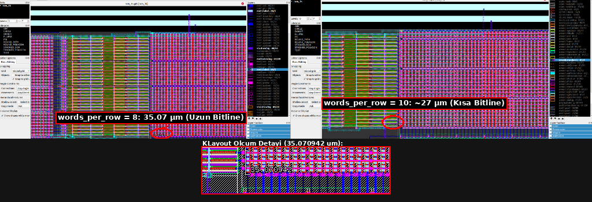

# OpenRAM ROM Delay Optimization (Architectural & Configuration Tuning)

This document outlines architectural and configuration strategies for optimizing read latency (access delay) and hold timing constraints in OpenRAM series-NAND ROM macros when characterization results exceed target specifications.

[<- back to the README](../README.md)

---

## 1. Physical Layout Comparison (Bitline Length: 35.07 µm vs ~27 µm)

The figure below compares KLayout physical ruler measurements across two configurations of the same 1K ROM macro with different `words_per_row` ratios. The measured bitline dimensions are highlighted:

* **Left Design (`words_per_row = 8`):**  
  * **Bitline Length:** **`35.070942 µm`** (circled in red).  
  * Array organization: $256$ columns by $32+$ rows. The bitline is physically longer, carrying substantial distributed parasitic capacitance ($C$) and series pull-down resistance ($R$).
* **Right Design (`words_per_row = 10`):**  
  * **Bitline Length:** **`~27 µm`** (circled in red).  
  * Array organization: $320$ columns by $26$ rows. Bitline length is shortened by $\approx 8\ \mu\text{m}$, which drastically curtails the series pull-down path and discharge latency.

---

## 2. Primary Configuration Parameter: The Impact of `words_per_row`

In an unlatched series-NAND ROM, total read latency is overwhelmingly dominated by the **Bitline discharge time**.

### Why Bitline Discharge Dominates Read Delay
1. **Absence of Sense Amplifiers:** Unlike OpenRAM SRAM arrays that employ differential sense amplifiers to detect small ($\sim 100\text{–}200\text{ mV}$) voltage swings, OpenRAM ROM macros use single-ended static CMOS inverters (`rom_bitline_inverter`).
2. **Full-Rail Discharge Requirement:** For the inverter to trip, the precharged bitline must physically discharge down to the inverter's logic threshold voltage ($V_M \approx 0.8\text{–}1.0\text{ V}$).
3. **Quadratic Scaling ($\propto N_{\text{row}}^2$):** As rows are added, both channel resistance and diffusion capacitance accumulate down the NAND stack. Elmore delay through distributed RC ladder networks causes discharge time to scale quadratically with chain height:
   $$t_{\text{dis}} \propto N_{\text{row}}^2$$

### Effect of Adjusting `words_per_row` (e.g. 8 to 10)
* At `words_per_row = 8`, bitline height is **35.07 µm** ($N_{\text{row}} \ge 32$).
* Increasing to `words_per_row = 10` reduces bitline height to **~27 µm** ($N_{\text{row}} = 26$).
* The reduction in stack height rapidly cuts bitline discharge latency, improving macro access time ($t_{\text{access}}$).

---

### Direct Impact on Input Address Hold and Output Data Retention (Hold Time Reduction)

Modifying `words_per_row` does not merely accelerate access latency; it fundamentally alters **both Input Address Hold (`hold_rising(addr0)`) and Output Data Retention (`retain_rise` / `retain_fall` / $t_{OH}$)**:

#### A. Input Address Hold Reduction (`hold_rising(addr0)`)
1. **Stack Height Shortening:** For a fixed capacity, row count decreases inversely with column multiplexing:
   $$N_{\text{row}} = \frac{\text{Total Words}}{\text{words\_per\_row}}$$
   For example, in a 1K ROM, moving from `words_per_row = 2` (128 rows) to `words_per_row = 8` (32 rows) slashes stack height by 4x.
2. **Quadratic Reduction in Array Cut Time ($cut_{\text{array}} \propto N_{\text{row}}^2$):**
   Input address hold is governed by the time required for the active pull-down chain to discharge the bitline past the trip point ($cut_{\text{array}}$) plus downstream backend propagation ($t_{\text{backend}}$):
   $$t_{\text{hold}} \approx cut_{\text{array}} + t_{\text{backend}}$$
   Because $cut_{\text{array}}$ scales with $N_{\text{row}}^2$, hold time plummets from **15–20 ns** in tall 128-row arrays down to **2–3 ns** in 32-row configurations, substantially alleviating input timing closure constraints.

#### B. Severe Reduction in Output Data Retention (Output Data Hold / $t_{OH}$)
From the perspective of data valid time at the macro output pins (`dout0`), shrinking bitlines introduces a critical timing effect:
1. **Output Data Retention Mechanism:** After an address transition or clock edge, the previous cycle's output data (`dout0`) does not vanish instantaneously. Due to residual bitline capacitance ($C_{BL}$) and inverter trip delays, the previous output state remains valid for a finite window known in Liberty syntax as `retain_rise` / `retain_fall` (equivalent to classical output hold $t_{OH}$).
2. **Faster Discharge Shortens Output Data Stability:**
   * When `words_per_row` is significantly increased, the bitline becomes very short (e.g., $35\ \mu\text{m} \rightarrow 20\ \mu\text{m}$).
   * Parasitic bitline capacitance ($C_{BL}$) and series stack resistance are drastically lower.
   * On the subsequent access, the newly addressed cell stack **discharges the small bitline much faster**.
   * The new data propagates through the bitline inverter and multiplexer almost immediately, overwriting the previous cycle's output value.
   * **Consequence:** The duration over which the old output data remains stable (**Output Data Hold / Retention Time**) **drops significantly**.
3. **Downstream Capture Flop Hold Violations (Race Conditions):**
   * Digital ASIC pipelines place sequential capture flip-flops downstream of the ROM (`dout0` $\rightarrow$ register).
   * For error-free capture, the previously read data must remain valid at the flip-flop input for at least the flip-flop's internal hold requirement:
     $$\text{Data Arrival (Hold)} = t_{\text{retain}} \ge t_{\text{hold(flop)}}$$
   * If a ROM's bitlines are made excessively short, $t_{\text{retain}}$ can become dangerously brief.
   * If the previous data corrupts before the clock edge cleanly captures it, downstream registers suffer **Hold Violations (Race Conditions)**.
   * Automated PnR engines (e.g. OpenLane, Innovus) must then inject artificial delay buffer chains into output data paths to resolve hold slack, adding area and dynamic switching energy.

---

### Architectural Trade-offs
Unchecked expansion of `words_per_row` eventually introduces opposing penalties:
1. **Wordline Delay & Capacitive Slew:** Expanding columns ($256 \rightarrow 320+$) lengthens horizontal wordlines. Heavy gate loading ($m = \text{Cols}$) degrades falling slew ($t_{\text{wlslew}}$) and delays activation at far-end columns.
2. **Multiplexer Loading & Address Holes:** Wide column multiplexers insert additional pass-transistor series resistance and parasitic diffusion capacitance into the backend sensing path. Non-power-of-two multiplexer ratios (`words_per_row = 10`) also introduce non-contiguous address gaps.
3. **Golden Ratio:** Optimal macro latency typically occurs when the array aspect ratio approaches a square matrix ($\text{Rows} \approx \text{Columns}$).

---

## 3. Supplementary Configurations for Minimizing Latency

When `words_per_row` has been balanced but delay remains excessive, evaluate the following compiler options:

### A. Power Grid Routing (`route_supplies = "ring"`)
* Cell array pull-down transistors sink discharge current into internal ground (`VSS`). Weak power meshes introduce ground bounce, degrading effective $V_{GS}$ overdrive and slowing pull-down current.
* Enable `route_supplies = "ring"` to route low-resistance peripheral guard rings around array boundaries.

### B. Multi-Banking (`num_banks`)
* For dense ROM capacities, subdividing the memory into multiple banks (`num_banks = 2` or `4`) halves local bitline and wordline lengths, trading peripheral area for improved access speed.

### C. Wordline Driver & Clock Buffer Sizing
* If SPICE transient analysis indicates sluggish wordline transitions, check driver tapering in `rom_row_decode_wordline_buffer` and clock tree buffering in `rom_control_logic`.

---

## 4. Practical Optimization Checklist

| Observed Symptom | Probable Root Cause | Recommended Action |
|---|---|---|
| Bitline discharge is sluggish ($\sim$ tens of ns) | Excessive row count; bitlines are too tall | Increase `words_per_row` (e.g. $8 \rightarrow 16$). |
| Input address hold is excessively large (input STA violation) | Tall bitline chains take too long to commit read | Increase `words_per_row` to shorten chain discharge. |
| Downstream capture flip-flops suffer hold violations (Data Hold too brief) | Bitline is excessively short; new data overwrites old data too fast | Insert delay buffers before capture registers, or avoid extreme `words_per_row` values. |
| Wordline transitions arrive late at far-edge columns | Horizontal wordlines overloaded with columns | Lower `words_per_row` or introduce banking (`num_banks`). |
| Multiplexer propagation delay is excessive | Column multiplexer stage is too wide | Balance multiplexer tree depth; inspect select driver sizing. |
| Read failures at high clock frequencies | Inadequate precharge window | Lengthen LOW phase of `clk0` or strengthen precharge drivers. |
